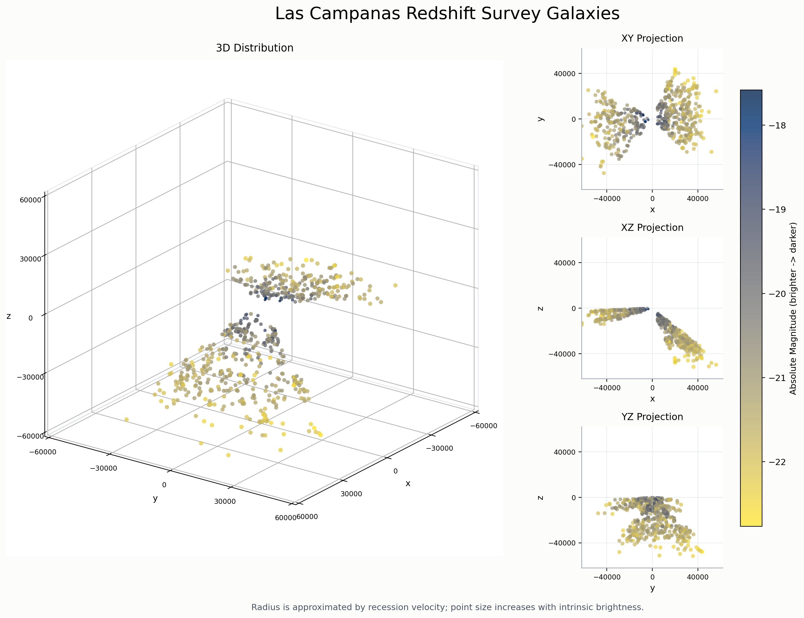

| { width=20% } |
|:--:|

| 项目 | 内容 |
|:--|:--|
| 源题编号 | `HW02` |
| 学生姓名 | 姜玥晟 |
| 报告主题 | LCRS 星系样本清洗、极值统计与三维可视化 |
| 实验环境 | `Python` 数据处理与 `matplotlib` 三维绘图 |

\newpage

# LCRS 星系样本的清洗与极值统计

## 题目陈述

题目给出 `lcrs.txt`。文件前部包含注释行，数据区的每条有效记录有四列，分别表示 recession velocity、球坐标角 `theta`、球坐标角 `phi` 以及红光波段 absolute magnitude。

### (a) 数据清洗与速度极值

去除注释行，保留纯数值记录，并求出 recession velocity 的最小值与最大值。

### (b) 最亮与最暗星系

找出最亮星系与最暗星系对应的 recession velocity。

### (c) 选择效应解释

结合该样本来自 flux-limited survey 的背景，对上述结果给出定性解释。

题目同时要求把计算结果写入 `galaxies.txt`。

## 解决方案

统计流程可形式化表示为如下伪代码：

```text
Input : raw catalog lines
Output: cleaned samples and extrema summary

samples <- []
for each line in catalog do
    fields <- split(line)
    if line is comment then
        continue
    end if
    if number_of(fields) != 4 then
        continue
    end if
    if first field is not numeric then
        continue
    end if
    append parsed record to samples
end for

v_min <- argmin recession_velocity in samples
v_max <- argmax recession_velocity in samples
m_bright <- argmin absolute_magnitude in samples
m_faint <- argmax absolute_magnitude in samples
write summary to galaxies.txt
```

上述流程由 `scripts/analyze_lcrs.py` 实现，并通过 `results/galaxies.txt` 输出最终统计结果。

## 问题答案

有效样本总数为 `734`。表 1 汇总了题目要求的极值记录。

| 项目 | recession velocity (km/s) | theta | phi | absolute magnitude |
|:--|--:|--:|--:|--:|
| 最小速度样本 | 3734 | 1.78597796 | 3.36897206 | -17.581007 |
| 最大速度样本 | 78736 | 2.25449395 | 0.409669995 | -22.2867413 |
| 最亮星系 | 54610 | 1.63460696 | 3.43572998 | -22.7668247 |
| 最暗星系 | 3734 | 1.78597796 | 3.36897206 | -17.581007 |

### (a) 数据清洗与速度极值

清洗后得到 `734` 条有效记录。recession velocity 的最小值为 `3734 km/s`，最大值为 `78736 km/s`。上述统计结果已经写入 `results/galaxies.txt`。

### (b) 最亮与最暗星系

最亮星系的 absolute magnitude 为 `-22.7668247`，对应 recession velocity 为 `54610 km/s`；最暗星系的 absolute magnitude 为 `-17.581007`，对应 recession velocity 为 `3734 km/s`。

### (c) 选择效应解释

最亮星系对应的 recession velocity 显著高于最暗星系，这与 flux-limited survey 的选择效应一致。距离较远的星系若要进入样本，必须具有更高的本征亮度；本征较暗的星系则往往只会在较近距离被观测到。

## 讨论和扩展

该结果与 flux-limited survey 的观测选择效应相一致。由于观测系统只能记录亮度高于阈值的天体，距离较远的星系若要进入样本，就必须拥有更高的本征亮度；反之，本征较暗的星系通常只能在较近距离被探测到。本次统计中，最亮星系对应的 recession velocity 远高于最暗星系，这一现象正体现了上述选择效应。

从样本覆盖范围看，最大与最小 recession velocity 之差达到 `75002 km/s`，说明样本已经跨越较宽的距离尺度。因此，极值对比并非局部波动，而是样本筛选机制在全体观测中的直接反映。

# LCRS 数据的三维可视化

## 题目陈述

题目要求把 LCRS 数据视为以太阳为原点的三维球坐标样本，并从不同视角观察其空间分布。

### (1) 三维坐标构造

已知第一列 recession velocity 作为径向距离，第二、三列分别提供方向信息，因此需要将球坐标样本转换为笛卡尔坐标。

### (2) 多视角可视化

在完成三维建模后，还需要从不同视角观察其空间分布。

## 解决方案

可视化流程如下：

```text
Input : cleaned samples (v, theta, phi, magnitude)
Output: 3D overview and orthogonal views

for each sample do
    r <- v
    x <- r * sin(theta) * cos(phi)
    y <- r * sin(theta) * sin(phi)
    z <- r * cos(theta)
    map magnitude to marker color and marker size
end for

plot 3D scatter overview
plot XY projection
plot XZ projection
plot YZ projection
save figure to lcrs_3d_views.png
```

其中颜色与点大小共同编码星系亮度，以便在空间位置之外同时保留亮度信息。

## 问题答案

### (1) 三维坐标构造

将样本从球坐标转换为笛卡尔坐标后，已经生成三维总览图和三个正交投影视图，如图 1 所示。

{ width=95% }

### (2) 多视角可视化

图 1 同时给出了三维总览和 `XY`、`XZ`、`YZ` 三个方向的投影，因此满足题目“从不同视角观察分布”的要求，能够同时呈现样本的整体空间形态和不同方向上的投影结构。

## 讨论和扩展

对这类三维星表数据而言，单张三维散点图常会受到遮挡影响，导致局部密集区域难以辨认。将 `XY`、`XZ`、`YZ` 三个投影视图与三维总览图并列展示，可以把不同方向的信息解耦，从而更稳定地观察样本的几何形态。

此外，三维图与第一题中的统计结果共享同一批清洗后的 `734` 条样本，因此统计结论与可视化结果之间具有一致的数据口径。这一点对于正式报告尤为重要，因为它保证了“结论”“图像”“原始结果文件”之间可以相互印证，而不是来自不同的数据子集。
