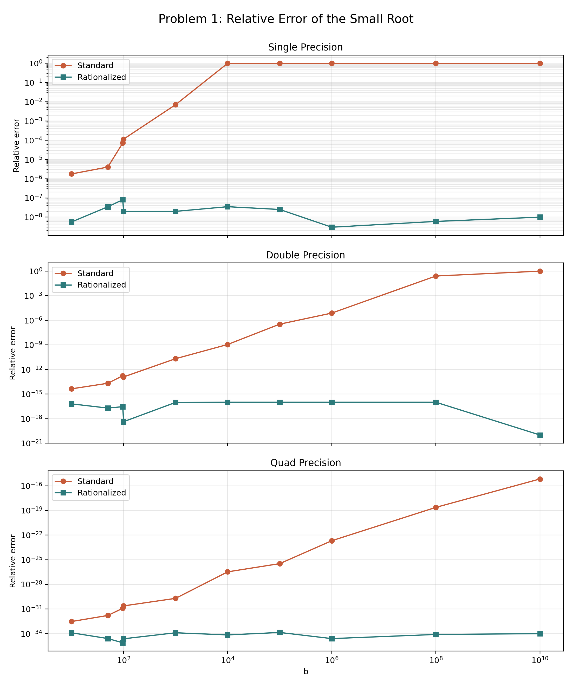
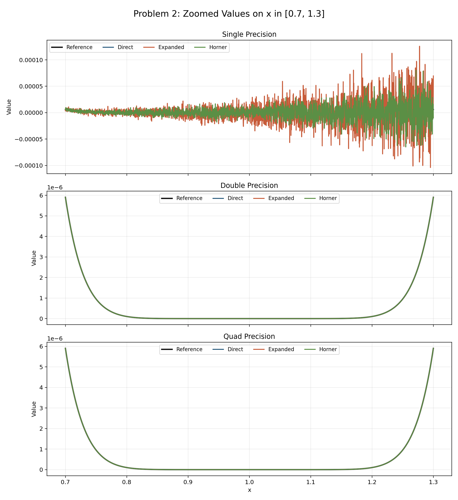
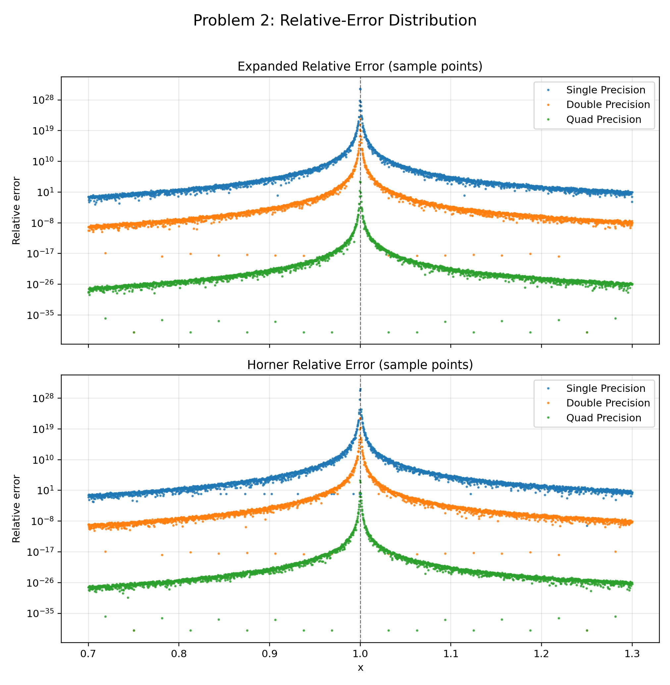
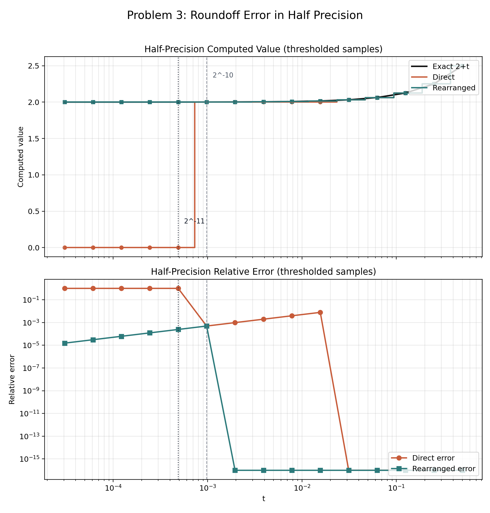

| { width=20% } |
|:--:|

| 项目 | 内容 |
|:--|:--|
| 源题编号 | `HW04` |
| 学生姓名 | 姜玥晟 |
| 报告主题 | 二次方程求根稳定性、多项式求值稳定性与 half precision 舍入误差 |
| 实验环境 | `C` 数值程序与 `Python` 统计绘图程序 |

\newpage

# 二次方程小根的相消误差分析

## 题目陈述

考察二次方程

$$
x^2 - b x + 1 = 0,
$$

其两根可写为

$$
x_1 = \frac{b+r}{2}, \qquad
x_2 = \frac{b-r}{2}, \qquad
r = \sqrt{b^2 - 4}.
$$

当 $b$ 足够大时，$r$ 与 $b$ 的数值非常接近，小根

$$
x_2 = \frac{b-r}{2}
$$

的计算将涉及两个接近量之间的相减。

### (1) `b=100` 附近的误差考察

首先考察该表达式在 `b=100` 附近的相对误差。

### (2) 大参数区间的误差比较

随后增大 $b$ 取值并列表比较误差变化。

### (3) 有理化改写与再实验

最后将小根公式改写为

$$
x_2 = \frac{(b-r)(b+r)}{2(b+r)} = \frac{2}{b+r},
$$

并重新进行同样的实验，以比较两种实现的稳定性差异。

## 解决方案

为使实验步骤表达得更规范，本文以伪代码方式给出求解过程：

```text
Input : precisions P, test values B
Output: error table and error curve

for each p in P do
    for each b in B do
        r <- sqrt(b^2 - 4)
        x_std <- (b - r) / 2
        x_rat <- 2 / (b + r)
        x_ref <- ref_root(b)
        err_std <- relerr(x_std, x_ref)
        err_rat <- relerr(x_rat, x_ref)
    end for
end for
```

其中 `ref_root(b)` 表示高精度参考解，`relerr` 表示相对误差计算函数。

## 问题答案

### (1) `b=100` 附近的误差考察

依据题图第二页给出的三位有效数字示例，取 `b=97` 时有

$$
x_2^{\text{exact}} = 0.01031, \qquad
x_2^{\text{standard}} = 0.01050,
$$

相应相对误差为 1.8429E-2，约为 `1.84%`。然而，在本机 IEEE `float` 运算中，`b=100` 的标准公式相对误差仅为 1.1359E-4。这表明题图中“about 2%”的表述对应的是低精度教学示例，而非标准单精度在 `b=100` 时的实际结果。

### (2) 大参数区间的误差比较

当 $b$ 继续增大时，标准公式的误差迅速放大，而有理化公式保持稳定。误差变化趋势如图所示。

{ width=88% }

表 1 给出了代表性结果。

| 精度 | b | 标准误差 | 有理化误差 | 改进倍数 |
|:--|--:|--:|--:|--:|
| float | 100 | 1.1359E-4 | 2.0003E-8 | 5.6786E+3 |
| float | 1000 | 7.0791E-3 | 2.0002E-8 | 3.5392E+5 |
| float | 10000 | 1.0000E+0 | 3.5000E-8 | 2.8571E+7 |
| double | 100000 | 3.3844E-7 | 9.9980E-17 | 3.3850E+9 |
| double | 10000000000 | 1.0000E+0 | 1.0000E-20 | 1.0000E+20 |
| quad | 10000000000 | 6.8266E-16 | 1.0000E-34 | 6.8266E+18 |

对于 `float`，当 `b=10000` 时，标准公式的相对误差已达到 1.0000E+0，说明小根信息几乎完全丢失；对应的有理化误差仍只有 3.5000E-8。对于 `double`，在 `b=10^10` 时也出现同类退化，而 `__float128` 在同一测试点仍维持 6.8266E-16 的误差量级。

### (3) 有理化改写与再实验

有理化后未再出现与标准公式同量级的误差爆炸。实验范围内，有理化公式始终显著优于标准公式；例如在 `double, b=10^10` 条件下，标准公式误差为 1.0000E+0，而有理化公式误差为 1.0000E-20。

## 讨论和扩展

标准公式的不稳定性来源于相消误差。由近似关系

$$
\sqrt{b^2-4} = b\sqrt{1-4/b^2} \approx b - \frac{2}{b}
$$

可知，当 $b$ 很大时，表达式

$$
b - \sqrt{b^2 - 4}
$$

仅保留数量级约为 $2/b$ 的小量，高位有效数字会在减法阶段被提前消耗。有理化公式

$$
x_2 = \frac{2}{b + \sqrt{b^2 - 4}}
$$

将这一相减过程替换为除法运算，因此显著抑制了误差放大。进一步地，由根的乘积关系 $x_1 x_2 = 1$ 还可得到另一种稳定实现，即先稳定计算较大的根 $x_1$，再由 $x_2 = 1/x_1$ 得到小根。

# 多项式写法对数值稳定性的影响

## 题目陈述

作业要求在 `single`、`double` 与 `quad` 三种精度下计算

$$
(x-1)^{10}
$$

及其多项式展开式，并在区间 $x\in[0.7, 1.3]$ 上观察数值结果。

### (1) 局部放大观察

比较直接形式与展开形式在局部区间上的数值表现。

### (2) 相对误差分布

绘制并比较误差分布。

### (3) Horner 方法比较

再使用 Horner 方法重新组织多项式计算，比较三种实现的误差分布，并解释在 $x=1$ 邻域出现差异的原因。

## 解决方案

本题的实验组织可形式化表示为：

```text
Input : grid X, methods M, precisions P
Output: zoomed plots and error statistics

for each p in P do
    for each x in X do
        y_ref <- high_precision((x - 1)^10)
        for each m in M do
            y <- eval(m, x, p)
            if y_ref != 0 then
                err[m, x, p] <- relerr(y, y_ref)
            end if
        end for
    end for
end for
```

其中 `M = {direct, expanded, horner}`，并基于 `err` 进一步统计最大误差、峰值位置与中位误差。

## 问题答案

### (1) 局部放大观察

局部放大结果表明，直接形式在三个精度下均最接近参考曲线，而展开形式与 Horner 形式在 $x=1$ 附近出现明显偏离。

{ width=88% }

造成该现象的直接原因在于：当 $x$ 接近 `1` 时，真值 $(x-1)^{10}$ 极小；若先将多项式展开为多个数量级接近的项再相加减，就会显著放大舍入误差。

### (2) 相对误差分布

相对误差统计结果如下。

{ width=88% }

| 精度 | 形式 | 最大相对误差 | 峰值位置 x | 中位相对误差 |
|:--|:--|--:|--:|--:|
| float | direct | 7.5107E-5 | 1.0005 | 9.5128E-8 |
| float | expanded | 1.7450E+31 | 0.99975002 | 1.3713E+3 |
| float | horner | 4.9415E+30 | 1.00025 | 7.3785E+2 |
| double | direct | 8.9867E-13 | 1.0005 | 5.2885E-16 |
| double | expanded | 2.6543E+22 | 1.00025 | 2.4256E-6 |
| double | horner | 1.4552E+22 | 1.00025 | 1.4286E-6 |
| quad | direct | 1.8490E-31 | 1.00025 | 1.2808E-34 |
| quad | expanded | 1.2522E+4 | 0.99975 | 2.3220E-24 |
| quad | horner | 9.3896E+3 | 0.99975 | 1.3699E-24 |

其中最显著的退化出现在 `float + expanded` 组合，其最大相对误差达到 1.7450E+31，峰值出现在 `x=0.99975002` 附近；相比之下，同为 `float` 的直接形式最大相对误差仅为 7.5107E-5。即使在 `quad` 精度下，展开形式的最大相对误差仍达到 1.2522E+4，说明表达式结构对稳定性的影响并不会因精度提升而完全消失。

### (3) Horner 方法比较

Horner 方法明显优于朴素展开形式，但仍劣于直接形式。以 `float` 为例，Horner 形式的最大相对误差为 4.9415E+30，相较朴素展开已有改善，但仍远大于直接形式。这说明 Horner 方法虽然减少了重复幂与大规模加减运算，却没有保留原问题中最关键的小量结构 $(x-1)$。

## 讨论和扩展

本题显示出“问题条件数”与“算法稳定性”之间的区别。在 $x=1$ 附近，真值本身非常接近零，因此任何微小的绝对误差都可能被转换为极大的相对误差。直接形式由于始终保留 $(x-1)$ 这一小量结构，运算路径最短，因而最稳定；朴素展开形式则会反复累积和抵消数量级接近的项，最容易触发相消误差；Horner 形式虽然改善了运算顺序，但并未改变展开后计算的本质。若需进一步提高稳定性，可结合高精度算术、补偿求和或围绕 $x=1$ 的局部重参数化方案。

# Half Precision 的机器精度与舍入误差

## 题目陈述

作业要求完成以下两项工作：

### (1) 基本指标测量

给出 half precision（binary16）的 machine precision、数值范围等基本指标。

### (2) 舍入误差算例

构造一个具体算例，说明在半精度环境下 roundoff error 可以严重到何种程度。

## 解决方案

本题采用的实验步骤可归纳为如下伪代码：

```text
Input : half type h, parameter set T
Output: metric table and roundoff plot

probe epsilon(h), min_normal(h)
probe true_min(h), max_finite(h)

for each t in T do
    y_dir <- ((1 + t)^2 - 1) / t
    y_alt <- 2 + t
    y_ref <- high_precision(2 + t)
    if y_ref != 0 then
        err_dir <- relerr(y_dir, y_ref)
        err_alt <- relerr(y_alt, y_ref)
    end if
end for
```

通过比较 `y_dir` 与 `y_alt` 的误差变化，可直接观察 half precision 下的舍入误差放大现象。

## 问题答案

### (1) 基本指标测量

`_Float16` 的主要数值指标如表所示。

| 指标 | 数值 |
|:--|--:|
| `_Float16` size | 2 bytes |
| bit pattern of `1.0` | `0x3c00` |
| machine epsilon | 0.0009765625 |
| min normal | 6.103515625e-05 |
| true min | 5.9604644775390625e-08 |
| max finite | 65504 |

上述结果与 binary16 的 `1` 位符号位、`5` 位指数位和 `10` 位尾数位结构一致，说明实验环境中的 half precision 实现符合常见 IEEE 754 binary16 格式。

### (2) 舍入误差算例

为说明舍入误差的严重程度，选取表达式

$$
\frac{(1+t)^2 - 1}{t},
$$

其精确值为 $2+t$。当 `t=0.00048828125` 时，半精度直接计算结果已退化为 `0`，而精确值仍为 `2.00048828125`；此时相对误差达到 1.0000E+0。若改写为 `2+t`，同一点的相对误差仅为 2.4408E-4。

{ width=88% }

### (3) 误差严重程度结论

因此，half precision 的 machine epsilon 约为 `2^(-10)`，有效数字极为有限；一旦表达式包含相消运算，舍入误差完全可能将本应处于 `2` 量级的结果直接压缩为 `0`。

## 讨论和扩展

half precision 在 `1` 附近的间隔约为 `2^(-10)`。当 $t$ 小于或接近这一阈值时，`1+t` 将首先被舍入回 `1`，进而使 `(1+t)^2-1` 被舍入为 `0`。本题中的首个失真点正好出现在 `t=0.00048828125`，即 machine epsilon 的一半附近，这与 binary16 的舍入行为相一致。由此可见，在低精度格式中，算法结构往往比“理论等价”更重要；对含有相消项的表达式进行代数改写，是避免灾难性误差的关键手段。
