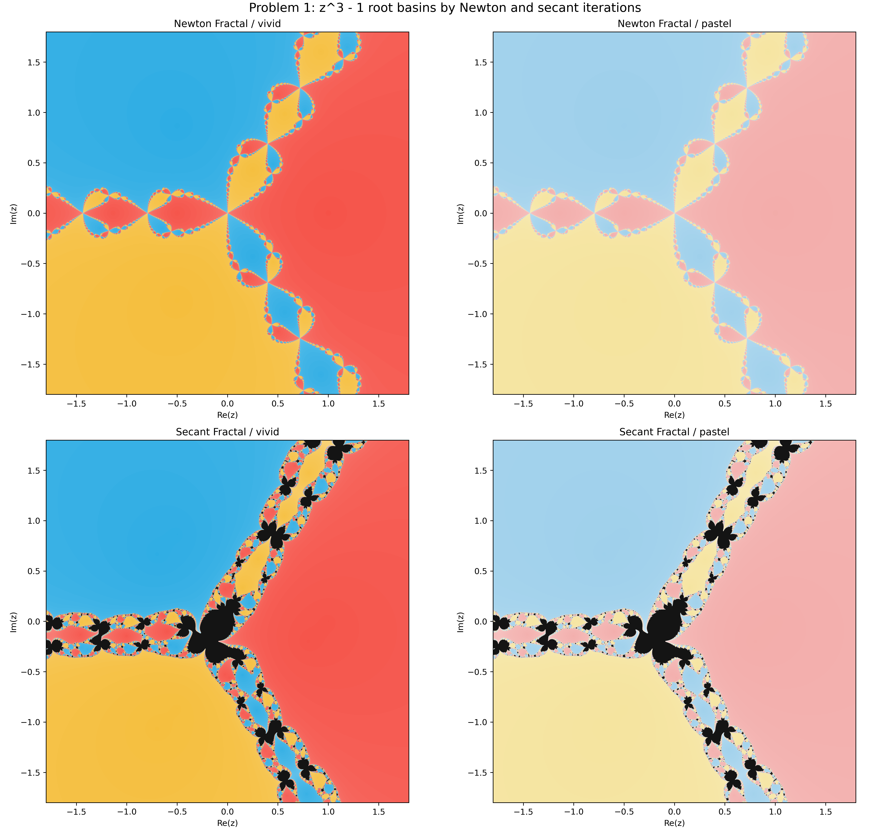
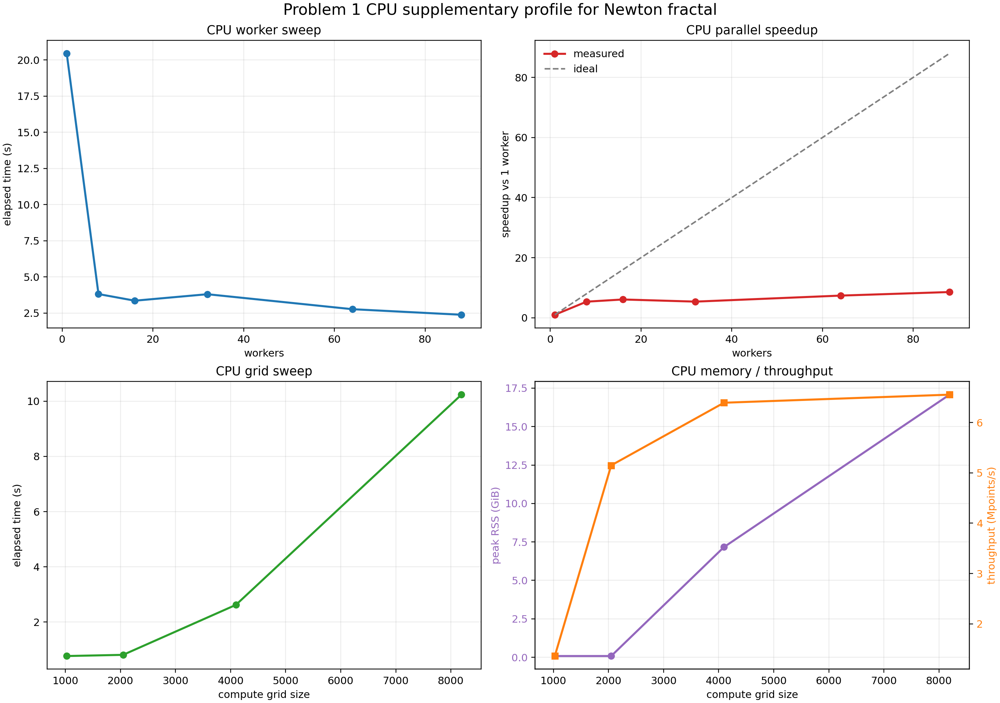
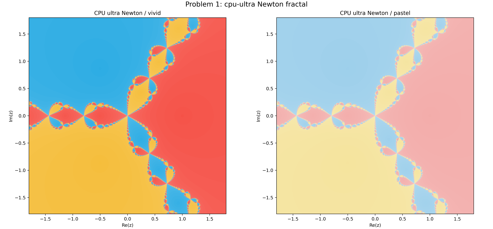
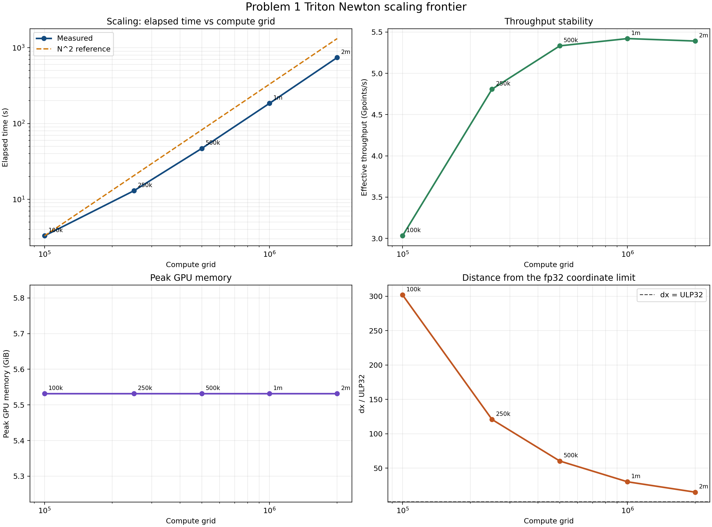
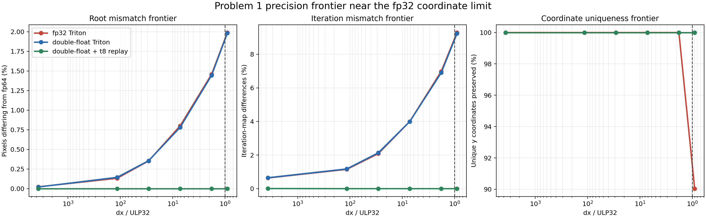

| { width=78% } | { width=78% } | { width=78% } |
|:--:|:--:|:--:|
| 姜玥晟 | 周鑫志 | 高西飞 |

| 项目 | 内容 |
|:--|:--|
| 作业编号 | `HW05` |
| 作业目录 | `HW/04` |
| 作业属性 | 小组作业 |
| 小组成员 | 姜玥晟、周鑫志、高西飞 |
| 报告主题 | Newton/Secant 分形、混合求根、Brent 型算法、范盛金公式与地月系统 `L1` 点 |
| 实验环境 | `Python` 数值程序、`mpmath` 参考值与图像后处理；Problem 1 主结果由多进程 CPU 程序生成 |
| 报告说明 | 正文按题目编号组织；Problem 1 先说明 CPU 主流程与补充 CPU 剖面，再讨论 GPU/Triton 扩展，完整实验脚本保留于 `scripts/`，扩展验证数据保留于 `result/analysis/`。 |

\newpage

# 方程 `z^3 - 1 = 0` 的 Newton 与 Secant 分形

## 题目陈述

对复方程

$$
f(z)=z^3-1=0
$$

使用 Newton-Raphson 方法生成分形图，并调节合适的收敛容差。题目还要求提供两套配色方案；可选部分要求改用 secant 方法并讨论是否仍能观察到分形结构。

## 解决方案

Newton 分形的计算流程如下：

```text
Input : complex grid G, tolerance tau, max_iter K
Output: basin label and iteration count

roots <- {1, exp(2pi i / 3), exp(4pi i / 3)}
for each z0 in G do
    z <- z0
    for k from 1 to K do
        z <- z - (z^3 - 1) / (3 z^2)
        if min_j |z - roots[j]| < tau then
            record basin j and iteration k
            break
        end if
    end for
    if no convergence then
        mark point as unconverged
    end if
end for
render two color maps from the same basin data
```

可选 secant 版本则把单点迭代改为双点迭代

$$
z_{n+1}=z_n-\frac{f(z_n)(z_n-z_{n-1})}{f(z_n)-f(z_{n-1})},
$$

并取 `z_1=z_0+(0.2+0.2i)` 作为第二初值。

## 问题答案

本次主流程采用收敛容差

$$
\tau=5\times 10^{-7}.
$$

在这一设置下，Newton 与 secant 的主结果如图 1 所示。

{ width=92% }

统计结果见表 1。

| 方法 | 收敛比例 | 平均迭代步数 | root 1 占比 | root 2 占比 | root 3 占比 |
|:--|--:|--:|--:|--:|--:|
| Newton | 0.9999997275 | 6.8145 | 0.341879 | 0.329060 | 0.329060 |
| Secant | 0.9452318 | 9.1147 | 0.359842 | 0.315501 | 0.269889 |

据此可以直接回答题目三点要求：

1. 取 `5×10^-7` 作为容差时，Newton 分形边界已经清晰可辨，能够兼顾图像效果与计算成本。
2. 两套配色方案已经输出到同一张主图中，满足题面要求。
3. secant 方法仍然能够观察到分形结构，但其未收敛区域更多、平均步数更大，因此稳定性劣于 Newton 方法。

## 讨论和扩展

本题最先完成的是纯 CPU 主流程，而不是 GPU 路线。`solution.py` 使用 `ProcessPoolExecutor` 按行带切分复平面，先在 `20000 x 20000` 计算网格上完成 Newton 与 secant 迭代，再降采样得到 `5000 x 5000` 的交付图像。表 1 与图 1 的全部结果都来自这条 CPU 实现链。就主实验而言，Newton 与 secant 都在复平面上定义了高度非线性的迭代映射，因此都会在根吸引域交界处形成分形边界；二者的差别不在于“是否存在分形”，而在于 secant 使用双初值且不显式调用导数，因此收敛域更易破碎，平均迭代步数也更大。对应地，在 `80` 个 worker 的 CPU 基线运行中，Newton 的收敛比例达到 `0.9999997275`，平均迭代步数为 `6.8145`；secant 的收敛比例为 `0.9452318`，平均迭代步数增至 `9.1147`。刚刚重新生成的 CPU 基线结果显示，总耗时为 `231.04 s`，峰值内存约 `98.71 GiB`，说明当采样网格极大时，CPU 版本的主要压力首先来自全局数组规模。

为了把 CPU 路线的工作补得更完整，又额外进行了一个较轻但可复现的 Problem 1 CPU 剖面实验，结果见图 2，原始数据保存在 `result/analysis/problem1_cpu_profile.csv`。在固定 `4096 x 4096` 网格时，`1` 个 worker 需要 `20.46 s`，吞吐率 `0.82` Mpoints/s；增加到 `64` 个 worker 后，耗时降为 `2.77 s`，吞吐率提升到 `6.05` Mpoints/s；继续增加到本机 `88` 个 worker 时，耗时进一步降到 `2.39 s`，相对单 worker 获得 `8.56` 倍加速，但峰值内存也从 `3.04 GiB` 增加到 `9.19 GiB`。若固定 `64` 个 worker 再把网格从 `1024` 提升到 `8192`，吞吐率会逐步稳定在 `6.39` 至 `6.56` Mpoints/s，而峰值内存则上升到 `17.08 GiB`。这些补充数据说明，本作业的 CPU 版本本身已经具备可重复的并行扩展性，只是在超大网格下会快速受到内存容量约束。

{ width=82% }

| CPU 剖面案例 | 耗时 / s | 吞吐率 / Mpoints/s | 峰值内存 / GiB |
|:--|--:|--:|--:|
| `4096^2`, `1` worker | 20.46 | 0.82 | 3.04 |
| `4096^2`, `64` workers | 2.77 | 6.05 | 7.43 |
| `4096^2`, `88` workers | 2.39 | 7.02 | 9.19 |
| `8192^2`, `64` workers | 10.24 | 6.56 | 17.08 |

仅靠原始 Python 多进程主流程，还不足以把 `80000 x 80000` 这类极大网格作为附加性能实验来反复测试，因此又补写了一条专用的 CPU ultra 路线：用 `C + OpenMP` 实现 Newton 直写公式，并结合上半平面对称复用、按输出 tile 流式聚合 `factor x factor` 超采样块，以及常量级小缓冲区而非全平面中间数组。这里需要说明的是，这条路线属于实现层面的附加优化实验，而不是题面额外要求的标准作业步骤；它的提速也同时依赖 `OpenMP` 并行和编译器优化，而不仅仅来自数学公式本身。该实现的主要目的有两个：其一是把峰值内存从随 `compute_grid` 急剧增长，改为主要受 `render_grid` 和 tile accumulator 大小控制；其二是减少 Python 进程调度和大块临时数组反复分配带来的额外开销。实际 benchmark 表明，这条专用 CPU 路线在 `5000 x 5000` 输出网格上，对 `20000`、`40000` 和 `80000` 三个计算网格分别取得 `1.95 s`、`2.39 s` 和 `5.53 s` 的总耗时，峰值 RSS 均约为 `0.118 GiB`。进一步对 `80000 x 80000` 做参数扫描时，`88` 线程配 `tile_rows=256` 的较优结果为 `4.79 s`。这些结果说明，若把任务明确收缩为 Problem 1 的 Newton 主计算，那么 CPU 侧可以通过“分块 + 对称 + 流式降采样 + 低层并行”得到明显更紧凑的时间与内存表现；但这仍然应当被视为对主作业实现的补充，而不是对题面要求本身的改写。

图 3 给出了这条 CPU ultra 路线直接生成的最终 Newton 分形图。这里使用 `80000 x 80000` 的计算网格、`5000 x 5000` 的输出网格、`88` 线程和 `tile_rows=256` 的分块设置，既验证了数值分类结果，也说明该路线并不只是统计模式，而是已经能够输出最终可交付图像。

{ width=92% }

| 案例 | 耗时 / s | 吞吐率 / Gpoints/s | 峰值内存 / GiB | 收敛比例 |
|:--|--:|--:|--:|--:|
| `20k -> 5k` | 1.95 | 0.205 | 0.118 | 0.999999640000 |
| `40k -> 5k` | 2.39 | 0.669 | 0.118 | 0.999999601250 |
| `80k -> 5k` | 5.53 | 1.157 | 0.118 | 0.999999605938 |
| `80k, tile=256` | 4.81 | 1.331 | 0.118 | 0.999999605938 |

若进一步把 `cpu-ultra` 的实现写成更具体的算法，它并不是“先生成完整 `80000 x 80000` 根标签平面，再整体缩图”，而是把最终 `render_grid x render_grid` 图像视为细网格块的流式聚合结果。设 `factor = compute_grid / render_grid`，则输出像素 `(i,j)` 对应一个 `factor x factor` 的细网格块 `B_{ij}`。对块内每个采样点，都显式执行 Newton 更新
$$
z_{n+1}=z_n-\frac{z_n^3-1}{3z_n^2}=\frac{2}{3}z_n+\frac{1}{3z_n^2},
$$
若满足 `\min_k |z_n-r_k| < \tau`，就记为收敛到第 `k` 个根。块内分别统计三个根的命中次数 `c_0,c_1,c_2`，再以 `\arg\max_k c_k` 作为该输出像素的 basin 标签，并用 `iter_sum / conv_count` 记录块内收敛样本的平均迭代步数作为着色强度。由于 `f(\bar z)=\overline{f(z)}`，程序只实际计算输出图的上半平面，再把结果按共轭镜像复制到下半平面，同时交换两个非实根的编号。因此，中间态只需要当前 tile 的 `count0/count1/count2/iter_sum/conv_count` 五个小缓冲区，而不需要保存整张 `compute_grid x compute_grid` 的根标签数组和步数数组；`OpenMP` 仅负责并行外层输出像素循环，Newton 更新、根分类、块内投票和镜像复用都在本实现中显式写出。

```text
for each upper-half tile T do
    allocate count0/count1/count2/iter_sum/conv_count
    parallel for each output pixel (i,j) in T do
        for each fine sample in the factor x factor block B_ij do
            run handwritten Newton iteration and classify the root
            accumulate root counts and iteration sum
        end for
        write argmax-root and mean-iteration to the render buffers
    end for
    flush tile result and free local buffers
end for
mirror the upper-half result to the lower half
```

\clearpage

在此基础上，才进一步展开 GPU 与高精度扩展研究。对 `100000 x 100000` 网格，`complex64` 的 PyTorch 实现耗时 `409.53 s`，峰值显存 `13.10 GiB`；同等规模下，Triton 版本仅耗时 `3.99 s`，峰值显存 `5.54 GiB`，其收敛比例 `0.9999996018`、平均迭代步数 `6.8143` 仍与 CPU 主实验统计量保持一致。这里的意义不在于用 GPU 替代作业本体，而在于说明：当 Problem 1 被扩展到更高采样尺度时，瓶颈已不再只来自 Newton 公式本身，而更取决于复平面采样、数据布局、并行框架和内核组织是否贴近硬件执行方式。

图 4 给出了继续扩大计算网格后的扩展缩放前沿。

{ width=74% }

由图 4 可见，随着计算网格从 `100000` 提升到 `2000000`，总耗时由 `3.30 s` 增加到 `741.91 s`，总体上仍呈接近平方增长；但吞吐率却从 `3.03` Gpoints/s 提升并稳定在 `5.39` 至 `5.42` Gpoints/s 区间，而峰值显存几乎固定在 `5.53 GiB`。这说明当前 GPU 扩展实现已经通过分块策略把显存占用与全局网格尺度有效解耦，因此继续扩大网格时，主要增加的是总计算时间，而不是显存压力。与此同时，`dx / float32 ULP` 的比值从 `301.99` 持续下降到 `15.10`，表明随着网格变密，单个采样步长正快速逼近 `float32` 的可分辨极限；这意味着问题已不再只是“能否算得更快”，而是逐步转化为“在坐标分辨率接近极限时能否保持分类正确”。

图 5 给出了接近 `float32` 坐标分辨率上限时的精度前沿。

{ width=74% }

由图 5 可见，当全局网格达到 `33554432` 时，单点步长仅为 `float32` ULP 的 `0.9` 倍。此时，`fp32_triton` 相对 `fp64` 参考已经出现 `5217` 个像素的根分类差异，占比 `1.99%`；更重要的是，其 `y` 方向唯一采样值比例下降到 `90.04%`，说明采样坐标已经发生明显碰撞。即使改用不带 replay 的基础 double-float 实现，仍然存在 `5198` 个像素的分类偏差，这表明仅仅扩展表示精度并不足以完全消除迭代轨道的偏移。只有在引入 `doublefloat_triton_t8` 的 replay 机制后，`8192` 到 `33554432` 全部测试网格才重新与 `fp64` 参考保持一致，达到 `root_diff_vs_fp64 = 0`，同时 `unique_x_percent` 与 `unique_y_percent` 均恢复为 `100%`。

综合来看，本题现在可以更准确地分成三层结论。第一层是作业主体：原始 CPU 并行程序已经独立完成 Newton 与 secant 分形图、统计量和其他各题的数值求解。第二层是 CPU 深化优化：针对 Problem 1 的 Newton 主计算，专用的 `cpu-ultra` 路线表明，大网格下真正需要解决的是内存组织和分块策略，而不是简单增加 worker 数；一旦把中间态改成流式 tile 聚合，并接受 `C + OpenMP + 编译器优化` 这一实现前提，就可以把同一 Newton 任务做得更紧凑。第三层才是扩展研究：分块 GPU 内核进一步提升了更大网格下的吞吐率，但当采样步长逼近 `float32` 分辨率极限时，若没有更高精度坐标表示与 replay 修正机制，最终图像仍会出现系统性漂移。因此，GPU 路线应理解为对 CPU 作业主线的放大与深化，而不是对原始作业求解过程的替代。

# Newton-Bisection 混合法求 `4 cos x - e^x = 0` 的根

## 题目陈述

使用完整的 Newton-Raphson 与 Bisection 混合算法，求

$$
f(x)=4\cos x-e^x
$$

的实根。

## 解决方案

本题先扫描变号区间，再在每个括区内执行守护式 Newton-Bisection：

```text
Input : interval [L, R]
Output: all roots in [L, R]

scan [L, R] and collect sign-change brackets [a, b]
for each bracket [a, b] do
    x <- (a + b) / 2
    repeat
        x_newton <- x - f(x) / f'(x)
        if a < x_newton < b then
            x_next <- x_newton
        else
            x_next <- (a + b) / 2
        end if
        update bracket so that f(a) f(b) <= 0
        x <- x_next
    until convergence
end for
```

本报告固定研究区间为 `[-10,2]`，从而把“所有负根”的开放任务转化为有限区间内的可验证求根问题。

## 问题答案

在 `[-10,2]` 内共得到 4 个根，如表 2 所示。

| 括区 | 根 | 步数 | 残差 | 绝对误差 |
|:--|--:|--:|--:|--:|
| `[-7.854,-7.852]` | -7.853884573753 | 3 | 3.119e-16 | 0 |
| `[-4.716,-4.714]` | -4.714629778215 | 3 | -3.296e-16 | 0 |
| `[-1.516,-1.514]` | -1.515864122805 | 3 | -7.216e-16 | 2.220e-16 |
| `[0.904,0.906]` | 0.904788217873 | 3 | -1.776e-15 | 2.220e-16 |

因此，在选定区间内的全部实根已经被完整求出，且都与高精度参考值在双精度舍入误差范围内一致。

## 讨论和扩展

本题的关键并不是单纯“用 Newton 找根”，而是利用括区信息保持算法稳定性。若 Newton 切线步跳出括区，就立即回退到二分步，从而保证 `f(a)f(b)\le 0` 的不变量始终成立。该策略兼顾了 Newton 的快速局部收敛和二分法的全局可靠性。

# 带参数方程的 Müller-Brent 求根

## 题目陈述

求下列两个函数的根：

$$
f(x)=x\tan x-\sqrt{h^2-x^2},
\qquad
g(x)=x\cot x+\sqrt{h^2-x^2},
$$

其中 `h` 取若干代表性数值，例如 `0.2`、`0.5`、`1.0` 与 `2.0`。

## 解决方案

算法组织如下：

```text
Input : parameter h and target function phi(x)
Output: all admissible roots for this h

restrict domain to (0, h)
split domain by singularities of tan or cot
for each valid subinterval do
    if sign change is detected then
        apply Brent-style safeguarded iteration
        record converged root
    end if
end for
if no sign change is found in all subintervals then
    report no root
end if
```

这里先处理定义域约束 `x<h`，再按 `tan` 或 `cot` 的奇点分段，否则根搜索将失去意义。

## 问题答案

结果如表 3 所示。

| \(h\) | \(f(x)\) 的根 | \(g(x)\) 的根 |
|:--|:--|:--|
| 0.2 | 0.19616428118784215 | 无根 |
| 0.5 | 0.45018361129487355 | 无根 |
| 1.0 | 0.7390851332151607 | 无根 |
| 2.0 | 1.029866529322259 | 1.8954942670339807 |

所有已求得的根，其残差均处于 `10^-15` 量级或更小。

## 讨论和扩展

本题的主要困难来自“定义域 + 奇点 + 非线性”三者同时存在。对 `g(x)` 而言，较小的 `h` 会显著压缩可行区间，因此在 `h=0.2`、`0.5` 和 `1.0` 时未检测到根；只有当 `h` 增大到 `2.0` 时，函数结构才允许实根出现。这说明参数 `h` 不仅改变根的位置，还可能直接改变根的存在性。

当 `h=1.0` 时，`f(x)` 的根约为 `0.7390851332`，它与经典方程 `x=\cos x` 的解一致，因此也构成了额外的正确性核验。

# 范盛金公式求三次方程的根

## 题目陈述

使用范盛金公式求解

$$
x^3-70.5x^2+1533.54x-10082.44=0
$$

的三个实根。

## 解决方案

求解流程如下：

```text
Input : cubic coefficients A, B, C
Output: three real roots and residuals

transform x = y - A / 3
compute depressed-cubic parameters p and q
compute theta from arccos formula
for k in {0, 1, 2} do
    y_k <- 2 * sqrt(-p / 3) * cos((theta + 2k pi) / 3)
    x_k <- y_k - A / 3
end for
evaluate residuals of original polynomial
```

在本题中，降次后得到的 `q` 非常接近 `0`，因此三根结构具有明显的对称性。

## 问题答案

程序输出如下。

| 根 | 残差 |
|:--|--:|
| 12.40000000000002 | 3.637978807091713e-12 |
| 23.499999999999954 | 5.4569682106375694e-12 |
| 34.60000000000002 | 1.8189894035458565e-12 |

因此，可将最终答案写为

$$
x=12.4,\quad 23.5,\quad 34.6.
$$

## 讨论和扩展

降次变换后得到

$$
y^3-123.21y-5.457\times 10^{-12}=0,
$$

其中常数项已经极小，因此方程几乎退化为

$$
y(y^2-123.21)=0.
$$

这正是三个实根近似等于 `0` 与 `\pm 11.1` 的原因。数值残差仅剩 `10^-12` 量级，说明当前误差主要来自浮点舍入，而不是范盛金公式失效。

# 地月系统的 `L1` 点

## 题目陈述

研究地月系统中的 `L1` 点。题目包含以下两个子问：

1. 证明距离地心为 `r` 的平衡点满足

$$
\frac{GM}{r^2}-\frac{Gm}{(R-r)^2}=\omega^2r.
$$

2. 利用 Newton 方法或 secant 方法求出 `r` 的数值解，并至少给出四位有效数字。

## 解决方案

### (a) 平衡方程推导

设待求平衡点位于地月连线上，距地心为 `r`，距月心为 `R-r`，并与月球一起以角速度 `\omega` 作同步转动。沿地月连线取指向地球的方向为正，则试探质点受到的两个引力加速度分别为

$$
a_E=\frac{GM}{r^2},\qquad
a_M=-\frac{Gm}{(R-r)^2}.
$$

这里 `a_E` 指向地球，`a_M` 指向月球，因此在所选正方向下二者符号相反。若该点能够与月球保持同角速度转动，则质点必须具有指向地球的向心加速度

$$
a_c=\omega^2 r.
$$

于是平衡条件就是沿地月连线方向的合加速度恰好等于所需向心加速度，即

$$
a_E+a_M=a_c.
$$

代入上式可得

$$
\frac{GM}{r^2}-\frac{Gm}{(R-r)^2}=\omega^2r,
$$

这正是题目第 `(a)` 问所要求的平衡关系。

### (b) 数值求解流程

将第 `(a)` 问得到的平衡方程写为

$$
\frac{GM}{r^2}-\frac{Gm}{(R-r)^2}=\omega^2r,
$$

等价地定义

$$
F(r)=\frac{GM}{r^2}-\frac{Gm}{(R-r)^2}-\omega^2r.
$$

对 Newton 方法还需要导数

$$
F'(r)=-\frac{2GM}{r^3}-\frac{2Gm}{(R-r)^3}-\omega^2.
$$

计算过程如下：

```text
Input : physical constants G, M, m, R, omega
Output: numerical root r of the L1 equation

define F(r) = GM / r^2 - Gm / (R - r)^2 - omega^2 r
derive F'(r) for Newton iteration

Newton:
    choose initial guess r0
    iterate r_{n+1} = r_n - F(r_n) / F'(r_n)

Secant:
    choose two initial guesses r0, r1
    iterate with secant update

compare both results with high-precision reference
```

其中，方程的物理含义是：地球引力提供向心趋势，月球引力抵消其中一部分，因此平衡点位于地球与月球之间。

## 问题答案

### (a) 平衡方程

由地球引力、月球引力与同步转动所需向心加速度的平衡关系，可直接得到

$$
\frac{GM}{r^2}-\frac{Gm}{(R-r)^2}=\omega^2r.
$$

其中左端是沿地月连线方向的净引力加速度，右端是半径为 `r` 的同步圆周运动所需向心加速度，因此该式具有明确的物理含义。

### (b) 数值解

利用 Newton 与 secant 方法求得的数值结果如下。

| 方法 | 初值 | \(r\) / m | 步数 | 残差 | 绝对误差 |
|:--|:--|--:|--:|--:|--:|
| Newton | `3.2e8` | 326045071.665355 | 5 | -1.735e-18 | 0 |
| Secant | `(3.0e8, 3.3e8)` | 326045071.665355 | 6 | -1.735e-18 | 0 |

因此，

$$
r=326045071.66535544\ \mathrm{m}
\approx 3.260\times 10^8\ \mathrm{m}.
$$

若进一步换算，则

$$
\frac{r}{R}\approx 0.84819,\qquad
R-r\approx 5.835\times 10^7\ \mathrm{m}.
$$

## 讨论和扩展

`L1` 点位于地月之间且更靠近月球，这是因为只有在靠近月球处，月球引力才足以显著抵消地球引力，使卫星获得恰好满足同步转动所需的向心加速度。Newton 与 secant 在不同初值下都快速收敛到同一解，说明本题所对应的标量方程在合理初值附近具有良好的数值可解性。
