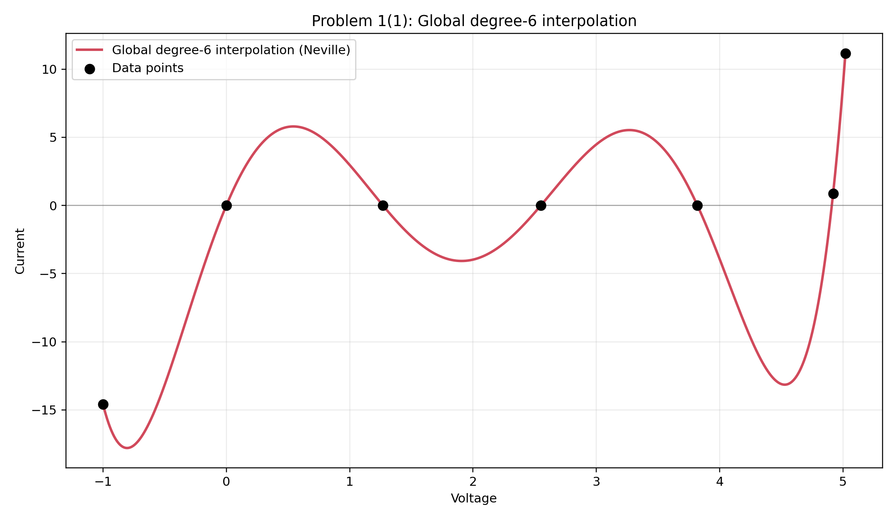
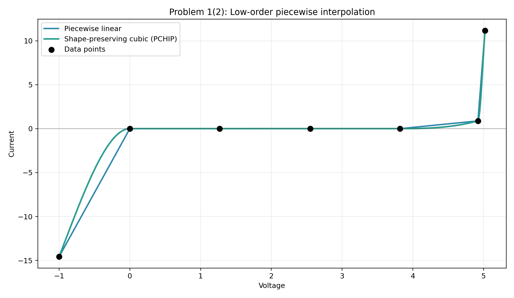
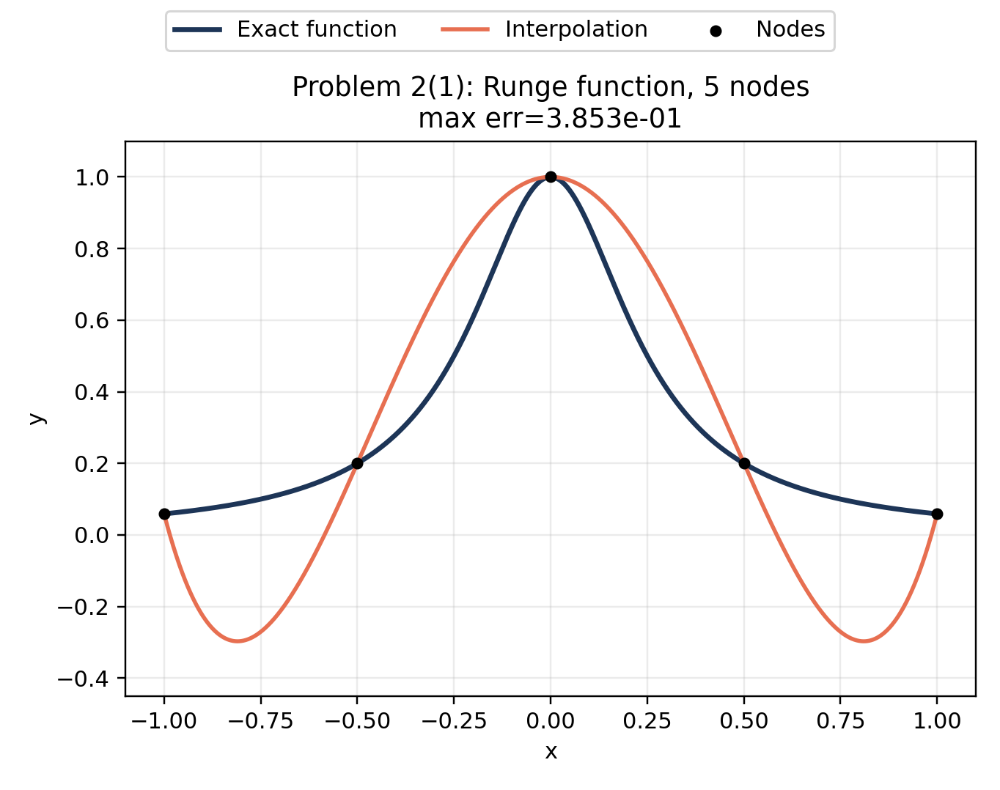
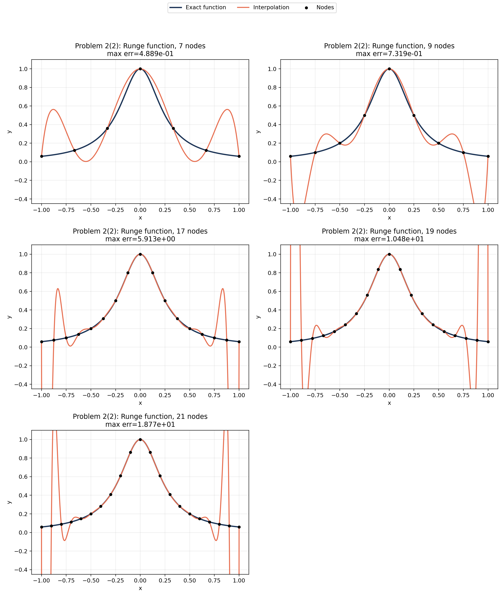
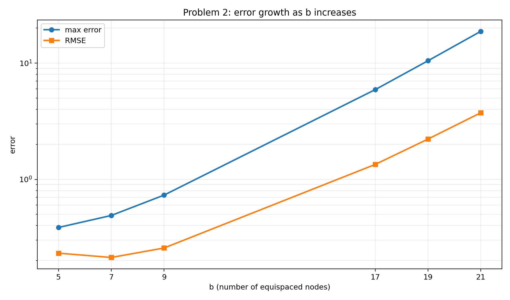
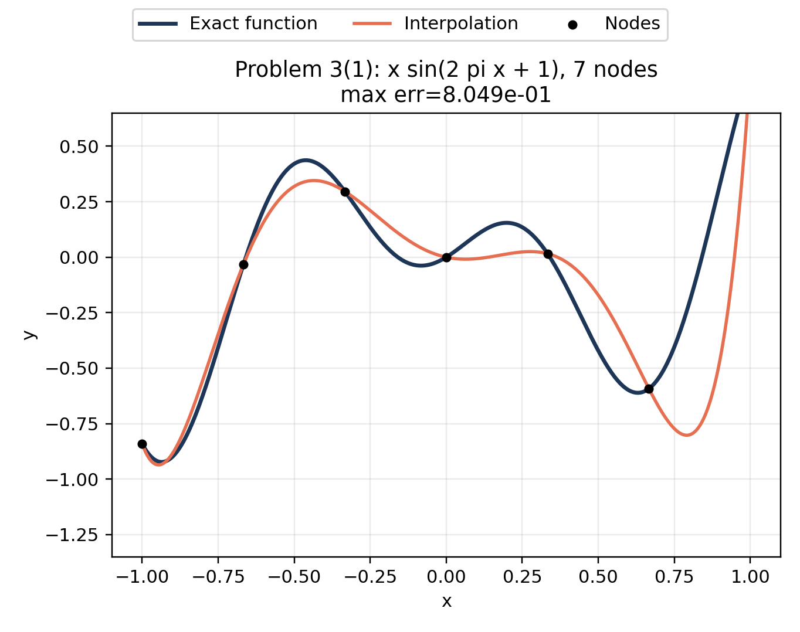
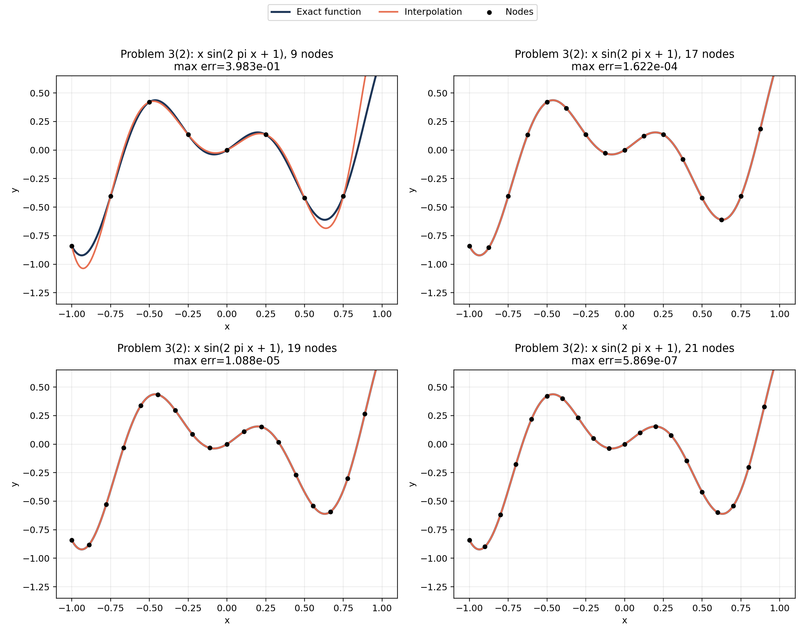
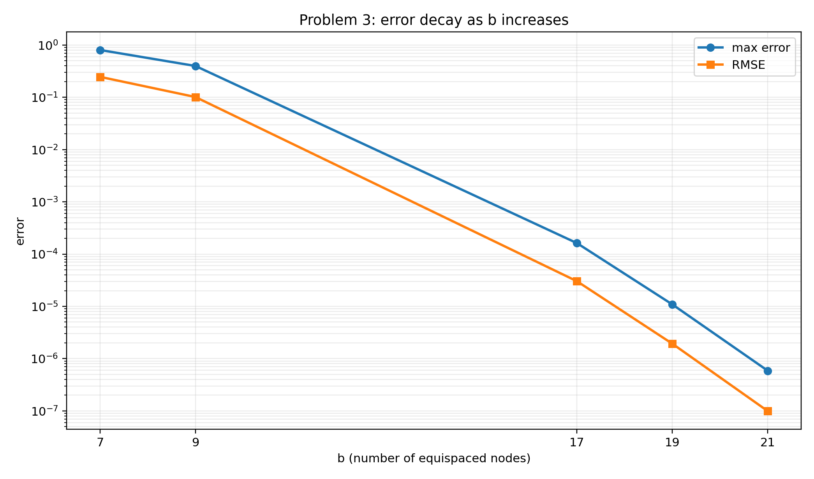

| { width=20% } |
|:--:|

| 项目 | 内容 |
|:--|:--|
| 项目目录 | `HW/05` |
| 提交编号 | `HW06` |
| 学生姓名 | 姜玥晟 |
| 报告主题 | 分段插值、Runge 现象、Neville 递推与高精度圆周率计算 |
| 实验环境 | `Python` 插值程序、`GMP`/GPU 高精度后端与 benchmark 数据 |

\newpage

\renewcommand{\contentsname}{目录}
\setcounter{tocdepth}{1}
\tableofcontents

\newpage

# I. 稳压二极管数据的分段插值 {-}

\phantomsection
\addcontentsline{toc}{section}{I. 稳压二极管数据的分段插值}

**Problem 1：稳压二极管数据的分段插值**

给定 7 个稳压二极管电压-电流数据点：

| Voltage | -1.00 | 0.00 | 1.27 | 2.55 | 3.82 | 4.92 | 5.02 |
|:--|--:|--:|--:|--:|--:|--:|--:|
| Current | -14.58 | 0.00 | 0.00 | 0.00 | 0.00 | 0.88 | 11.17 |

题目指出，用一个整体 6 次多项式将全部 7 点连接起来会在点间产生明显摆动，因此应改用由低阶多项式组成的分段插值曲线。

## Problem 1(1)：整体高阶插值的局限

相关脚本：

- [本地 scripts/problem1.py](../../scripts/problem1.py)
- [GitHub scripts/problem1.py](https://github.com/Void0312Aurora/computational-physics-homework-2026/blob/main/05/scripts/problem1.py)

### 待求问题

说明整体 6 次多项式为何不适合这组数据。

### 解决方式

本小问只构造经过全部 7 个数据点的整体 6 次插值多项式 $P_6(x)$。由于 7 个互异节点唯一确定一个次数不超过 6 的插值多项式，这里使用 Neville 递推在致密网格和各区间中点上求值：

```text
Input : sample points (x_i, y_i)
Output: global degree-6 interpolation values

build dense grid X
for each x in X do
    y_global <- Neville(all points, x)
end for

compute min, max and range of y_global
evaluate y_global at each interval midpoint
plot P_6(x) with the original data points
```

Neville 递推不需要显式解 Vandermonde 方程，但得到的是同一个全局 $P_6(x)$。本小问不引入分段线性或 PCHIP，因为它要检验的正是整体 6 次多项式自身的点间行为。

### 问题答案

整体 6 次插值结果见图 1。

{ width=94% }

表 1 给出整体 6 次插值与原始数据范围比较。

| 对象 | 最小电流 | 最大电流 | 振幅宽度 |
|:--|--:|--:|--:|
| 原始数据范围 | -14.580000 | 11.170000 | 25.750000 |
| 整体 6 次多项式 | -17.791266 | 11.170000 | 28.961266 |

代表性中点结果如表 2 所示。

| 中点电压 | 整体 6 次插值电流 |
|:--|--:|
| -0.500 | -13.161141 |
| 0.635 | 5.656649 |
| 1.910 | -4.070359 |
| 3.185 | 5.421118 |
| 4.370 | -11.866745 |
| 4.970 | 5.566334 |

由此可见，整体 6 次多项式在平台段附近产生了明显的虚假振荡。原始数据电流范围是 `25.75`，而 $P_6(x)$ 的范围扩大到 `28.961266`；在实际应接近零的平台区间，中点 `0.635`、`1.910`、`3.185` 处分别给出 `5.656649`、`-4.070359`、`5.421118`。因此，整体 6 次多项式虽然严格通过所有节点，但不适合表示这组二极管伏安曲线。

### 理解

本小问说明的是整体高阶插值的失败原因。稳压二极管数据同时包含平台段和陡升段，整体 $P_6(x)$ 被迫用一组全局系数同时满足所有节点，因此远端节点会影响平台段形状，产生不符合物理直觉的点间过冲。问题不在于它是否通过数据点，而在于通过数据点之间的连续曲线是否可信。

## Problem 1(2)：分段插值方案

相关脚本：

- [本地 scripts/problem1.py](../../scripts/problem1.py)
- [GitHub scripts/problem1.py](https://github.com/Void0312Aurora/computational-physics-homework-2026/blob/main/05/scripts/problem1.py)

### 待求问题

构造由低阶多项式组成的分段插值曲线，并给出比较。

### 解决方式

本小问不再使用整体 $P_6(x)$，而是在每个相邻节点区间内单独构造低阶多项式。本文采用两条分段曲线：分段线性作为最低阶保守方案，保形三次 Hermite/PCHIP 作为更平滑的低阶方案。

```text
Input : sample points (x_i, y_i)
Output: low-order piecewise interpolation curves

for each interval [x_i, x_{i+1}] do
    y_linear <- line segment through the two endpoints
    y_pchip <- cubic Hermite segment with shape-preserving slopes
end for

compute range and midpoint values of both piecewise curves
plot only the low-order piecewise curves with data points
```

对 PCHIP，记

$$
h_i=x_{i+1}-x_i,\qquad \delta_i=\frac{y_{i+1}-y_i}{h_i}.
$$

当相邻割线斜率 $\delta_{i-1}$ 与 $\delta_i$ 异号或其中一个为零时，令节点导数 $m_i=0$，避免在平台段人为制造过冲；当二者同号时，采用加权调和平均

$$
m_i=\frac{w_1+w_2}{w_1/\delta_{i-1}+w_2/\delta_i},\qquad
w_1=2h_i+h_{i-1},\quad w_2=h_i+2h_{i-1}.
$$

因此，低阶分段方案只受相邻或近邻节点控制，不会像整体 6 次多项式那样让远端节点共同影响平台段。

### 问题答案

低阶分段插值结果见图 2。两种分段方案都没有超过原始数据的电流范围，曲线最小值保持为 `-14.58`，最大值保持为 `11.17`。

{ width=94% }

| 分段方案 | 最小电流 | 最大电流 | 振幅宽度 |
|:--|--:|--:|--:|
| 分段线性 | -14.580000 | 11.170000 | 25.750000 |
| 保形三次 Hermite/PCHIP | -14.580000 | 11.170000 | 25.750000 |

代表性中点结果如下。

| 中点电压 | 分段线性 | 保形三次 |
|:--|--:|--:|
| -0.500 | -7.290000 | -4.664637 |
| 0.635 | 0.000000 | 0.000000 |
| 1.910 | 0.000000 | 0.000000 |
| 3.185 | 0.000000 | 0.000000 |
| 4.370 | 0.440000 | 0.139518 |
| 4.970 | 6.025000 | 4.659712 |

由表中结果可见，分段线性在每个区间内直接连接相邻数据点，因此完全不会越过相邻节点范围；PCHIP 在平台段中点 `0.635`、`1.910`、`3.185` 仍给出 `0.000000`，同时在陡升段给出更平滑的过渡，例如 `4.970` 处为 `4.659712`。因此，分段线性适合作为保守基线，PCHIP 是本题更平滑且仍保持形状约束的分段插值结果。

### 理解

本题的核心并不在于“多项式次数越高越好”，而在于数据本身具有平台段与陡升段并存的局部结构。整体高阶插值被迫用一组全局系数同时拟合所有区间，因此极易在中间区段产生不合理的过冲。分段低阶插值将全局约束转化为局部约束，更适合这类具有明显分段物理特征的数据；若希望曲线比折线更光滑，同时又不牺牲平台段的形状约束，PCHIP 是本题中更合适的折中方案。

# II. Runge 函数上的等距节点插值 {-}

\phantomsection
\addcontentsline{toc}{section}{II. Runge 函数上的等距节点插值}

**Problem 2：Runge 函数上的等距节点插值**

对 Runge 函数

$$
f(x)=\frac{1}{1+16x^2},
$$

在区间 `[-1,1]` 上取等距节点。

## Problem 2(1)：5 个节点的 5 次插值

相关脚本：

- [本地 scripts/problem2.py](../../scripts/problem2.py)
- [GitHub scripts/problem2.py](https://github.com/Void0312Aurora/computational-physics-homework-2026/blob/main/05/scripts/problem2.py)

### 待求问题

先从 `5` 个节点开始作图，并与精确函数进行比较。

### 解决方式

题面写作“`5` 个等距点、`5` 次多项式”，但从插值问题的良定性看，`m` 个互异节点唯一确定的是次数不超过 `m-1` 的插值多项式；若强行使用 `m` 次多项式，还需要额外约束才能唯一确定。因此本文按节点数解释题意，本小问的 `5` 个节点对应 4 次插值多项式。

本小问只计算 `5` 个等距节点的插值曲线和误差指标：

```text
Input : node count m = 5 and Runge function f(x)
Output: interpolation curve and error metrics

build 5 equispaced nodes on [-1, 1]
evaluate nodal data f(x_j)
for each query point x do
    y_neville <- Neville(nodes, values, x)
    y_bary <- barycentric_lagrange(nodes, values, x)
end for
compare interpolation with exact function
record max_abs_error and RMSE
```

其中 Neville 递推负责生成报告中的插值曲线，重心 Lagrange 用于一致性核对。两种方法应给出同一个 4 次插值多项式；若二者差异只在舍入误差量级，说明实现没有把插值公式本身写错。

### 问题答案

5 个节点的插值结果见图 3。

{ width=94% }

误差汇总见表 6。

| 节点数 | 插值次数 | 最大绝对误差 | RMSE |
|:--|--:|--:|--:|
| 5 | 4 | 3.853043e-01 | 2.316902e-01 |

由图和表可见，`5` 个节点时已经能够观察到端点附近的偏离，但整体振荡尚未失控。该 4 次插值多项式的最大绝对误差为 `3.853043e-01`，RMSE 为 `2.316902e-01`；Neville 与重心 Lagrange 的最大逐点差异仅为 `4.44e-16`，说明本小问的误差主要来自等距节点插值本身，而不是两种求值公式不一致。

### 理解

本小问作为基线实验，说明少量等距节点下 Runge 函数已经存在边界误差，但还没有出现后续高阶情形中的灾难性端点振荡。它为下一小问观察误差随节点数 `b` 增大而变化提供了基准。

## Problem 2(2)：更多节点的重复实验

相关脚本：

- [本地 scripts/problem2.py](../../scripts/problem2.py)
- [GitHub scripts/problem2.py](https://github.com/Void0312Aurora/computational-physics-homework-2026/blob/main/05/scripts/problem2.py)

### 待求问题

再对 `7,9,17,19,21` 个节点重复，观察等距高阶插值的表现。

### 解决方式

本小问沿用上一小问的良定解释：`m` 个等距节点生成次数不超过 `m-1` 的插值多项式。继续增加节点数的目的不是改变插值公式，而是观察等距高阶插值在 Runge 函数上的误差传播。

本小问只计算 `7,9,17,19,21` 个等距节点的插值曲线，以及误差随节点数 `b` 增大的曲线：

```text
Input : node counts M = [7, 9, 17, 19, 21]
Output: interpolation curves, error-vs-b curve and error table

for each m in M do
    build m equispaced nodes on [-1, 1]
    evaluate interpolation by Neville recursion
    evaluate interpolation by barycentric Lagrange
    compare interpolation with exact function
    record max_abs_error and RMSE
end for
```

其中 Neville 递推负责生成报告中的插值曲线，重心 Lagrange 用于一致性核对。本实验中两者最大逐点差异为 `1.96e-11`，远小于 Runge 现象导致的函数逼近误差。

### 问题答案

更多节点的插值结果见图 4。其中 `b` 表示等距节点数，最大误差与 RMSE 随 `b` 增大的变化见图 5。

{ width=94% }

{ width=90% }

误差汇总见表 7。

| 节点数 | 插值次数 | 最大绝对误差 | RMSE |
|:--|--:|--:|--:|
| 7 | 6 | 4.888773e-01 | 2.127766e-01 |
| 9 | 8 | 7.318894e-01 | 2.566409e-01 |
| 17 | 16 | 5.913241e+00 | 1.343585e+00 |
| 19 | 18 | 1.047845e+01 | 2.221318e+00 |
| 21 | 20 | 1.876836e+01 | 3.739459e+00 |

Neville 与重心 Lagrange 的逐点差异始终维持在机器精度附近，说明两种实现确实在求同一个插值多项式。继续增加节点数后，最大误差从 `4.888773e-01` 增至 `1.876836e+01`，RMSE 从 `2.127766e-01` 增至 `3.739459e+00`；图 5 直接显示误差指标随 `b` 增大而上升。

### 理解

本题展示了经典的 Runge 现象。问题的根源不在于插值公式本身，而在于“等距节点 + 高阶整体多项式”这一组合对边界非常敏感。对 `b` 个节点的插值多项式 $p_{b-1}$，误差可以写成

$$
f(x)-p_{b-1}(x)=\frac{f^{(b)}(\xi_x)}{b!}\prod_{j=0}^{b-1}(x-x_j).
$$

这个公式说明误差由两部分共同决定：节点多项式 $\omega_b(x)=\prod_j(x-x_j)$ 的放大形态，以及目标函数高阶导数的增长速度。Runge 函数

$$
f(x)=\frac{1}{1+16x^2}
$$

在复平面最近的奇点是 $x=\pm i/4$，距离实区间很近。按 Bernstein 椭圆估计，对应参数约为

$$
\rho=\frac14+\sqrt{1+\frac1{16}}\approx 1.2808,
$$

因此最优多项式逼近的解析衰减尺度只有 $\rho^{-b}\approx e^{-0.247b}$。等距插值的稳定性因子却会随 `b` 近似指数增长；当这个放大超过函数可逼近性的衰减时，整体误差就会随节点数增加而增大。

用表中 `b=7,9,17,19,21` 的数据作半对数拟合，

$$
E_\infty(b)\approx 7.36\times10^{-2}e^{0.261b},\qquad
E_2(b)\approx 4.45\times10^{-2}e^{0.206b},
$$

其中 $E_\infty$ 表示最大误差，$E_2$ 表示 RMSE。两个拟合的 $R^2$ 分别为 `0.9988` 和 `0.9932`。这意味着在本实验范围内，每增加 1 个等距节点，最大误差平均乘以 `1.30`，RMSE 平均乘以 `1.23`。所以 `21` 个节点的最大误差比 `5` 个节点大约 `48.7` 倍并不是偶然数值波动，而是“近奇点 + 等距高阶插值放大”共同作用的结果；若改用 Chebyshev 节点，这一放大会显著缓解。

# III. 振荡函数的等距节点插值 {-}

\phantomsection
\addcontentsline{toc}{section}{III. 振荡函数的等距节点插值}

**Problem 3：振荡函数的等距节点插值**

对函数

$$
f(x)=x\sin(2\pi x+1),
$$

在区间 `[-1,1]` 上取等距节点。

## Problem 3(1)：7 个节点的初始实验

相关脚本：

- [本地 scripts/problem3.py](../../scripts/problem3.py)
- [GitHub scripts/problem3.py](https://github.com/Void0312Aurora/computational-physics-homework-2026/blob/main/05/scripts/problem3.py)

### 待求问题

先从 `7` 个节点开始作图，比较插值曲线与精确函数。

### 解决方式

题面写作“`7` 个等距点、`7` 次多项式”，同样存在节点数与多项式次数的表述不一致。本文仍按插值良定性解释为 `m` 个节点对应次数不超过 `m-1` 的插值多项式，因此 `7` 个节点对应 6 次插值。本小问只计算 `7` 个等距节点的初始插值曲线和误差指标。

算法框架与第二题相同，只是目标函数发生变化：

```text
Input : node count m = 7 and target function f(x)
Output: interpolation curve and error metrics

generate 7 equispaced nodes on [-1, 1]
compute nodal values of f
evaluate interpolation by Neville recursion
evaluate interpolation by barycentric Lagrange
compare both interpolants with exact function
record max_abs_error and RMSE
```

### 问题答案

7 个节点的插值结果见图 6。

{ width=94% }

初始实验误差如下。

| 节点数 | 插值次数 | 最大绝对误差 | RMSE |
|:--|--:|--:|--:|
| 7 | 6 | 8.048997e-01 | 2.465718e-01 |

从 `7` 个节点的结果可以看出，初始插值已经能够大体跟随原函数，但边界附近仍存在较明显误差。该 6 次插值多项式的最大绝对误差为 `8.048997e-01`，RMSE 为 `2.465718e-01`；Neville 与重心 Lagrange 的最大逐点差异为 `5.55e-16`，说明误差主要来自插值逼近本身。

### 理解

本小问作为基线实验，说明 `7` 个等距节点下边界附近仍会出现可见偏差。它为下一小问观察误差随节点数 `b` 增大而变化提供了基准。

## Problem 3(2)：更多节点的重复实验

相关脚本：

- [本地 scripts/problem3.py](../../scripts/problem3.py)
- [GitHub scripts/problem3.py](https://github.com/Void0312Aurora/computational-physics-homework-2026/blob/main/05/scripts/problem3.py)

### 待求问题

再对 `9,17,19,21` 个节点重复，比较插值曲线与精确函数。

### 解决方式

本小问继续沿用 `m` 个节点对应 `m-1` 次插值的解释，并用 Neville 与重心 Lagrange 两种形式交叉核对。与 Runge 函数相比，本题目标函数在端点附近没有尖锐边界层，因此等距高阶插值的表现明显更好。这里的 `b` 表示等距节点数。

提交包中，结果文件按题目和 Project 分组：Problem 1、Problem 2、Problem 3 分别归档到 `results/problem1/`、`results/problem2/`、`results/problem3/`。Project 2 在 `results/project2/` 内继续拆分为 `output/`、`manifest/`、`benchmarks/` 与 `references/ycruncher/`，避免大量 `project2_*` 文件堆在同一层。

算法框架与第二题相同，只是目标函数发生变化：

```text
Input : node counts M and target function f(x)
Output: interpolation curves, error-vs-b curve and error table

for each m in M do
    generate m equispaced nodes on [-1, 1]
    compute nodal values of f
    evaluate interpolation by Neville recursion
    evaluate interpolation by barycentric Lagrange
    compare both interpolants with exact function
    record max_abs_error and RMSE
end for
```

### 问题答案

更多节点的插值结果见图 7。其中 `b` 表示等距节点数，最大误差与 RMSE 随 `b` 增大的变化见图 8。

{ width=94% }

{ width=90% }

更多节点的误差汇总如下。

| 节点数 | 插值次数 | 最大绝对误差 | RMSE |
|:--|--:|--:|--:|
| 9 | 8 | 3.983079e-01 | 1.014035e-01 |
| 17 | 16 | 1.621634e-04 | 3.026737e-05 |
| 19 | 18 | 1.088196e-05 | 1.927355e-06 |
| 21 | 20 | 5.868755e-07 | 9.914063e-08 |

继续增加节点数后，插值误差随次数提高而明显下降。`21` 个节点时，最大绝对误差已降至 $5.87\times 10^{-7}$，相对于 `7` 个节点约缩小 `1.37e6` 倍；RMSE 从 `2.465718e-01` 降至 `9.914063e-08`，约缩小 `2.49e6` 倍。图 8 直接显示误差指标随 `b` 增大而下降。

### 理解

这一结果与第二题形成鲜明对照。同样使用

$$
f(x)-p_{b-1}(x)=\frac{f^{(b)}(\xi_x)}{b!}\omega_b(x)
$$

作为误差模型，差别主要来自目标函数。$x\sin(2\pi x+1)$ 是整函数，在复平面没有像 Runge 函数 $\pm i/4$ 那样贴近实轴的极点；它的高阶导数主要由三角函数频率 $2\pi$ 控制，并被插值误差公式中的 $b!$ 分母抵消。虽然等距节点仍然带来一定放大，但函数本身的可逼近性更强，误差衰减项压过了节点放大项。

对 `b=7,9,17,19,21` 的误差作同样的半对数拟合得到

$$
E_\infty(b)\approx 1.94\times10^{3}e^{-1.007b},\qquad
E_2(b)\approx 7.52\times10^{2}e^{-1.048b},
$$

对应 $R^2$ 分别为 `0.9864` 和 `0.9888`。负指数系数给出了定量解释：每增加 1 个节点，最大误差平均约乘以 `0.365`，RMSE 平均约乘以 `0.351`。实际高阶段下降还更快，例如最大误差从 `17` 到 `19` 个节点约乘以 `0.067`，从 `19` 到 `21` 个节点约乘以 `0.054`。因此第三题不是“等距节点一定可靠”，而是该目标函数在本区间内足够平滑、没有近实轴奇点，使高阶多项式插值的逼近收益超过了等距节点的稳定性损失。

# IV. Project 2：高精度圆周率计算 {-}

\phantomsection
\addcontentsline{toc}{section}{IV. Project 2：高精度圆周率计算}

**Problem 4：Project 2：高精度圆周率计算**

Project 2 要求在笔记本电脑上计算 $\pi$，精确到小数点后至少 `10000` 位，并尽量兼顾两个目标：

- 计算速度；
- 可达到的位数规模。

## Problem 4(1)：计算速度

相关脚本：

- [本地 scripts/problem4_project2.py](../../scripts/problem4_project2.py)
- [GitHub scripts/problem4_project2.py](https://github.com/Void0312Aurora/computational-physics-homework-2026/blob/main/05/scripts/problem4_project2.py)

### 待求问题

尽量提高计算速度。

### 解决方式

主计算路线采用 Chudnovsky 公式与 binary splitting：

```text
Input : target decimal digits d
Output: decimal expansion of pi and benchmark summary

N <- number of Chudnovsky terms required by d
(P, Q, T) <- binary_split(0, N)
s <- guard digits
X <- isqrt(10005 * 10^(2(d+s)))
pi_scaled <- floor(426880 * X * Q / T)
truncate guard digits and format decimal string

benchmark multiple backends:
    optimized CPU GMP route
    GPU hybrid route
    y-cruncher reference route
```

速度比较分成两类：一类是自研路线在 `10,000,000` 位上的同口径矩阵，另一类是 y-cruncher 在 `100M/1B/2.5B` 位上的成熟工具链参考。二者目标位数不同，因此不把它们当作严格同规模对照；但它们共同回答“自研路线能达到什么速度”和“成熟工具链大约是什么量级”。

### 问题答案

若比较自研完整流水线，`gpu_hybrid_merge_fast_auto` 在 `10,000,000` 位上达到约 `5.02e6 digits/s`，相对 `cpp_gmp_openmp` 的 `2.61e6 digits/s` 约快 `1.92` 倍；作为成熟工具链参考，`y-cruncher` 在 `100,000,000` 位上达到约 `4.71e7 digits/s`。

\newpage

| 路线 | 目标位数 | 用时 / s | 吞吐量 / digits/s |
|:--|--:|--:|--:|
| Python+GMP | 10,000,000 | 4.754297 | 2.10e6 |
| C++ GMP | 10,000,000 | 3.826070 | 2.61e6 |
| C++ levelpool | 10,000,000 | 3.822220 | 2.62e6 |
| GPU hybrid | 10,000,000 | 1.991292 | 5.02e6 |
| y-cruncher | 100,000,000 | 2.124 | 4.71e7 |
| y-cruncher | 1,000,000,000 | 26.042 | 3.84e7 |
| y-cruncher | 2,500,000,000 | 73.693 | 3.39e7 |

表中自研路线均通过前缀核对；y-cruncher 三行分别有 `Good through 100M`、`Good through 1B` 与 `Good through 2.5B` 的历史 validation 记录。

### 理解

Project 2 的速度问题不能只看 Chudnovsky 公式“每项约增加 14 位十进制有效数字”这一点。对 $d$ 位计算，项数近似为 $N\simeq d/14$，例如 `10,000,000` 位需要约 `714,290` 项，`100,000,000` 位需要约 `7,142,861` 项。真正昂贵的部分不是逐项代入公式，而是随着位数增长而迅速变大的整数乘法、归并、平方根和最终除法。binary splitting 把级数写成三元组 $(P,Q,T)$ 的树形合并，避免在每一项上做高精度除法，并把大量工作转化为可并行的大整数乘法；因此它是本题能进入千万位乃至亿位规模的基础。

从 CPU 路线看，`cpp_gmp_openmp` 与 `cpp_gmp_levelpool` 在 `10,000,000` 位上分别为 `2.61e6` 与 `2.62e6 digits/s`，两者几乎相同。这说明在当前规模下，单纯改变任务池组织方式已经不是主要矛盾；GMP 大整数乘法、树形归并和最终整除才是端到端时间的主体。Python+GMP 路线慢于 C++ 路线，也说明解释器调度和 Python 层对象组织会带来额外开销，但其数量级仍然由底层 GMP 支撑。

GPU hybrid 的意义在于把树形归并和最终大整数乘法中的一部分转到 GPU FFT 路线。表中 `10,000,000` 位时它相对 C++ GMP 约快 `1.92` 倍；在额外规模扫描中，`20M/50M/100M` 位的 `hybrid-fast-auto` 吞吐量约为 `6.34e6/6.97e6/6.92e6 digits/s`，而对应 C++ CPU 路线约为 `2.02e6/1.73e6/1.53e6 digits/s`，加速比随位数增大从约 `3.15` 倍提高到约 `4.52` 倍。这一趋势符合大整数乘法的特征：规模越大，FFT 类乘法和 GPU 并行吞吐越容易摊薄启动、传输和调度成本。

但是，GPU kernel 的峰值不能直接等同于圆周率端到端速度。单独的 GPU FFT 精确乘法在 `100M` 量级可达到约 `1.49e8 digits/s`，这是乘法内核吞吐信号；完整流水线还要做 chunk 生成、host-device 转换、树形归并、平方根、最终除法和十进制格式化。已有 profiling 中 `100M` 运行的时间被分散到 partial generation、sqrt、merge tree、final division 等阶段，实际 GPU kernel 只占总流程的一部分。因此本题不能把“某个乘法 kernel 很快”写成“整个 $\pi$ 计算同样快”，而要以完整输出通过前缀或 manifest 校验的端到端时间为准。

y-cruncher 的结果则给出成熟工程实现的参考。它在 `100M` 位上的 wall-time 吞吐约为 `4.71e7 digits/s`，显著高于当前自研 hybrid 路线。这并不否定自研路线的有效性，而是说明 y-cruncher 在算法选择、汇编级乘法、内存调度、线程池和 NUMA/缓存利用上已经做了大量专门优化。自研路线的结论应表述为：已实现可复核的千万到亿位级计算，并在 GPU hybrid 下取得相对 CPU GMP 的明确加速；若以绝对最快为目标，成熟专用工具仍明显领先。

## Problem 4(2)：已验证达到的位数规模

相关脚本：

- [本地 scripts/problem4_project2.py](../../scripts/problem4_project2.py)
- [GitHub scripts/problem4_project2.py](https://github.com/Void0312Aurora/computational-physics-homework-2026/blob/main/05/scripts/problem4_project2.py)

### 待求问题

尽量提高可达到的位数规模，且至少达到小数点后 `10000` 位。本文只报告已经生成并验证的自研输出规模，不声称完成了位数极限测试。

### 解决方式

位数规模的验证不再强调各后端速度，也不把历史大位数记录解释为当前自研代码的极限；本小问只确认提交包中已有输出是否确实超过题目要求。主计算路线仍采用 Chudnovsky 公式与 binary splitting：

```text
Input : target decimal digits d
Output: decimal expansion of pi and benchmark summary

N <- number of Chudnovsky terms required by d
(P, Q, T) <- binary_split(0, N)
s <- guard digits
X <- isqrt(10005 * 10^(2(d+s)))
pi_scaled <- floor(426880 * X * Q / T)
truncate guard digits and format decimal string

validate output:
    write 100,000,000 decimal digits
    compute byte size and file fingerprint
    record first, last, fixed-offset and deterministic sample windows
    compare historical y-cruncher validation logs
```

完整高精度结果以 `100M` 位十进制文本保存，提交包中放在 Project 2 的 `output/` 子目录；复核入口 `make project2_manifest` 只读取已有文件，并把 sidecar 写入 `manifest/`。该入口不触发重算；历史 y-cruncher benchmark、日志与 validation 文件放在 `references/ycruncher/` 下，只作为外部工具参考，不作为自研代码可达极限的证据。

### 问题答案

精度方面，题目所要求的 `10000` 位已经被大幅超越，本次报告已经验证到 `100000000` 位完整十进制输出，是题目最低要求的 `10000` 倍。这个数值是本次自研结果的已验证达到规模，也是当前报告能够给出的保守下界；它不是位数极限。

### 理解

这一小问的核心不是“程序能打印很多字符”，而是这些字符是否能证明为同一次高精度计算的有效输出。题目最低要求是小数点后 `10000` 位，当前提交的自研输出为小数点后 `100000000` 位，规模上超过最低要求 `10000` 倍。文件大小 `100000003 bytes` 与格式也相互一致：`3.` 占 2 字节，后面有 `100000000` 个小数位，最后换行占 1 字节。这个简单的大小关系可以排除明显截断或多余内容，但还不足以证明内容正确。

因此报告使用 manifest 作为结果可信性的主证据。manifest 中的文件哈希是机器校验用的文件指纹，不是人工阅读的数值结论；它用于固定完整文件的逐字节内容，便于之后确认提交包里的大文件没有被替换或截断。首段、末段、25M、50M、75M 等固定偏移窗口说明文件不是只在开头正确；确定性抽样窗口进一步降低了“中间大段被替换但未被发现”的风险。前 `69` 位匹配圆周率已知前缀只是轻量 sanity check，不能单独证明 `100M` 位全正确；它必须和文件指纹、窗口抽样以及外部 validation 记录结合使用。

因此，本小问的结论应是“已验证自研输出达到 `100M` 位”，而不是“已经测得本机或本程序的位数极限”。真正的极限规模需要专门设计递增位数实验，记录每个目标位数的成功、失败、内存峰值、运行时间和失败原因；当前报告没有做这样的极限搜索。Chudnovsky 公式的收敛速度本身并不是主要限制，实际限制来自大整数乘法、binary splitting 树中最大操作数、内存峰值、I/O 和验证成本。由于缺少完整的递增位数失败边界，`100M` 只能作为当前自研结果的保守可达下界。

y-cruncher 的 `1B` 与 `2.5B` validation 记录只能说明成熟工具链在本机环境中有过更大规模参考结果，不能替代自研代码的位数测试。报告中把二者分开，是为了避免把外部工具记录混入自研结果的证据链。默认 manifest 目标只读取既有输出并生成哈希和抽样证据，不触发大位数重算，这样既保留了可复核性，也避免把高成本实验隐藏在普通构建流程中。
