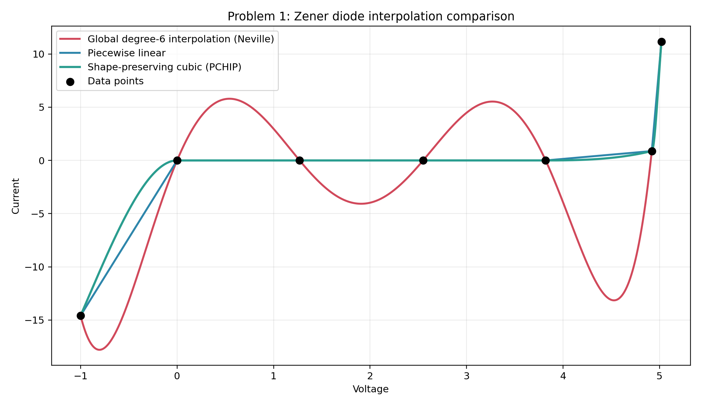
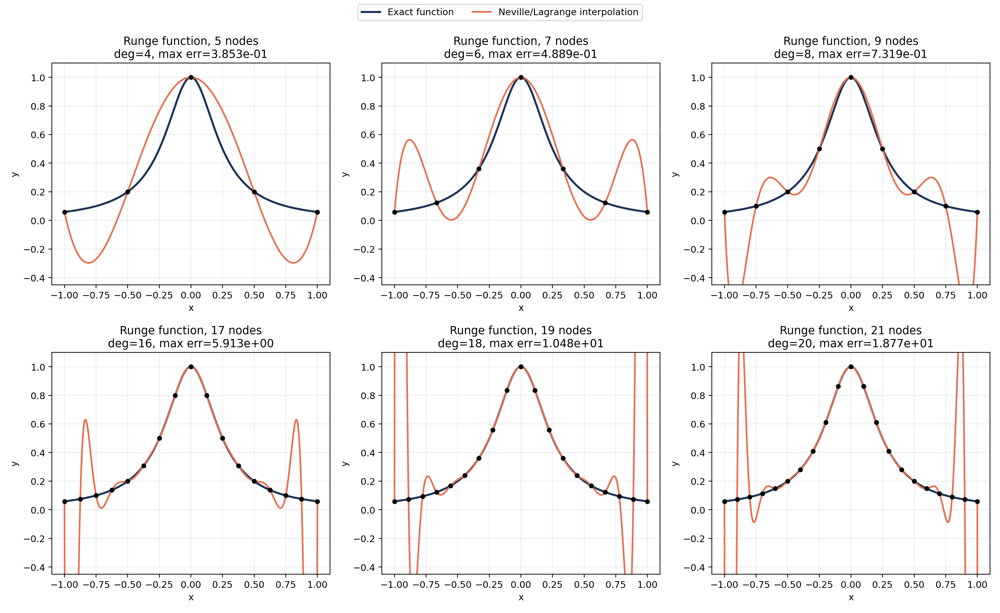
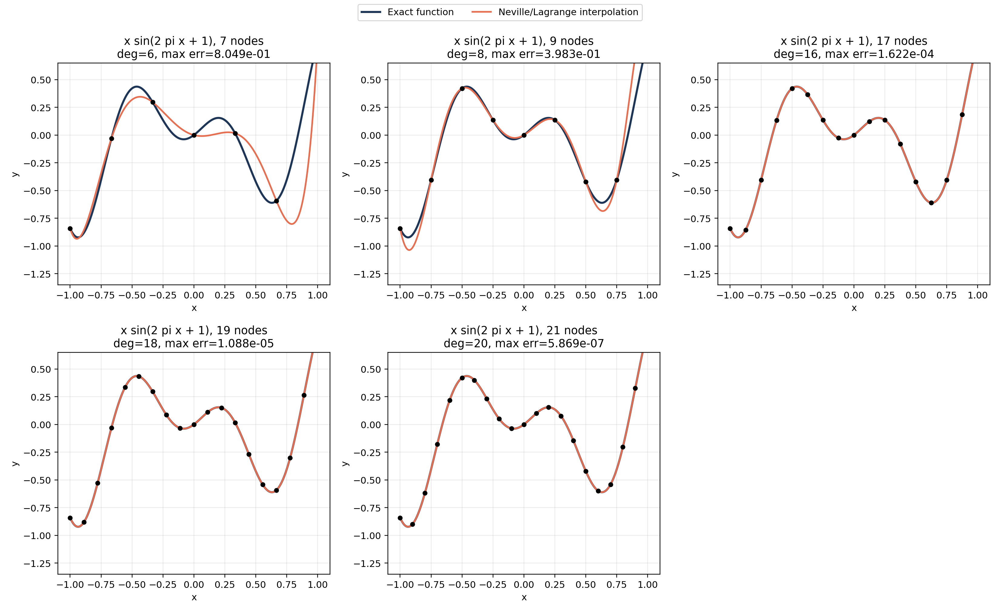

| { width=20% } |
|:--:|

| 项目 | 内容 |
|:--|:--|
| 源题编号 | `HW06` |
| 学生姓名 | 姜玥晟 |
| 报告主题 | 分段插值、Runge 现象、Neville 递推与高精度圆周率计算 |
| 实验环境 | `Python` 插值程序、`GMP`/GPU 高精度后端与 benchmark 数据 |

\newpage

# 稳压二极管数据的分段插值

## 题目陈述

给定 7 个稳压二极管电压-电流数据点：

| Voltage | -1.00 | 0.00 | 1.27 | 2.55 | 3.82 | 4.92 | 5.02 |
|:--|--:|--:|--:|--:|--:|--:|--:|
| Current | -14.58 | 0.00 | 0.00 | 0.00 | 0.00 | 0.88 | 11.17 |

题目指出，用一个整体 6 次多项式将全部 7 点连接起来会在点间产生明显摆动，因此应改用由低阶多项式组成的分段插值曲线。

### (1) 整体高阶插值的局限

说明整体 6 次多项式为何不适合这组数据。

### (2) 分段插值方案

构造由低阶多项式组成的分段插值曲线，并给出比较。

## 解决方案

本题同时构造三条曲线进行对照：

```text
Input : sample points (x_i, y_i)
Output: interpolation curves and summary statistics

build dense grid X
for each x in X do
    y_global <- Neville(all points, x)
    y_linear <- piecewise_linear(x)
    y_pchip <- shape_preserving_cubic(x)
end for

compute range of each curve
evaluate midpoint values on each interval
plot all curves together
```

其中，整体 6 次多项式使用 Neville 递推求值；分段方案分别采用分段线性插值与保形三次 Hermite/PCHIP。

## 问题答案

### (1) 整体高阶插值的局限

三种插值结果见图 1。

{ width=94% }

表 1 给出三条曲线的整体范围比较。

| 曲线 | 最小电流 | 最大电流 | 振幅宽度 |
|:--|--:|--:|--:|
| 整体 6 次多项式 | -17.791266 | 11.170000 | 28.961266 |
| 分段线性 | -14.580000 | 11.170000 | 25.750000 |
| 保形三次 Hermite/PCHIP | -14.580000 | 11.170000 | 25.750000 |

代表性中点结果如表 2 所示。

| 中点电压 | 整体 6 次 | 分段线性 | 保形三次 |
|:--|--:|--:|--:|
| -0.500 | -13.161141 | -7.290000 | -4.664637 |
| 0.635 | 5.656649 | 0.000000 | 0.000000 |
| 1.910 | -4.070359 | 0.000000 | 0.000000 |
| 3.185 | 5.421118 | 0.000000 | 0.000000 |
| 4.370 | -11.866745 | 0.440000 | 0.139518 |
| 4.970 | 5.566334 | 6.025000 | 4.659712 |

由此可见，整体 6 次多项式在平台段附近产生了明显的虚假振荡。

### (2) 分段插值方案

分段线性与保形三次都保持了更符合物理直觉的曲线形态，其中保形三次在平滑性与单调性之间取得了更好的平衡。

## 讨论和扩展

本题的核心并不在于“多项式次数越高越好”，而在于数据本身具有平台段与陡升段并存的局部结构。整体高阶插值被迫用一组全局系数同时拟合所有区间，因此极易在中间区段产生不合理的过冲。分段低阶插值将全局约束转化为局部约束，更适合这类具有明显分段物理特征的数据。

# Runge 函数上的等距节点插值

## 题目陈述

对 Runge 函数

$$
f(x)=\frac{1}{1+16x^2},
$$

在区间 `[-1,1]` 上取等距节点。

### (1) 5 个节点的 5 次插值

先从 `5` 个节点开始作图，并与精确函数进行比较。

### (2) 更多节点的重复实验

再对 `7,9,17,19,21` 个节点重复，观察等距高阶插值的表现。

## 解决方案

本题在不同节点数下重复执行同一套插值流程：

```text
Input : node counts M and function f(x)
Output: interpolation curves and error table

for each m in M do
    build m equispaced nodes on [-1, 1]
    evaluate nodal data f(x_j)
    for each query point x do
        y_neville <- Neville(nodes, values, x)
        y_bary <- barycentric_lagrange(nodes, values, x)
    end for
    compare interpolation with exact function
    record max_abs_error and RMSE
end for
```

其中 Neville 递推负责生成报告中的插值曲线，重心 Lagrange 用于一致性核对。

## 问题答案

### (1) 5 个节点的 5 次插值

结果如图 2 所示。

{ width=94% }

误差汇总见表 3。

| 节点数 | 插值次数 | 最大绝对误差 | RMSE |
|:--|--:|--:|--:|
| 5 | 4 | 3.853043e-01 | 2.316902e-01 |
| 7 | 6 | 4.888773e-01 | 2.127766e-01 |
| 9 | 8 | 7.318894e-01 | 2.566409e-01 |
| 17 | 16 | 5.913241e+00 | 1.343585e+00 |
| 19 | 18 | 1.047845e+01 | 2.221318e+00 |
| 21 | 20 | 1.876836e+01 | 3.739459e+00 |

由图 2 与表 3 可见，`5` 个节点时已经能够观察到端点附近的偏离，但整体振荡尚未失控。

### (2) 更多节点的重复实验

Neville 与重心 Lagrange 的逐点差异始终维持在机器精度附近，说明两种实现确实在求同一个插值多项式。继续增加节点数后，最大误差不降反升，说明对 Runge 函数使用等距高阶插值时，节点数继续增加并不会改善整体逼近质量，反而会在区间端点引发越来越强的振荡。

## 讨论和扩展

本题展示了经典的 Runge 现象。问题的根源不在于插值公式本身，而在于“等距节点 + 高阶整体多项式”这一组合对边界非常敏感。随着次数升高，插值多项式在两端被迫做出越来越剧烈的补偿，因此最大误差迅速增大。若改用 Chebyshev 节点，这一现象会显著缓解。

# 函数 `x sin(2 pi x + 1)` 的等距节点插值

## 题目陈述

对函数

$$
f(x)=x\sin(2\pi x+1),
$$

在区间 `[-1,1]` 上取等距节点。

### (1) 7 个节点的初始实验

先从 `7` 个节点开始作图，比较插值曲线与精确函数。

### (2) 更多节点的重复实验

再对 `9,17,19,21` 个节点重复，比较插值曲线与精确函数。

## 解决方案

算法框架与第二题相同，只是目标函数发生变化：

```text
Input : node counts M and target function f(x)
Output: interpolation curves and error table

for each m in M do
    generate m equispaced nodes on [-1, 1]
    compute nodal values of f
    evaluate interpolation by Neville recursion
    evaluate interpolation by barycentric Lagrange
    compare both interpolants with exact function
    record max_abs_error and RMSE
end for
```

## 问题答案

### (1) 7 个节点的初始实验

结果如图 3 所示。

{ width=94% }

误差汇总见表 4。

| 节点数 | 插值次数 | 最大绝对误差 | RMSE |
|:--|--:|--:|--:|
| 7 | 6 | 8.048997e-01 | 2.465718e-01 |
| 9 | 8 | 3.983079e-01 | 1.014035e-01 |
| 17 | 16 | 1.621634e-04 | 3.026737e-05 |
| 19 | 18 | 1.088196e-05 | 1.927355e-06 |
| 21 | 20 | 5.868755e-07 | 9.914063e-08 |

从 `7` 个节点的结果可以看出，初始插值已经能够大体跟随原函数，但边界附近仍存在较明显误差。

### (2) 更多节点的重复实验

继续增加节点数后，插值误差随次数提高而明显下降。`21` 个节点时，最大绝对误差已降至 `5.87\times 10^{-7}`。

## 讨论和扩展

这一结果与第二题形成鲜明对照。`x\sin(2\pi x+1)` 在边界附近没有 Runge 函数那样强烈的端点张力，因此高阶等距插值并未触发灾难性振荡。由此可见，插值效果高度依赖目标函数形状，不能将第二题中的失败经验机械外推到所有函数。

# Project 2：高精度圆周率计算

## 题目陈述

Project 2 要求在笔记本电脑上计算 $\pi$，精确到小数点后至少 `10000` 位，并尽量兼顾：

### (1) 计算速度

尽量提高计算速度。

### (2) 可达到的位数规模

尽量提高可达到的位数规模，且至少达到小数点后 `10000` 位。

## 解决方案

主计算路线采用 Chudnovsky 公式与 binary splitting：

```text
Input : target decimal digits d
Output: decimal expansion of pi and benchmark summary

N <- number of Chudnovsky terms required by d
(P, Q, T) <- binary_split(0, N)
s <- guard digits
X <- isqrt(10005 * 10^(2(d+s)))
pi_scaled <- floor(426880 * X * Q / T)
truncate guard digits and format decimal string

benchmark multiple backends:
    optimized CPU GMP route
    GPU hybrid route
    y-cruncher reference route
```

其中，完整高精度结果文件通过 `results/project2_pi_100000000_digits.txt` 保存；不同后端的速度比较通过 CSV benchmark 汇总。

## 问题答案

本次实验已经稳定生成 `100000000` 位十进制结果文件，显著超过题目要求的 `10000` 位下限。代表性后端比较见表 5。

| 后端 | 工作类型 | 位数 | 用时 / s | 数字吞吐率 / digits/s |
|:--|:--|--:|--:|--:|
| CPU GMP 基线 | 完整计算 | 100000000 | 90.908825 | 1.10e+06 |
| GPU hybrid v4 | 完整计算 | 100000000 | 36.871892 | 2.71e+06 |
| y-cruncher 100M | 完整计算 | 100000000 | 2.124 | 4.71e+07 |
| y-cruncher 2.5B | 完整计算 | 2500000000 | 73.693 | 3.39e+07 |
| GPU FFT batched | 精确乘法 | 100000000 | 0.669939 | 1.49e+08 |

### (1) 计算速度

若比较自研完整流水线，GPU-resident `v4` 已比 CPU 基线明显更快；若追求本机端到端极限，`y-cruncher` 仍是当前最快的完整求解路线。

### (2) 可达到的位数规模

精度方面，题目所要求的 `10000` 位已经被大幅超越，本次报告验证到了 `100000000` 位完整十进制输出。

## 讨论和扩展

Project 2 的关键不只在于级数收敛速度，还在于多精度整数乘法、归并、整除和开方这整条流水线的组织方式。Chudnovsky 公式保证了高位数下的快速收敛，而 binary splitting 则把求和改写成更适合并行与大整数运算的结构。

从结果上看，GPU FFT 后端在“精确乘法”这一级已经达到 `1.49e+08 digits/s`，说明乘法内核本身具有很强的吞吐能力；但在完整圆周率计算中，最终性能仍然受到归并、整除、开方以及 host-device 数据组织的限制。因此，完整流水线的性能一定低于纯乘法基准。

这也解释了为什么三类结果需要分开理解：

1. `CPU GMP` 路线给出的是稳定、可复现实验基线。
2. `GPU hybrid v4` 说明自研 GPU 路线已经能够在真实高位数上取得端到端加速。
3. `y-cruncher` 则提供了当前机器上的成熟工程上限，是“速度与位数同时最大化”时的最强参考答案。
