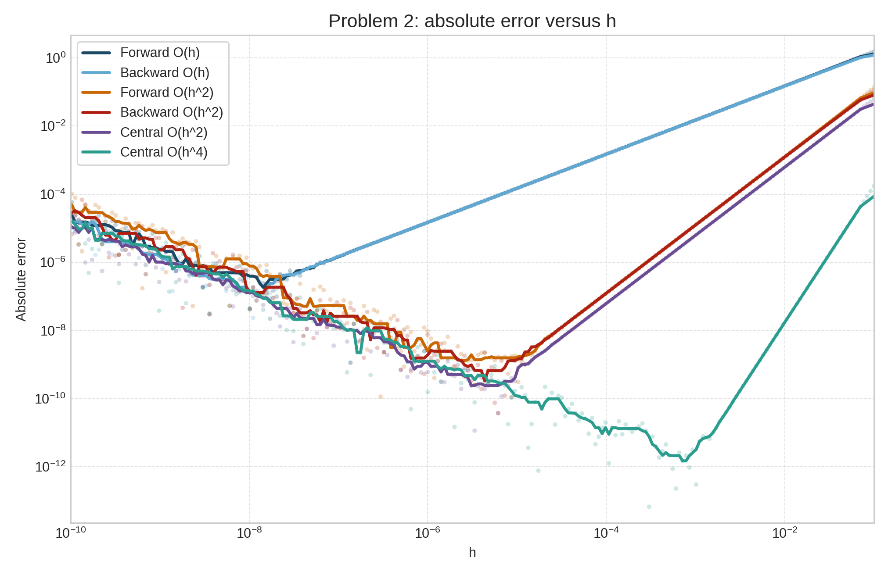
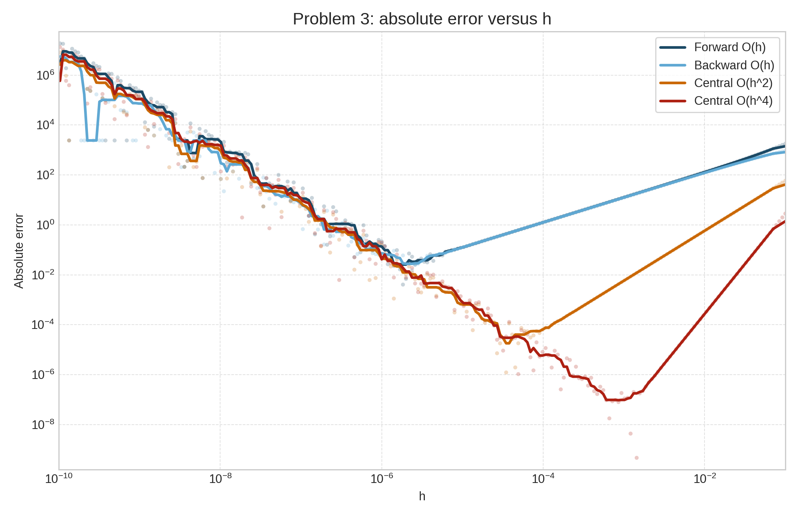
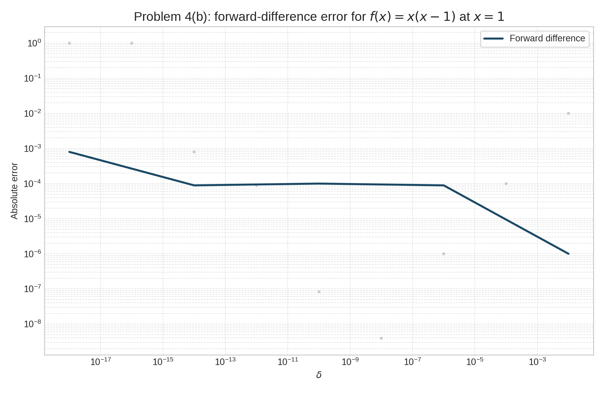
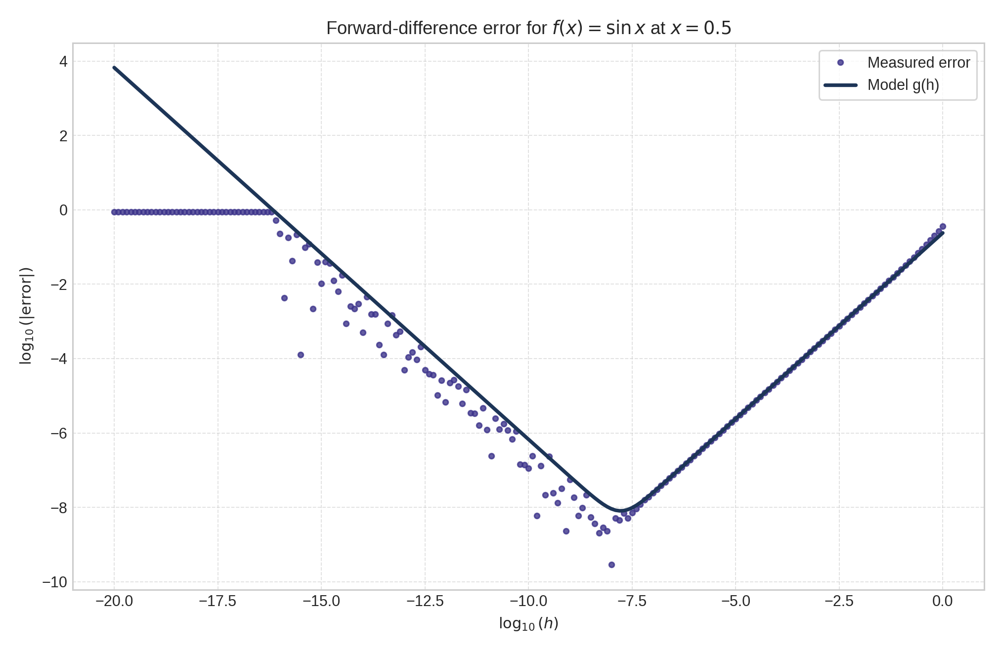
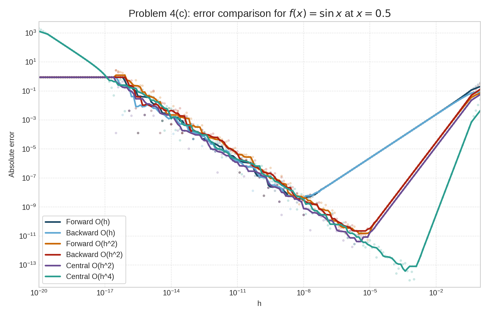

| { width=20% } |
|:--:|

| 项目 | 内容 |
|:--|:--|
| 源题编号 | `HW07` |
| 学生姓名 | 姜玥晟 |
| 报告主题 | 有限差分公式推导、数值微分误差比较与最佳步长分析 |
| 实验环境 | `Python 3.13.5`、`sympy`、`numpy`、`matplotlib`、`pypandoc` |

\newpage

# I. 有限差分公式推导 {-}

**Problem 1：有限差分公式推导**

Problem 1 要求推导函数 $y=f(x)$ 的高阶有限差分公式。

## Problem 1(a)

相关脚本：

- [本地 scripts/problem1.py](../../scripts/problem1.py)
- [GitHub scripts/problem1.py](https://github.com/Void0312Aurora/computational-physics-homework-2026/blob/main/06/scripts/problem1.py)

### 待求问题

推导二阶导数的向前差分、向后差分与中心差分公式。

### 解决方式

对二阶导数，先取向前模板

$$
D_{2,+}f_i=\frac{a f_i+b f_{i+1}+c f_{i+2}}{h^2}.
$$

将

$$
f_{i+1}=f_i+h f_i'+\frac{h^2}{2}f_i''+\frac{h^3}{6}f_i^{(3)}+O(h^4),
$$

$$
f_{i+2}=f_i+2h f_i'+2h^2f_i''+\frac{4h^3}{3}f_i^{(3)}+O(h^4)
$$

代入，比较 $f_i$、$f_i'$ 与 $f_i''$ 的系数，得到

$$
\begin{cases}
a+b+c=0,\\
b+2c=0,\\
\dfrac{b}{2}+2c=1.
\end{cases}
$$

解得

$$
a=1,\qquad b=-2,\qquad c=1,
$$

从而

$$
f''(x_i)=\frac{f_i-2f_{i+1}+f_{i+2}}{h^2}+O(h).
$$

向后模板

$$
D_{2,-}f_i=\frac{a f_{i-2}+b f_{i-1}+c f_i}{h^2}
$$

完全类似，或由上式把节点关于 $x_i$ 镜像过去即可，得到

$$
f''(x_i)=\frac{f_{i-2}-2f_{i-1}+f_i}{h^2}+O(h).
$$

对中心模板取

$$
D_{2,c}f_i=\frac{a f_{i-1}+b f_i+c f_{i+1}}{h^2}.
$$

由

$$
f_{i\pm1}=f_i\pm h f_i'+\frac{h^2}{2}f_i''\pm\frac{h^3}{6}f_i^{(3)}+O(h^4)
$$

得到方程组

$$
\begin{cases}
a+b+c=0,\\
-a+c=0,\\
\dfrac{a+c}{2}=1.
\end{cases}
$$

故

$$
a=1,\qquad b=-2,\qquad c=1.
$$

由于左右两侧的奇次项自动抵消，故中心公式提升为

$$
f''(x_i)=\frac{f_{i-1}-2f_i+f_{i+1}}{h^2}+O(h^2).
$$

### 问题答案

二阶导数公式为

$$
f''(x_i)=\frac{f_i-2f_{i+1}+f_{i+2}}{h^2}+O(h),
$$

$$
f''(x_i)=\frac{f_{i-2}-2f_{i-1}+f_i}{h^2}+O(h),
$$

$$
f''(x_i)=\frac{f_{i-1}-2f_i+f_{i+1}}{h^2}+O(h^2).
$$

### 分析

本题体现了有限差分模板的一个基本规律：向前与向后模板只利用单侧点，因此在最小模板下通常只能达到 $O(h)$ 的截断误差；中心模板具有对称性，奇次误差项会自动抵消，因此相同宽度下往往可以提升到 $O(h^2)$。这也是后续数值实验中中心差分整体优于单侧差分的根本原因。

## Problem 1(b)

相关脚本：

- [本地 scripts/problem1.py](../../scripts/problem1.py)
- [GitHub scripts/problem1.py](https://github.com/Void0312Aurora/computational-physics-homework-2026/blob/main/06/scripts/problem1.py)

### 待求问题

推导三阶导数的向前差分、向后差分与中心差分公式。

### 解决方式

对三阶及以上的向前、向后公式，可直接从重复差分算子得到。定义

$$
\Delta_h f_i=f_{i+1}-f_i,\qquad \nabla_h f_i=f_i-f_{i-1}.
$$

重复应用后有

$$
\Delta_h^r f_i=\sum_{k=0}^{r}(-1)^{r-k}\binom{r}{k}f_{i+k},
$$

$$
\nabla_h^r f_i=\sum_{k=0}^{r}(-1)^k\binom{r}{k}f_{i-k}.
$$

把 Taylor 展开代入即可验证

$$
\Delta_h^r f_i=h^r f_i^{(r)}+O(h^{r+1}),\qquad
\nabla_h^r f_i=h^r f_i^{(r)}+O(h^{r+1}).
$$

于是三阶向前、向后公式直接来自 $r=3$ 的二项式系数。

对三阶中心公式，利用反对称模板

$$
D_{3,c}f_i
=\frac{a(f_{i+2}-f_{i-2})+b(f_{i+1}-f_{i-1})}{h^3}.
$$

其中

$$
f_{i+1}-f_{i-1}
=2h f_i'+\frac{h^3}{3}f_i^{(3)}+\frac{h^5}{60}f_i^{(5)}+O(h^7),
$$

$$
f_{i+2}-f_{i-2}
=4h f_i'+\frac{8h^3}{3}f_i^{(3)}+\frac{8h^5}{15}f_i^{(5)}+O(h^7).
$$

于是

$$
\begin{cases}
4a+2b=0,\\
\dfrac{8a+b}{3}=1.
\end{cases}
$$

解得

$$
a=\frac{1}{2},\qquad b=-1,
$$

故

$$
f^{(3)}(x_i)=\frac{-f_{i-2}+2f_{i-1}-2f_{i+1}+f_{i+2}}{2h^3}+O(h^2).
$$

### 问题答案

三阶导数公式为

$$
f^{(3)}(x_i)=\frac{-f_i+3f_{i+1}-3f_{i+2}+f_{i+3}}{h^3}+O(h),
$$

$$
f^{(3)}(x_i)=\frac{-f_{i-3}+3f_{i-2}-3f_{i-1}+f_i}{h^3}+O(h),
$$

$$
f^{(3)}(x_i)=\frac{-f_{i-2}+2f_{i-1}-2f_{i+1}+f_{i+2}}{2h^3}+O(h^2).
$$

### 分析

本题体现了有限差分模板的一个基本规律：向前与向后模板只利用单侧点，因此在最小模板下通常只能达到 $O(h)$ 的截断误差；中心模板具有对称性，奇次误差项会自动抵消，因此相同宽度下往往可以提升到 $O(h^2)$。这也是后续数值实验中中心差分整体优于单侧差分的根本原因。

## Problem 1(c)

相关脚本：

- [本地 scripts/problem1.py](../../scripts/problem1.py)
- [GitHub scripts/problem1.py](https://github.com/Void0312Aurora/computational-physics-homework-2026/blob/main/06/scripts/problem1.py)

### 待求问题

推导四阶导数的向前差分、向后差分与中心差分公式。

### 解决方式

对四阶向前、向后公式，同样由 $\Delta_h^4$ 与 $\nabla_h^4$ 直接给出。

对四阶中心公式，取对称模板

$$
D_{4,c}f_i
=\frac{a(f_{i-2}+f_{i+2})+b(f_{i-1}+f_{i+1})+c f_i}{h^4}.
$$

此时

$$
f_{i+1}+f_{i-1}
=2f_i+h^2 f_i''+\frac{h^4}{12}f_i^{(4)}+\frac{h^6}{360}f_i^{(6)}+O(h^8),
$$

$$
f_{i+2}+f_{i-2}
=2f_i+4h^2 f_i''+\frac{4h^4}{3}f_i^{(4)}+\frac{8h^6}{45}f_i^{(6)}+O(h^8).
$$

代入后得到

$$
\begin{cases}
2a+2b+c=0,\\
4a+b=0,\\
\dfrac{4a}{3}+\dfrac{b}{12}=1.
\end{cases}
$$

解得

$$
a=1,\qquad b=-4,\qquad c=6,
$$

于是

$$
f^{(4)}(x_i)=\frac{f_{i-2}-4f_{i-1}+6f_i-4f_{i+1}+f_{i+2}}{h^4}+O(h^2).
$$

### 问题答案

四阶导数公式为

$$
f^{(4)}(x_i)=\frac{f_i-4f_{i+1}+6f_{i+2}-4f_{i+3}+f_{i+4}}{h^4}+O(h),
$$

$$
f^{(4)}(x_i)=\frac{f_{i-4}-4f_{i-3}+6f_{i-2}-4f_{i-1}+f_i}{h^4}+O(h),
$$

$$
f^{(4)}(x_i)=\frac{f_{i-2}-4f_{i-1}+6f_i-4f_{i+1}+f_{i+2}}{h^4}+O(h^2).
$$

### 分析

本题体现了有限差分模板的一个基本规律：向前与向后模板只利用单侧点，因此在最小模板下通常只能达到 $O(h)$ 的截断误差；中心模板具有对称性，奇次误差项会自动抵消，因此相同宽度下往往可以提升到 $O(h^2)$。这也是后续数值实验中中心差分整体优于单侧差分的根本原因。

## Problem 1(d)

相关脚本：

- [本地 scripts/problem1.py](../../scripts/problem1.py)
- [GitHub scripts/problem1.py](https://github.com/Void0312Aurora/computational-physics-homework-2026/blob/main/06/scripts/problem1.py)

### 待求问题

推导五阶导数的向前差分、向后差分与中心差分公式。

### 解决方式

对五阶向前、向后公式，直接取 $\Delta_h^5$ 与 $\nabla_h^5$ 即可。

对五阶中心公式，取反对称模板

$$
D_{5,c}f_i
=\frac{a(f_{i+3}-f_{i-3})+b(f_{i+2}-f_{i-2})+c(f_{i+1}-f_{i-1})}{h^5}.
$$

利用奇函数差分展开

$$
f_{i+1}-f_{i-1}
=2h f_i'+\frac{h^3}{3}f_i^{(3)}+\frac{h^5}{60}f_i^{(5)}+O(h^7),
$$

$$
f_{i+2}-f_{i-2}
=4h f_i'+\frac{8h^3}{3}f_i^{(3)}+\frac{8h^5}{15}f_i^{(5)}+O(h^7),
$$

$$
f_{i+3}-f_{i-3}
=6h f_i'+9h^3 f_i^{(3)}+\frac{81h^5}{20}f_i^{(5)}+O(h^7).
$$

代入并令 $f_i'$、$f_i^{(3)}$ 项消失，同时使 $f_i^{(5)}$ 项系数为 $1$，可得

$$
\begin{cases}
3a+2b+c=0,\\
27a+8b+c=0,\\
243a+32b+c=60.
\end{cases}
$$

解得

$$
a=\frac{1}{2},\qquad b=-2,\qquad c=\frac{5}{2},
$$

故

$$
f^{(5)}(x_i)=\frac{-f_{i-3}+4f_{i-2}-5f_{i-1}+5f_{i+1}-4f_{i+2}+f_{i+3}}{2h^5}+O(h^2).
$$

### 问题答案

五阶导数公式为

$$
f^{(5)}(x_i)=\frac{-f_i+5f_{i+1}-10f_{i+2}+10f_{i+3}-5f_{i+4}+f_{i+5}}{h^5}+O(h),
$$

$$
f^{(5)}(x_i)=\frac{-f_{i-5}+5f_{i-4}-10f_{i-3}+10f_{i-2}-5f_{i-1}+f_i}{h^5}+O(h),
$$

$$
f^{(5)}(x_i)=\frac{-f_{i-3}+4f_{i-2}-5f_{i-1}+5f_{i+1}-4f_{i+2}+f_{i+3}}{2h^5}+O(h^2).
$$

### 分析

本题体现了有限差分模板的一个基本规律：向前与向后模板只利用单侧点，因此在最小模板下通常只能达到 $O(h)$ 的截断误差；中心模板具有对称性，奇次误差项会自动抵消，因此相同宽度下往往可以提升到 $O(h^2)$。这也是后续数值实验中中心差分整体优于单侧差分的根本原因。

# II. 表格数据上的一阶导数近似 {-}

**Problem 2：表格数据上的一阶导数近似**

题目给出函数

$$
f(x)=xe^x
$$

在五个等距节点上的函数值，并要求使用本次课程中所有适用的一阶差分公式来近似 $f'(2.0)$，再将结果与解析真值进行比较。

## Problem 2(a)

相关脚本：

- [本地 scripts/problem2.py](../../scripts/problem2.py)
- [GitHub scripts/problem2.py](https://github.com/Void0312Aurora/computational-physics-homework-2026/blob/main/06/scripts/problem2.py)

### 待求问题

比较所有适用公式在 $x=2.0$ 处的误差，判断哪一种公式最好，并按题目要求继续测试

$$
h=0.1,\ 0.01,\ 0.001,\ 0.0001,\ \ldots
$$

时的误差变化。

### 解决方式

对题目给出的 $h=0.1$ 表格，可使用的模板为

$$
\frac{f_{i+1}-f_i}{h},\quad
\frac{f_i-f_{i-1}}{h},\quad
\frac{-3f_i+4f_{i+1}-f_{i+2}}{2h},\quad
\frac{3f_i-4f_{i-1}+f_{i-2}}{2h},
$$

$$
\frac{f_{i+1}-f_{i-1}}{2h},\quad
\frac{f_{i-2}-8f_{i-1}+8f_{i+1}-f_{i+2}}{12h}.
$$

解析导数为

$$
f'(x)=(x+1)e^x,
$$

因此可将各近似值直接与 $f'(2)=3e^2$ 比较。

### 问题答案

解析真值为

$$
f'(2)=3e^2\approx 22.167168296792.
$$

基于题目给出的 $h=0.1$ 表格数据，各公式结果如表 1。

| 公式 | 近似值 | 绝对误差 |
|:--|--:|--:|
| 二点向前 $O(h)$ | 23.708450000000 | 1.541281703208 |
| 二点向后 $O(h)$ | 20.749130000000 | 1.418038296792 |
| 三点向前 $O(h^2)$ | 22.032310000000 | 0.134858296792 |
| 三点向后 $O(h^2)$ | 22.054525000000 | 0.112643296792 |
| 三点中心 $O(h^2)$ | 22.228790000000 | 0.061621703208 |
| 五点中心 $O(h^4)$ | 22.166999166667 | 0.000169130125 |

由表 1 可知，在题目给定表格上五点中心公式 $O(h^4)$ 最优。

进一步对不同步长做扫描后，最优模板仍为五点中心公式。其在代表性步长上的绝对误差如表 2。

| $h$ | 五点中心 $O(h^4)$ 的绝对误差 |
|--:|--:|
| $10^{-1}$ | `1.726753920330e-04` |
| $10^{-2}$ | `1.724160725303e-08` |
| $10^{-3}$ | `1.175948227683e-12` |
| $10^{-4}$ | `3.745981302927e-11` |
| $10^{-5}$ | `2.905871099301e-10` |

在致密扫描中，该公式的最佳步长约为

$$
h_\star \approx 3.0283\times 10^{-4},
$$

对应最小绝对误差约为

$$
6.75\times 10^{-14}.
$$

图 1 给出了全部公式随 $h$ 变化的误差曲线。

{ width=92% }

### 分析

Problem 2 的函数规模适中，因此高阶中心差分可以把截断误差压到非常低的水平。误差曲线先降后升的形状说明：数值微分的最优精度来自截断误差与舍入误差之间的平衡，而不是来自无限制地缩小步长。

## Problem 2(b)

相关脚本：

- [本地 scripts/problem2.py](../../scripts/problem2.py)
- [GitHub scripts/problem2.py](https://github.com/Void0312Aurora/computational-physics-homework-2026/blob/main/06/scripts/problem2.py)

### 待求问题

讨论步长 $h$ 是否越小越好；特别观察当 $h$ 小于大约 $10^{-4}$ 时误差会出现什么变化，并解释其原因。

### 解决方式

为了分析步长影响，对上述模板再做对数均匀的步长扫描，考察绝对误差 $|D_hf(2)-f'(2)|$ 随 $h$ 的变化。

### 问题答案

$h$ 并不是越小越好。由图 1 可见，当 $h$ 从 $10^{-1}$ 缩小到 $10^{-3}$ 左右时，高阶中心差分的误差迅速下降；但当 $h$ 继续减小到 $10^{-4}$ 以下时，误差反而开始回升。原因在于差分分子中出现了两个非常接近的函数值相减，此时有效数字被抵消，而最终结果还要除以很小的 $h$，舍入误差因此被进一步放大。

### 分析

Problem 2 的函数规模适中，因此高阶中心差分可以把截断误差压到非常低的水平。误差曲线先降后升的形状说明：数值微分的最优精度来自截断误差与舍入误差之间的平衡，而不是来自无限制地缩小步长。

# III. 表格数据上的二阶导数近似 {-}

**Problem 3：表格数据上的二阶导数近似**

题目给出函数

$$
f(x)=x\exp(x^2)
$$

在五个等距节点上的函数值，并要求使用课堂上所有适用的二阶差分公式来近似 $f''(2.0)$，再把结果与解析真值进行比较。

## Problem 3(a)

相关脚本：

- [本地 scripts/problem3.py](../../scripts/problem3.py)
- [GitHub scripts/problem3.py](https://github.com/Void0312Aurora/computational-physics-homework-2026/blob/main/06/scripts/problem3.py)

### 待求问题

比较所有适用公式在 $x=2.0$ 处的误差，判断哪一种公式最好，并按题目要求继续测试

$$
h=0.1,\ 0.01,\ 0.001,\ 0.0001,\ \ldots
$$

时的误差变化。

### 解决方式

对题目给出的 $h=0.1$ 表格，可使用的模板为

$$
\frac{f_i-2f_{i+1}+f_{i+2}}{h^2},\quad
\frac{f_{i-2}-2f_{i-1}+f_i}{h^2},\quad
\frac{f_{i+1}-2f_i+f_{i-1}}{h^2},
$$

$$
\frac{-f_{i-2}+16f_{i-1}-30f_i+16f_{i+1}-f_{i+2}}{12h^2}.
$$

解析导数为

$$
f'(x)=(1+2x^2)e^{x^2},\qquad
f''(x)=2x(3+2x^2)e^{x^2},
$$

因此可将近似值直接与 $f''(2)=44e^4$ 比较。

### 问题答案

解析真值为

$$
f''(2)=44e^4\approx 2402.318601458346.
$$

基于题目给出的 $h=0.1$ 表格数据，各公式结果如表 3。

| 公式 | 近似值 | 绝对误差 |
|:--|--:|--:|
| 三点向前 $O(h)$ | 4189.712800000000 | 1787.394198541654 |
| 三点向后 $O(h)$ | 1468.599900000000 | 933.718701458347 |
| 三点中心 $O(h^2)$ | 2460.877300000001 | 58.558698541655 |
| 五点中心 $O(h^4)$ | 2399.497458333334 | 2.821143125012 |

由表 3 可知，在题目给定表格上五点中心公式 $O(h^4)$ 仍是最优方案。

对步长继续扫描后，五点中心公式依然给出整体最小误差。其代表性结果如表 4。

| $h$ | 五点中心 $O(h^4)$ 的绝对误差 |
|--:|--:|
| $10^{-1}$ | `2.821065028007e+00` |
| $10^{-2}$ | `2.719763037931e-04` |
| $10^{-3}$ | `6.879417924210e-09` |
| $10^{-4}$ | `1.226729409609e-05` |
| $10^{-5}$ | `1.335924657724e-04` |

致密扫描给出的最佳步长约为

$$
h_\star \approx 1.4384\times 10^{-3},
$$

对应最小绝对误差约为

$$
4.66\times 10^{-10}.
$$

图 2 给出了全部模板在不同步长下的误差变化。

{ width=92% }

### 分析

Problem 3 再次表明，导数阶数越高，数值微分对步长的选择就越敏感。即使高阶中心模板仍然最优，其可稳定工作的最佳区间也会随着误差放大机制的增强而向更保守的步长移动。

## Problem 3(b)

相关脚本：

- [本地 scripts/problem3.py](../../scripts/problem3.py)
- [GitHub scripts/problem3.py](https://github.com/Void0312Aurora/computational-physics-homework-2026/blob/main/06/scripts/problem3.py)

### 待求问题

讨论步长 $h$ 是否越小越好；特别观察当 $h$ 小于大约 $10^{-4}$ 时误差会出现什么变化，并解释其原因。

### 解决方式

与上一题相同，对全部模板做对数均匀步长扫描，以比较不同模板的最优误差区间与失稳阈值。

### 问题答案

与 Problem 2 相同，$h$ 过小会导致舍入误差放大；但二阶导数更加敏感，因为差分结果最终要除以 $h^2$。因此 Problem 3 的误差回升比 Problem 2 更早、更陡，最优步长也从 $10^{-4}$ 量级前移到了 $10^{-3}$ 量级。

### 分析

Problem 3 再次表明，导数阶数越高，数值微分对步长的选择就越敏感。即使高阶中心模板仍然最优，其可稳定工作的最佳区间也会随着误差放大机制的增强而向更保守的步长移动。

# IV. 前向差分中的截断误差与舍入误差 {-}

**Problem 4：前向差分中的截断误差与舍入误差**

题目先从导数定义

$$
\frac{df}{dx}=\lim_{\delta\to 0}\frac{f(x+\delta)-f(x)}{\delta}
$$

出发，说明在计算机上无法真正取极限，但可以通过令 $\delta$ 足够小来获得数值近似；随后要求通过程序实验分析截断误差与舍入误差之间的竞争关系。

## Problem 4(a)

相关脚本：

- [本地 scripts/problem4.py](../../scripts/problem4.py)
- [GitHub scripts/problem4.py](https://github.com/Void0312Aurora/computational-physics-homework-2026/blob/main/06/scripts/problem4.py)

### 待求问题

编写程序定义 $f(x)=x(x-1)$，并在同一程序中实现一个通用导数函数，其参数包括函数名、求导点 $x$ 和步长 $\delta$。然后在 $x=1$ 处取 $\delta=10^{-2}$，用前向差分计算并打印导数，与解析真值比较，并说明二者为什么不能完全一致。

### 解决方式

统一使用前向差分

$$
D_\delta f(x)=\frac{f(x+\delta)-f(x)}{\delta}.
$$

对 $f(x)=x(x-1)$，解析导数为 $f'(x)=2x-1$，因此 $f'(1)=1$。

### 问题答案

对 $f(x)=x(x-1)=x^2-x$，

$$
f'(x)=2x-1,\qquad f'(1)=1.
$$

取 $\delta=10^{-2}$ 时，

$$
D_\delta f(1)=\frac{f(1.01)-f(1)}{0.01}=1.010000000000001.
$$

其绝对误差为

$$
|D_\delta f(1)-f'(1)|\approx 1.0\times 10^{-2}.
$$

这一误差来自前向差分的一阶截断误差；对二次函数而言，主导误差项正好与 $\delta$ 同阶。

### 分析

Problem 4 最直观地展示了截断误差与舍入误差之间的竞争关系。对 $f(x)=x(x-1)$ 而言，极小的 $\delta$ 会让 $1+\delta$ 与 $1$ 在浮点系统中合并，从而使差分分子退化为零；对 $f(x)=\sin x$ 而言，经验曲线与模型 $g(h)$ 的谷底位置一致，说明总误差模型不仅能解释实验现象，而且能够直接预测前向差分的最佳步长。进一步比较其余模板后还可看出，高阶中心公式虽然需要更宽的模板，但它们显著降低了截断误差，因此能在更大的最优步长附近达到更高精度，这正是五点中心公式优于其余模板的根本原因。

## Problem 4(b)

相关脚本：

- [本地 scripts/problem4.py](../../scripts/problem4.py)
- [GitHub scripts/problem4.py](https://github.com/Void0312Aurora/computational-physics-homework-2026/blob/main/06/scripts/problem4.py)

### 待求问题

再对

$$
\delta=10^{-2},10^{-4},10^{-6},10^{-8},10^{-10},10^{-12},10^{-14},10^{-16},10^{-18}
$$

逐一重复实验。题目提示应当观察到：随着 $\delta$ 先减小，精度先提高，但继续减小时精度又会变差，并要求解释这一现象。

### 解决方式

将题目指定的九个 $\delta$ 值逐一代入前向差分，记录近似值与绝对误差。

### 问题答案

对题目指定步长逐一计算，可得表 5。

| $\delta$ | 近似值 | 绝对误差 |
|--:|--:|--:|
| $10^{-2}$ | 1.010000000000001 | `1.000000000000e-02` |
| $10^{-4}$ | 1.000099999999890 | `9.999999988985e-05` |
| $10^{-6}$ | 1.000000999917733 | `9.999177332798e-07` |
| $10^{-8}$ | 1.000000003922529 | `3.922528746259e-09` |
| $10^{-10}$ | 1.000000082840371 | `8.284037100736e-08` |
| $10^{-12}$ | 1.000088900583341 | `8.890058334132e-05` |
| $10^{-14}$ | 0.999200722162651 | `7.992778373491e-04` |
| $10^{-16}$ | 0.000000000000000 | `1.000000000000e+00` |
| $10^{-18}$ | 0.000000000000000 | `1.000000000000e+00` |

图 3 清楚显示误差先降后升；最小误差出现在 $\delta=10^{-8}$ 左右。

{ width=88% }

### 分析

Problem 4 最直观地展示了截断误差与舍入误差之间的竞争关系。对 $f(x)=x(x-1)$ 而言，极小的 $\delta$ 会让 $1+\delta$ 与 $1$ 在浮点系统中合并，从而使差分分子退化为零；对 $f(x)=\sin x$ 而言，经验曲线与模型 $g(h)$ 的谷底位置一致，说明总误差模型不仅能解释实验现象，而且能够直接预测前向差分的最佳步长。进一步比较其余模板后还可看出，高阶中心公式虽然需要更宽的模板，但它们显著降低了截断误差，因此能在更大的最优步长附近达到更高精度，这正是五点中心公式优于其余模板的根本原因。

## Problem 4(c)

相关脚本：

- [本地 scripts/problem4.py](../../scripts/problem4.py)
- [GitHub scripts/problem4.py](https://github.com/Void0312Aurora/computational-physics-homework-2026/blob/main/06/scripts/problem4.py)

### 待求问题

复现 $f(x)=\sin x$ 在 $x=0.5$ 处的误差图，并与总误差模型

$$
g(h)=\frac{h}{2}\sin(0.5)+\tilde{\epsilon}\frac{2\sin(0.5)}{h}
$$

进行比较。

### 解决方式

对 $f(x)=\sin x$、$x=0.5$ 使用同样的前向差分定义，绘制一个 $\log_{10}$-$\log_{10}$ 图：横轴为 $\log_{10} h$，纵轴为绝对总误差的 $\log_{10}$。题图给出的采样规则为

$$
h=10^{-0.01i},\qquad i=0,\ldots,200,
$$

并要求在误差散点之外叠加模型曲线

$$
g(h)=\frac{h}{2}\sin(0.5)+\tilde{\epsilon}\frac{2\sin(0.5)}{h},
\qquad \tilde{\epsilon}=7\times 10^{-17}.
$$

作为扩展比较，再把二点向后、三点向前、三点向后、三点中心与五点中心这些一阶差分模板也纳入同一组步长扫描，以比较不同模板在截断误差与舍入误差共同作用下的最佳步长与最佳精度。

### 问题答案

对 $f(x)=\sin x$ 在 $x=0.5$ 处进行前向差分步长扫描后，得到图 4。图中的散点为实际误差，实线为理论模型。

{ width=88% }

由采样点可见，最优步长落在

$$
h\approx 10^{-8},
$$

对应最小绝对误差约为

$$
2.85\times 10^{-10}.
$$

若把其余一阶差分模板也纳入比较，则得到图 5 与表 6。

{ width=88% }

| 模板 | 阶数 | 最佳步长 | 最小绝对误差 |
|:--|--:|--:|--:|
| 五点中心 | 4 | `6.309573444802e-04` | `8.881784197001e-15` |
| 三点中心 | 2 | `1.584893192461e-06` | `1.773914348746e-12` |
| 三点向前 | 2 | `7.943282347243e-06` | `5.437983396916e-12` |
| 三点向后 | 2 | `3.981071705535e-06` | `1.242261848944e-11` |
| 二点向前 | 1 | `1.000000000000e-08` | `2.850324420933e-10` |
| 二点向后 | 1 | `1.000000000000e-08` | `2.850324420933e-10` |

从表 6 可见，五点中心公式在全部模板中最优；它既凭借 $O(h^4)$ 截断误差把谷底压得更低，又把最佳步长推到了约 $6.31\times 10^{-4}$ 的更稳定区间，因此最终误差已经接近双精度舍入极限。

### 分析

Problem 4 最直观地展示了截断误差与舍入误差之间的竞争关系。对 $f(x)=x(x-1)$ 而言，极小的 $\delta$ 会让 $1+\delta$ 与 $1$ 在浮点系统中合并，从而使差分分子退化为零；对 $f(x)=\sin x$ 而言，经验曲线与模型 $g(h)$ 的谷底位置一致，说明总误差模型不仅能解释实验现象，而且能够直接预测前向差分的最佳步长。进一步比较其余模板后还可看出，高阶中心公式虽然需要更宽的模板，但它们显著降低了截断误差，因此能在更大的最优步长附近达到更高精度，这正是五点中心公式优于其余模板的根本原因。

## Problem 4(d)

相关脚本：

- [本地 scripts/problem4.py](../../scripts/problem4.py)
- [GitHub scripts/problem4.py](https://github.com/Void0312Aurora/computational-physics-homework-2026/blob/main/06/scripts/problem4.py)

### 待求问题

根据总误差模型推导最佳步长 $h_{\text{best}}$，并判断其是否与实验结果一致。

### 解决方式

根据课堂中的总误差公式，把误差写成

$$
g(h)=Ah+\frac{B}{h},
$$

再由 $g'(h)=0$ 解得最佳步长

$$
h_{\text{best}}=\sqrt{\frac{B}{A}}.
$$

### 问题答案

对模型

$$
g(h)=Ah+\frac{B}{h},
$$

取

$$
A=\frac{\sin(0.5)}{2},\qquad
B=2\tilde{\epsilon}\sin(0.5),
$$

则

$$
g'(h)=A-\frac{B}{h^2}=0
\quad\Longrightarrow\quad
h_{\text{best}}=\sqrt{\frac{B}{A}}=\sqrt{4\tilde{\epsilon}}.
$$

代入 $\tilde{\epsilon}=7\times 10^{-17}$，得到

$$
h_{\text{best}}\approx 1.6733\times 10^{-8}.
$$

该理论值与图 4 中由数值试验观察到的前向差分最优步长处于同一量级，并位于同一误差谷底附近，因此两者是一致的。对扩展模板而言，若截断误差主项从 $O(h)$ 提升到 $O(h^2)$ 或 $O(h^4)$，则最优步长会整体向更大的 $h$ 移动，这与图 5 中不同模板谷底位置的变化规律一致。

### 分析

Problem 4 最直观地展示了截断误差与舍入误差之间的竞争关系。对 $f(x)=x(x-1)$ 而言，极小的 $\delta$ 会让 $1+\delta$ 与 $1$ 在浮点系统中合并，从而使差分分子退化为零；对 $f(x)=\sin x$ 而言，经验曲线与模型 $g(h)$ 的谷底位置一致，说明总误差模型不仅能解释实验现象，而且能够直接预测前向差分的最佳步长。进一步比较其余模板后还可看出，高阶中心公式虽然需要更宽的模板，但它们显著降低了截断误差，因此能在更大的最优步长附近达到更高精度，这正是五点中心公式优于其余模板的根本原因。

# 附录：原始输出位置 {-}

- `result/problem1_formulas.md`
- `result/problem1_coefficients.csv`
- `result/problem2_table_h0p1.csv`
- `result/problem2_error_sweep.csv`
- `result/problem2_error_curves.png`
- `result/problem3_table_h0p1.csv`
- `result/problem3_error_sweep.csv`
- `result/problem3_error_curves.png`
- `result/problem4_partb_forward_difference.csv`
- `result/problem4_partb_error.png`
- `result/problem4_partc_error_model.csv`
- `result/problem4_partc_error_model.png`
- `result/problem4_partc_template_comparison.csv`
- `result/problem4_partc_template_best.csv`
- `result/problem4_partc_template_comparison.png`
- `result/hw06_summary.json`
- `result/temp-01.log`
- `result/temp-02.log`
