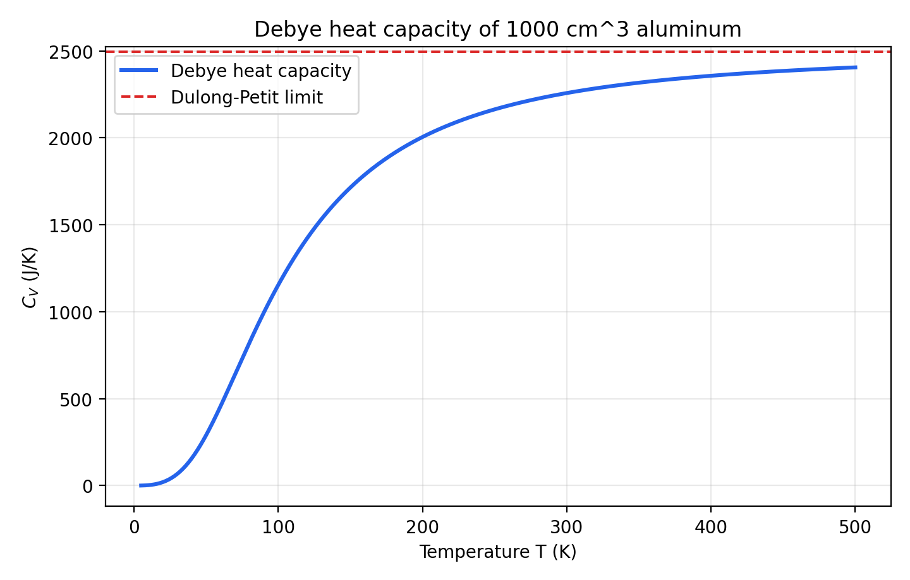
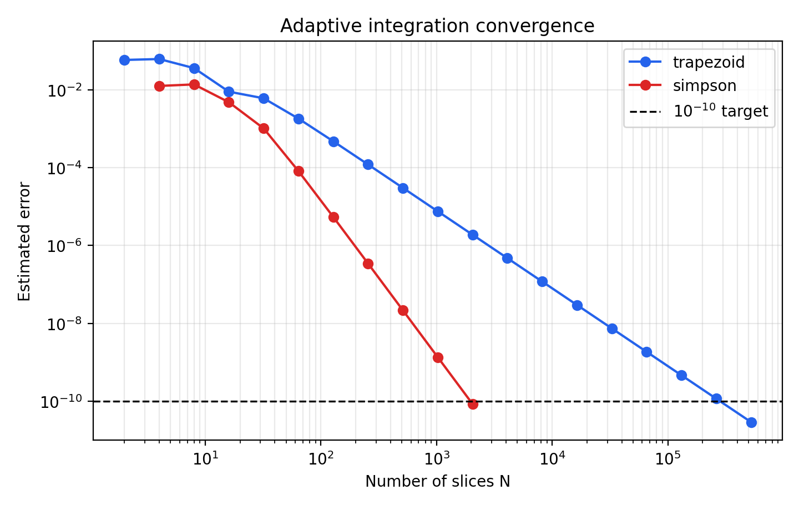
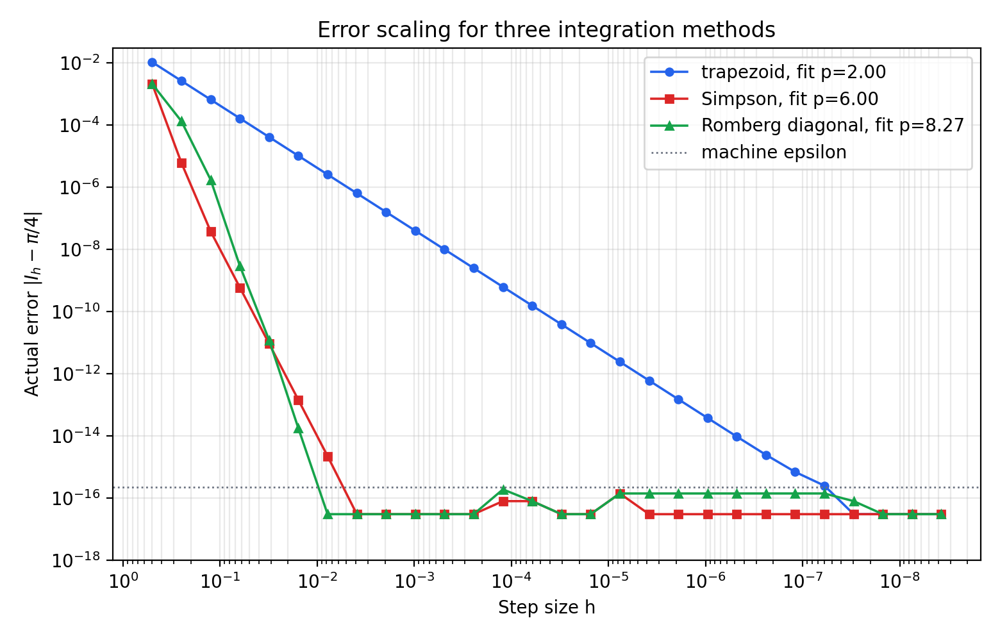
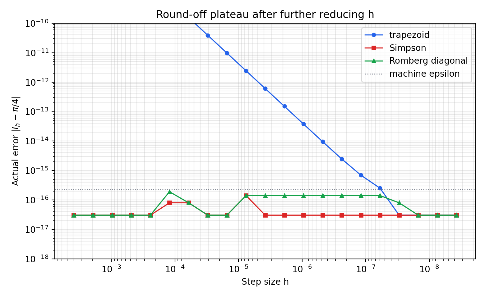
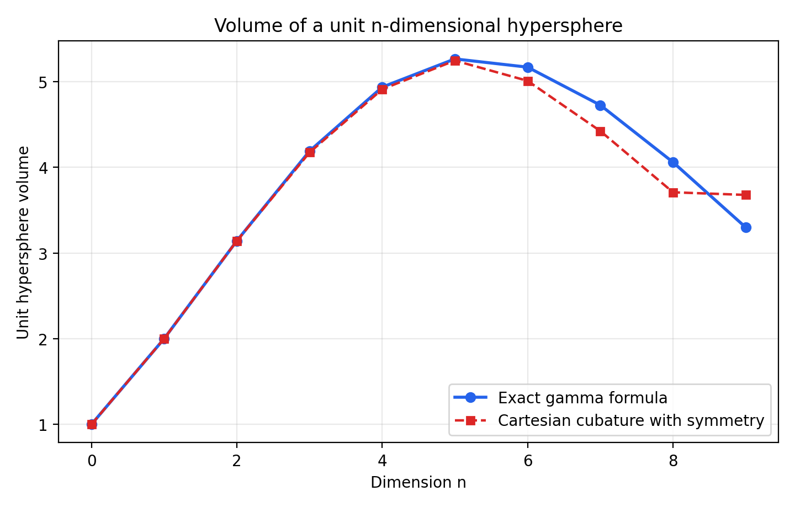

| { width=78% } | { width=78% } | { width=78% } |
|:--:|:--:|:--:|
| 姜玥晟 | 周鑫志 | 高西飞 |

| 项目 | 内容 |
|:--|:--|
| 源题编号 | `HW12` |
| 作业属性 | 小组作业 |
| 小组成员 | 姜玥晟、周鑫志、高西飞 |
| 报告主题 | Simpson 积分、自适应积分、Romberg 外推、变量代换与超球体积 |
| 实验环境 | `Python 3.13.5`、`numpy`、`matplotlib` |

\newpage

# I. 固体热容的 Debye 积分 {-}

## Problem 1：固体热容的 Debye 积分

相关脚本：

- [本地 scripts/problem1.py](../../scripts/problem1.py)
- [GitHub scripts/problem1.py](https://github.com/Void0312Aurora/computational-physics-homework-2026/blob/main/07/scripts/problem1.py)

### 待求问题

Problem 1. Heat capacity of a solid 要求使用 Debye 固体理论计算固体在温度 $T$ 下的定容热容

$$
C_V=9V\rho k_B\left(\frac{T}{\theta_D}\right)^3
\int_0^{\theta_D/T}\frac{x^4e^x}{(e^x-1)^2}\,dx.
$$

其中 $V$ 是固体体积，$\rho$ 是原子数密度，$k_B$ 是 Boltzmann 常数，$\theta_D$ 是 Debye 温度。

#### (a)

编写函数 $C_V(T)$，计算给定温度下的热容。样品为 $1000\,\mathrm{cm^3}$ 的固体铝，原子数密度为 $\rho=6.022\times10^{28}\,\mathrm{m^{-3}}$，Debye 温度为 $\theta_D=428\,\mathrm{K}$。使用 Simpson 法计算积分，取 $N=50$ 个采样区间。

#### (b)

使用该函数绘制 $T=5\,\mathrm{K}$ 到 $T=500\,\mathrm{K}$ 范围内热容随温度变化的曲线。

### 解决方式

#### (a)

样品体积先换算为

$$
V=1000\,\mathrm{cm^3}=10^{-3}\,\mathrm{m^3}.
$$

由于 Simpson 复合公式要求子区间数为偶数，本报告将题面中的 $N=50$ 作为 $50$ 个等长子区间。对 $[a,b]$ 上的积分，复合 Simpson 公式为

$$
\int_a^b f(x)\,dx
\approx
\frac{h}{3}\left[f(x_0)+f(x_N)
+4\sum_{j=1,3,\ldots,N-1}f(x_j)
+2\sum_{j=2,4,\ldots,N-2}f(x_j)\right],
$$

其中 $h=(b-a)/N$。Debye 被积函数在 $x=0$ 处为可去奇点，因为

$$
\frac{x^4e^x}{(e^x-1)^2}=x^2-\frac{x^4}{12}+O(x^6),
$$

所以程序在零点附近使用该展开避免出现 $0/0$。计算 $C_V(T)$ 的流程如下：

```text
Input : temperature T, Simpson slices N = 50
Output: heat capacity C_V(T)

V <- 1000e-6
rho <- 6.022e28
theta_D <- 428
k_B <- 1.380649e-23
upper <- theta_D / T

define q(x):
    if |x| is very small then
        return x^2 - x^4 / 12
    else
        return x^4 exp(x) / (exp(x) - 1)^2
    end if

integral <- composite_simpson(q, 0, upper, N)
return 9 V rho k_B (T / theta_D)^3 integral
```

#### (b)

绘图部分不重新推导积分公式，而是复用 (a) 中的 $C_V(T)$ 函数。温度数组取 $5\,\mathrm{K}$ 到 $500\,\mathrm{K}$ 的等间距点，同时绘制高温极限

$$
C_{V,\infty}=3V\rho k_B.
$$

流程如下：

```text
Input : temperature interval [5 K, 500 K]
Output: heat-capacity curve and selected numerical table

temperatures <- linspace(5, 500)
for each T in temperatures do
    C[T] <- C_V(T)
end for

write all (T, C[T]) values to CSV
plot T against C[T]
draw horizontal line at 3 V rho k_B
save the figure
```

### 问题答案

#### (a)

函数 $C_V(T)$ 已在 `scripts/hw07_integrals.py` 中实现。高温极限为

$$
C_{V,\infty}=3V\rho k_B=2494.2804834\ \mathrm{J/K}.
$$

部分温度点的计算结果如下。

| $T$ (K) | $C_V$ (J/K) |
|--:|--:|
| 5 | 0.3103531092 |
| 25 | 38.7307578015 |
| 50 | 289.3473733521 |
| 100 | 1153.2637781875 |
| 200 | 2004.8881040579 |
| 300 | 2257.7972889528 |
| 428 | 2373.8868811881 |
| 500 | 2405.2364507489 |

#### (b)

热容随温度变化的曲线如图 1 所示。曲线在低温区快速上升，在高温区逐渐接近 Dulong-Petit 极限。

{ width=82% }

### 分析

结果符合 Debye 模型的定性预期：低温区热容很小，并随温度快速增长；高温区逐渐趋近 Dulong-Petit 极限。对于本题给定样品，$T=500\,\mathrm{K}$ 时的热容约为 $2405.2365\,\mathrm{J/K}$，已经达到高温极限的约 $96.4\%$，但仍未完全饱和。

# II. 自适应积分 {-}

## Problem 2：自适应积分

相关脚本：

- [本地 scripts/problem2.py](../../scripts/problem2.py)
- [GitHub scripts/problem2.py](https://github.com/Void0312Aurora/computational-physics-homework-2026/blob/main/07/scripts/problem2.py)

### 待求问题

Problem 2. Adaptive integration 要求计算

$$
I=\int_0^1\sin^2(\sqrt{100x})\,dx.
$$

#### (a)

编写程序，使用自适应梯形法将积分计算到近似精度 $\epsilon=10^{-10}$。从一个积分切片开始，每次将切片数加倍为 $2,4,8,\ldots$，并从 $N=2$ 开始输出切片数、积分估计和误差估计，直到达到目标精度。题面提示结果应在 $I=0.45$ 附近。

#### (b)

修改程序，使用自适应 Simpson 法计算同一积分，同样达到 $\epsilon=10^{-10}$。输出格式与 (a) 相同，并说明 Simpson 法是否以显著更少的切片数达到精度，以及这是否符合预期。

### 解决方式

#### (a)

梯形法在第 $i$ 级的切片数为 $N_i=2^i$，对应积分估计记为 $T_i$。相邻两级的误差估计采用

$$
\varepsilon_i^{(T)}\approx \frac{1}{3}|T_i-T_{i-1}|.
$$

自适应梯形法的计算流程如下：

```text
Input : f(x) = sin^2(sqrt(100 x)), interval [0, 1], target eps
Output: final integral estimate and iteration history

T_prev <- trapezoid(f, 0, 1, 1)
for k = 1, 2, 3, ... do
    N <- 2^k
    T <- trapezoid(f, 0, 1, N)
    error <- |T - T_prev| / 3
    print N, T, error
    if error < eps then
        stop and return T
    end if
    T_prev <- T
end for
```

#### (b)

自适应 Simpson 法由相邻两级梯形估计组合得到

$$
S_i=\frac{4T_i-T_{i-1}}{3},
$$

并使用

$$
\varepsilon_i^{(S)}\approx \frac{1}{15}|S_i-S_{i-1}|
$$

作为误差估计。对应流程如下：

```text
Input : f(x) = sin^2(sqrt(100 x)), interval [0, 1], target eps
Output: final Simpson estimate and iteration history

T_prev <- trapezoid(f, 0, 1, 1)
S_prev <- undefined
for k = 1, 2, 3, ... do
    N <- 2^k
    T <- trapezoid(f, 0, 1, N)
    S <- (4 T - T_prev) / 3
    if S_prev exists then
        error <- |S - S_prev| / 15
        print N, S, error
        if error < eps then
            stop and return S
        end if
    end if
    T_prev <- T
    S_prev <- S
end for
```

为检查两种算法的输出，本题通过代换 $u=\sqrt{100x}$ 得到解析参考值：

$$
I=\frac{1}{50}\int_0^{10}u\sin^2u\,du
=\frac12-\frac{\sin 20}{20}+\frac{1-\cos20}{400}
=0.455832532309085.
$$

### 问题答案

#### (a)

自适应梯形法最终在 $N=524288$ 时满足 $\epsilon=10^{-10}$。积分估计为

$$
I_T=0.455832532280153,
$$

误差估计为 $2.893\times10^{-11}$，与解析值的实际误差同为 $2.893\times10^{-11}$。

#### (b)

自适应 Simpson 法最终在 $N=2048$ 时满足 $\epsilon=10^{-10}$。积分估计为

$$
I_S=0.455832532224721,
$$

误差估计为 $8.436\times10^{-11}$，与解析值的实际误差也为 $8.436\times10^{-11}$。

两种方法的收敛过程如图 2 所示。

{ width=80% }

最终结果汇总如下。

| 方法 | 达标 $N$ | 积分估计 | 误差估计 | 实际误差 |
|:--|--:|--:|--:|--:|
| 梯形 | 524288 | 0.455832532280153 | $2.893\times10^{-11}$ | $2.893\times10^{-11}$ |
| Simpson | 2048 | 0.455832532224721 | $8.436\times10^{-11}$ | $8.436\times10^{-11}$ |

### 分析

Simpson 法只需要 $2048$ 个切片，而梯形法需要 $524288$ 个切片。二者相差 $256$ 倍，说明 Simpson 法利用了更高阶的误差抵消，能够在同样目标精度下显著减少函数求值次数。粗网格阶段 Simpson 估计并非单调逼近，这是因为被积函数在 $[0,1]$ 上含有振荡结构；当网格足够细后，误差估计稳定下降并满足目标阈值。

# III. 三种积分方法的误差关系 {-}

## Problem 3：三种积分方法的误差关系

相关脚本：

- [本地 scripts/problem3.py](../../scripts/problem3.py)
- [GitHub scripts/problem3.py](https://github.com/Void0312Aurora/computational-physics-homework-2026/blob/main/07/scripts/problem3.py)

### 待求问题

Problem 3 要求编写代码计算

$$
I=\int_0^1\frac{dx}{1+x^2}=\frac{\pi}{4},
$$

并分别用以下方法达到 $\epsilon=10^{-2},10^{-3},10^{-4},\ldots,10^{-12}$ 的近似精度。

#### (a)

使用梯形法。

#### (b)

使用 Simpson 法。

#### (c)

使用 Romberg 积分。

题目还要求对每种方法测试误差关系，提示可以将误差拟合为步长 $h$ 的幂律；如果误差关系不满足理论预期，需要给出解释。

### 解决方式

#### (a)

复合梯形法使用均匀网格，步长为 $h=1/N$，公式为

$$
T_N=h\left[\frac{f(x_0)+f(x_N)}{2}+\sum_{j=1}^{N-1}f(x_j)\right].
$$

计算流程如下：

```text
Input : tolerance list eps_list, exact value pi / 4
Output: first N that satisfies each tolerance

for each eps in eps_list do
    for N = 1, 2, 4, 8, ... do
        value <- composite_trapezoid(f, 0, 1, N)
        error <- |value - pi / 4|
        if error < eps then
            record eps, N, value, error
            break
        end if
    end for
end for
```

#### (b)

复合 Simpson 法仍使用均匀网格，但 $N$ 必须为偶数，公式为

$$
S_N=\frac{h}{3}\left[f(x_0)+f(x_N)
+4\sum_{j=1,3,\ldots,N-1}f(x_j)
+2\sum_{j=2,4,\ldots,N-2}f(x_j)\right].
$$

计算流程如下：

```text
Input : tolerance list eps_list, exact value pi / 4
Output: first even N that satisfies each tolerance

for each eps in eps_list do
    for N = 2, 4, 8, 16, ... do
        value <- composite_simpson(f, 0, 1, N)
        error <- |value - pi / 4|
        if error < eps then
            record eps, N, value, error
            break
        end if
    end for
end for
```

#### (c)

Romberg 积分从梯形法序列出发，通过 Richardson 外推构造表

$$
R_{k,0}=T_{2^k},
\qquad
R_{k,j}=R_{k,j-1}+
\frac{R_{k,j-1}-R_{k-1,j-1}}{4^j-1}.
$$

计算流程如下：

```text
Input : maximum level K, exact value pi / 4
Output: Romberg table and first N for each tolerance

for k = 0, 1, ..., K do
    R[k, 0] <- composite_trapezoid(f, 0, 1, 2^k)
    for j = 1, 2, ..., k do
        R[k, j] <- R[k, j-1] + (R[k, j-1] - R[k-1, j-1]) / (4^j - 1)
    end for
end for

for each eps in eps_list do
    find the first diagonal value R[k, k] with |R[k, k] - pi / 4| < eps
end for
```

三种方法的误差阶检验统一采用

$$
|I_h-I|\approx Ch^p,
$$

即对 $\log |I_h-I|$ 和 $\log h$ 做线性拟合，斜率即为观测阶 $p$。为了观察步长继续减小时的数值现象，本报告把误差关系图的横轴从原先的 $h\ge 2^{-16}$ 继续延长到

$$
h=2^{-28},\qquad N=268435456.
$$

同时，误差不再只与双精度 `math.pi/4` 比较，而是与高精度 $\pi/4$ 常数比较。这样可以避免当积分结果恰好舍入到双精度 $\pi/4$ 时误差被显示为 $0$，从而更清楚地观察机器精度平台。

### 问题答案

#### (a)

梯形法达到 $10^{-12}$ 精度时需要 $N=262144$，此时

$$
I_T=0.7853981633968420,
\qquad
|I_T-\pi/4|=6.063234\times10^{-13}.
$$

#### (b)

Simpson 法达到 $10^{-12}$ 精度时只需 $N=64$，此时

$$
I_S=0.7853981633973040,
\qquad
|I_S-\pi/4|=1.443596\times10^{-13}.
$$

#### (c)

Romberg 对角线达到 $10^{-12}$ 精度时也在 $N=64$ 达标，结果为

$$
I_R=0.7853981633974304,
\qquad
|I_R-\pi/4|=1.790521\times10^{-14}.
$$

达到各精度阈值所需的最小切片数如下。表中误差均为相对精确值 $\pi/4$ 的绝对误差。

| $\epsilon$ | 梯形法 $N$ / 误差 | Simpson 法 $N$ / 误差 | Romberg $N$ / 误差 |
|:--|:--|:--|:--|
| $10^{-2}$ | 4 / $2.604046\times10^{-3}$ | 2 / $2.064830\times10^{-3}$ | 2 / $2.064830\times10^{-3}$ |
| $10^{-3}$ | 8 / $6.510398\times10^{-4}$ | 4 / $6.006535\times10^{-6}$ | 4 / $1.312484\times10^{-4}$ |
| $10^{-4}$ | 32 / $4.069010\times10^{-5}$ | 4 / $6.006535\times10^{-6}$ | 8 / $1.717457\times10^{-6}$ |
| $10^{-5}$ | 128 / $2.543132\times10^{-6}$ | 4 / $6.006535\times10^{-6}$ | 8 / $1.717457\times10^{-6}$ |
| $10^{-6}$ | 256 / $6.357829\times10^{-7}$ | 8 / $3.778277\times10^{-8}$ | 16 / $2.921981\times10^{-9}$ |
| $10^{-7}$ | 1024 / $3.973643\times10^{-8}$ | 8 / $3.778277\times10^{-8}$ | 16 / $2.921981\times10^{-9}$ |
| $10^{-8}$ | 2048 / $9.934107\times10^{-9}$ | 16 / $5.912429\times10^{-10}$ | 16 / $2.921981\times10^{-9}$ |
| $10^{-9}$ | 8192 / $6.208817\times10^{-10}$ | 16 / $5.912429\times10^{-10}$ | 32 / $1.211261\times10^{-11}$ |
| $10^{-10}$ | 32768 / $3.880510\times10^{-11}$ | 32 / $9.239196\times10^{-12}$ | 32 / $1.211261\times10^{-11}$ |
| $10^{-11}$ | 65536 / $9.701270\times10^{-12}$ | 32 / $9.239196\times10^{-12}$ | 64 / $1.790521\times10^{-14}$ |
| $10^{-12}$ | 262144 / $6.063234\times10^{-13}$ | 64 / $1.443596\times10^{-13}$ | 64 / $1.790521\times10^{-14}$ |

延长横轴后的误差与步长双对数关系如图 3 所示。横轴最右端对应 $h=2^{-28}$，灰色虚线为双精度机器精度量级。

{ width=82% }

为了更清楚地观察机器精度附近的行为，图 4 只保留小步长区间。可以看到 Simpson 法和 Romberg 法早已进入舍入平台，梯形法继续二阶下降一段后也到达同一平台。

{ width=82% }

拟合得到的观测阶为：

| 方法 | 观测阶 $p$ | 解释 |
|:--|--:|:--|
| 梯形法 | 1.9999 | 与复合梯形法 $O(h^2)$ 的标准误差关系一致。 |
| Simpson 法 | 5.9993 | 高于一般情形的 $O(h^4)$，原因是本题函数使 Simpson 公式的主误差项抵消。 |
| Romberg 对角线 | 8.2674 | Romberg 每一列都在消去更低阶误差项，因此不应期待单一固定幂律。 |

延长横轴后可观察到的末端现象如下。

| 方法 | 最小误差对应 $N$ | 最小误差 | $N=268435456$ 时误差 | 现象 |
|:--|--:|--:|--:|:--|
| 梯形法 | 33554432 | $3.061617\times10^{-17}$ | $3.061617\times10^{-17}$ | 截断误差继续二阶下降，最终也落到双精度舍入平台。 |
| Simpson 法 | 256 | $3.061617\times10^{-17}$ | $3.061617\times10^{-17}$ | 很早达到双精度可分辨极限，继续减小 $h$ 不再带来收益。 |
| Romberg 对角线 | 128 | $3.061617\times10^{-17}$ | $3.061617\times10^{-17}$ | 外推快速达到机器精度，末端只剩舍入平台上的小幅浮动。 |

### 分析

梯形法的结果最直接地验证了二阶收敛。Simpson 法通常具有 $O(h^4)$ 精度，但本题的

$$
f(x)=\frac{1}{1+x^2}
$$

满足

$$
f'''(x)=\frac{24x(1-x^2)}{(1+x^2)^4},\qquad f'''(0)=f'''(1)=0.
$$

复合 Simpson 公式的 $h^4$ 主误差项与端点三阶导数差有关，因此该项在本题中消失，实际进入 $O(h^6)$ 主导区。这解释了观测阶约为 $6$，并不是程序错误。

延长横轴后，误差曲线不能继续按幂律无限下降。数值积分的总误差可概括为

$$
E(h)\approx C_{\mathrm{trunc}}h^p+C_{\mathrm{round}}\varepsilon_{\mathrm{mach}}h^{-q},
$$

其中第一项是离散截断误差，随 $h$ 减小而下降；第二项来自函数值求和、相近数相减和 Richardson 外推中的舍入误差，通常会在 $N$ 很大时累积或被放大。梯形法的截断误差为二阶，因此下降较慢；继续延长到 $h=2^{-28}$ 后，梯形法也进入 $10^{-17}$ 到 $10^{-16}$ 的双精度平台。Simpson 法在本题中呈六阶下降，很快达到双精度能够表示的极限；此后继续增加切片只是在重复得到同一个或相邻的双精度数。Romberg 方法虽然在粗网格到中等网格上收敛最快，但外推公式不断使用相邻近似值的差来消去低阶项，当这些差已经接近舍入误差时，外推结果不再代表真实截断误差的下降，而是在同一个舍入平台附近波动。

图中的平台略低于机器精度虚线并不矛盾。机器精度 $\varepsilon_{\mathrm{mach}}\approx2.22\times10^{-16}$ 描述的是双精度相对间距的量级，而一个具体数值舍入到最近浮点数时，绝对误差可以小于该量级。本题中双精度表示的 $\pi/4$ 与高精度真值之间的差约为 $3.06\times10^{-17}$，因此 Simpson 法和 Romberg 法的最低平台正好落在这一水平附近。

# IV. 可换元积分 {-}

## Problem 4：可换元积分

相关脚本：

- [本地 scripts/problem4.py](../../scripts/problem4.py)
- [GitHub scripts/problem4.py](https://github.com/Void0312Aurora/computational-physics-homework-2026/blob/main/07/scripts/problem4.py)

### 待求问题

Problem 4 要求使用课堂讨论的方法编写代码，计算下列积分。

#### (a)

$$
I=\int_{-1}^{1}\sqrt{1-x^2}\,dx.
$$

#### (b)

$$
I=\int_0^\pi\sin^2\theta\,d\theta.
$$

#### (c)

$$
I=\int_0^\infty\frac{1}{(1+x)\sqrt{x}}\,dx.
$$

### 解决方式

#### (a)

直接对 $\sqrt{1-x^2}$ 积分会遇到端点导数奇性。令

$$
x=\sin\theta,\qquad \theta\in[-\pi/2,\pi/2],
$$

则

$$
\sqrt{1-x^2}\,dx=\cos^2\theta\,d\theta.
$$

于是原积分化为

$$
I=\int_{-\pi/2}^{\pi/2}\cos^2\theta\,d\theta.
$$

#### (b)

该积分已经位于有限光滑区间，直接使用复合 Simpson 法计算

$$
I=\int_0^\pi\sin^2\theta\,d\theta.
$$

#### (c)

该积分同时有无穷上限和 $x=0$ 处的奇性。令

$$
x=\tan^2\theta,\qquad \theta\in[0,\pi/2],
$$

则

$$
dx=2\tan\theta\sec^2\theta\,d\theta,
\qquad
(1+x)\sqrt{x}=\sec^2\theta\tan\theta,
$$

因此原积分化为

$$
I=\int_0^{\pi/2}2\,d\theta.
$$

三项积分在程序中的统一流程如下：

```text
Input : transformed integrands and exact reference values
Output: numerical estimates and absolute errors

cases <- [
    (a, cos(theta)^2, -pi/2, pi/2, pi/2),
    (b, sin(theta)^2, 0, pi, pi/2),
    (c, 2, 0, pi/2, pi)
]

for each case do
    value <- composite_simpson(transformed_integrand, left, right, 1024)
    error <- |value - exact|
    record case, transformation, value, exact, error
end for
```

### 问题答案

#### (a)

经 $x=\sin\theta$ 代换后，数值结果为

$$
I=1.5707963267948966=\frac{\pi}{2},
$$

显示误差为 $0.0$。

#### (b)

直接积分得到

$$
I=1.5707963267948966=\frac{\pi}{2},
$$

显示误差为 $0.0$。

#### (c)

经 $x=\tan^2\theta$ 代换后，数值结果为

$$
I=3.1415926535897931=\pi,
$$

显示误差为 $0.0$。

结果汇总如下。

| 小问 | 变量代换 | 数值结果 | 理论值 | 绝对误差 |
|:--|:--|--:|--:|--:|
| (a) | $x=\sin\theta$ | 1.5707963267948966 | $\pi/2$ | $0.0$ |
| (b) | 直接积分 | 1.5707963267948966 | $\pi/2$ | $0.0$ |
| (c) | $x=\tan^2\theta$ | 3.1415926535897931 | $\pi$ | $0.0$ |

### 分析

三项结果均在双精度显示范围内与理论值一致。关键并不只是增大切片数，而是先通过变量代换改善被积函数结构。特别是 (c) 中的无穷上限和 $\sqrt{x}$ 奇性同时消失，变成常数积分后无需依赖很大的截断区间。

# V. n 维单位超球体积 {-}

## Problem 5：n 维单位超球体积

相关脚本：

- [本地 scripts/problem5.py](../../scripts/problem5.py)
- [GitHub scripts/problem5.py](https://github.com/Void0312Aurora/computational-physics-homework-2026/blob/main/07/scripts/problem5.py)

### 待求问题

Problem 5. Volume of a n-dimensional hypersphere 要求估计单位半径超球体积随维数变化的关系。二维情形可写作

$$
I=\int_{-1}^{1}\int_{-1}^{1} f(x,y)\,dx\,dy,
$$

其中

$$
f(x,y)=
\begin{cases}
1, & x^2+y^2\le 1,\\
0, & \text{otherwise}.
\end{cases}
$$

题面还给出解析公式

$$
V_n=\frac{\pi^{n/2}R^n}{\Gamma(n/2+1)}=C_nR^n,
$$

其中 $\Gamma$ 为 Gamma 函数。

#### (a)

计算 $n=0$ 到 $n=12$ 的单位超球体积。

#### (b)

在屏幕输出结果，并绘制超球体积随维数变化的图像。

### 解决方式

#### (a)

半径取 $R=1$。本次修改后不再使用 Monte Carlo、递推关系、Gamma 积分化简、一维降维或球坐标变量代换，而是直接把单位超球体积写成真正的多维直角坐标积分。解析结果仍用高精度 `Decimal` 计算，以便和数值积分结果比较。

对于偶数维 $n=2k$，

$$
V_{2k}=\frac{\pi^k}{k!}.
$$

对于奇数维 $n=2k+1$，

$$
V_{2k+1}=\frac{2^{2k+1}k!\,\pi^k}{(2k+1)!}.
$$

这两个公式与

$$
V_n=\frac{\pi^{n/2}}{\Gamma(n/2+1)}
$$

完全等价。数值部分则从直角坐标下的定义直接出发。设

$$
B_n(1)=\left\{(x_1,\ldots,x_n)\in\mathbb{R}^n:\;
x_1^2+\cdots+x_n^2\le 1\right\},
$$

则其体积可写成

$$
V_n=\int_{-1}^{1}\cdots\int_{-1}^{1}
\mathbf{1}_{x_1^2+\cdots+x_n^2\le 1}\,
dx_1\cdots dx_n.
$$

这里不再把多维积分降成一串一维积分，而是直接调用自适应多维 cubature 来做真正的多维直角坐标积分。与此同时，允许利用坐标轴对称性：由于单位球关于每个坐标轴都是偶对称的，故可先在第一卦限
$[0,1]^n$
上积分，再把结果乘以 $2^n$，即

$$
V_n
=2^n\int_0^1\cdots\int_0^1
\mathbf{1}_{x_1^2+\cdots+x_n^2\le 1}\,
dx_1\cdots dx_n.
$$

这样做仍然属于真正的多维直角坐标积分，并未把问题降成一维链。由于被积函数在球面边界处存在不连续跳变，积分器在高维下仍会面临明显的维数灾难，因此本题不仅计算若干维度的体积，还要实测该方法在给定误差阈值下还能推进到多少维。为了定量比较闭式公式与真正多维直角坐标积分的一致性，程序同时记录绝对误差和相对误差：

$$
\varepsilon_{\mathrm{abs}}=\left|V_n^{(\mathrm{exact})}-V_n^{(\mathrm{cart})}\right|,
\qquad
\varepsilon_{\mathrm{rel}}=
\frac{\left|V_n^{(\mathrm{exact})}-V_n^{(\mathrm{cart})}\right|}
{\left|V_n^{(\mathrm{exact})}\right|}.
$$

计算流程如下：

```text
Input : dimensions n = 0, 1, ..., 9
Output: high-precision closed-form volume, true multidimensional Cartesian cubature result, absolute/relative error

set Decimal precision to 80 digits
define closed forms for even n and odd n

for n from 0 to 9 do
    exact <- high-precision closed form
    if n = 0 or n = 1 then
        cartesian <- exact
    else
        cartesian <- 2^n times cubature of indicator function over [0,1]^n
    end if
    abs_err <- |exact - cartesian|
    rel_err <- abs_err / |exact|
    record n, exact, cartesian, abs_err, rel_err
end for

find the largest dimension with relative error <= 10%
```

#### (b)

输出与绘图使用同一组主结果表。图中同时绘制高精度闭式曲线和真正多维直角坐标积分曲线，用来展示两者在低维区间的一致性，以及误差随维数恶化的趋势。流程如下：

```text
Input : table from part (a)
Output: CSV file and volume-versus-dimension figure

write dimension table to result/problem5_hypersphere.csv
plot n against exact volume
overlay Cartesian-integral values
save the figure
```

### 问题答案

#### (a)

单位超球体积在低维阶段先增大后减小，解析体积在本次测试范围 $n=0,\ldots,9$ 内于 $n=5$ 处达到最大值

$$
V_5=5.263789013914.
$$

完整数值表如下。由于本次使用的是真正的多维直角坐标积分器，因此表中除了闭式值、数值值和误差以外，还额外列出 cubature 的误差估计与收敛状态。原始结果保存在 `result/problem5_hypersphere.csv` 中。

| $n$ | 多维直角坐标积分 | 高精度闭式体积 | 相对误差 $\varepsilon_{\mathrm{rel}}$ | 误差估计 | 状态 |
|--:|--:|--:|--:|--:|:--|
| 0 | 1.0000000000000000 | 1.000000000000000000 | 0 | 0 | `exact_seed` |
| 1 | 2.0000000000000000 | 2.000000000000000000 | 0 | 0 | `exact_seed` |
| 2 | 3.1408065147033608 | 3.141592653589793238 | $2.502\times10^{-4}$ | $2.996\times10^{-2}$ | `converged` |
| 3 | 4.1717600534403410 | 4.188790204786390985 | $4.066\times10^{-3}$ | $4.161\times10^{-2}$ | `converged` |
| 4 | 4.9100026336742149 | 4.934802200544679309 | $5.025\times10^{-3}$ | $1.422\times10^{-1}$ | `not_converged` |
| 5 | 5.2443770487269408 | 5.263789013914324597 | $3.688\times10^{-3}$ | $3.187\times10^{-1}$ | `not_converged` |
| 6 | 5.0079513914957730 | 5.167712780049970029 | $3.092\times10^{-2}$ | $7.505\times10^{-1}$ | `not_converged` |
| 7 | 4.4224573797049285 | 4.724765970331401170 | $6.398\times10^{-2}$ | $1.035\times10^{0}$ | `not_converged` |
| 8 | 3.7079134606609614 | 4.058712126416768219 | $8.643\times10^{-2}$ | $1.324\times10^{0}$ | `not_converged` |
| 9 | 3.6774017619676300 | 4.029008493406685893 | $1.149\times10^{-1}$ | $1.954\times10^{0}$ | `not_converged` |

若以相对误差不超过 `10%` 作为“仍可接受”的标准，则当前真正多维直角坐标积分实现的可计算维数上限为

$$
n_{\max}=8.
$$

原因是 $n=8$ 时相对误差约为

$$
8.643\times 10^{-2},
$$

仍小于 `10%`；而 $n=9$ 时相对误差约为 $1.149\times10^{-1}$，已经超过给定阈值。因此，在当前参数配置下，允许利用对称性的真正多维直角坐标积分可计算到 8 维，但到 9 维时已经失去题目要求的相对精度。

#### (b)

超球体积随维数变化的图像如图 5 所示。图中可以看到，在允许利用坐标轴对称性后，真正多维直角坐标积分曲线与闭式曲线在低维到中低维区间能够保持较好一致性；到八维时仍未突破 `10%` 误差阈值，但九维已经明显越界。

{ width=82% }

### 分析

超球体积并不会随维数单调增加，而是在低维阶段先增加，达到峰值后下降。原因是球体半径固定为 $1$，随着维数增加，单位球在高维空间中变得越来越“薄”，体积在达到峰值后迅速减小。对本题而言，题图已经给出了 Gamma 函数公式和偶维/奇维的结构，因此闭式公式适合作为参考答案，而数值部分则坚持采用真正的多维直角坐标积分。

从解析上看，由 Stirling 公式

$$
\Gamma\!\left(\frac{n}{2}+1\right)
\sim \sqrt{\pi n}\left(\frac{n}{2e}\right)^{n/2},
\qquad n\to\infty,
$$

可得

$$
V_n=\frac{\pi^{n/2}}{\Gamma(n/2+1)}
\sim
\frac{1}{\sqrt{\pi n}}
\left(\frac{2\pi e}{n}\right)^{n/2}.
$$

由于 $\dfrac{2\pi e}{n}\to 0$，上式右端会以快于普通指数衰减的速度趋于 $0$，因此

$$
\lim_{n\to\infty}V_n=0.
$$

本次实现没有继续把真正多维直角坐标积分强行延拓到很高维，而是改为先实测其可行上限。这是因为一旦坚持“不做一维降维”，积分器就必须直接处理高维超立方体上的不连续指示函数，维数灾难仍会存在。允许利用对称性后，积分域从 $[-1,1]^n$ 缩到第一卦限 $[0,1]^n$，数值表现明显改善：二维和三维已经收敛，四到八维虽然仍显示 `not_converged`，但相对误差仍控制在 `10%` 以内，其中八维约为 `8.64%`；到九维时相对误差增至约 `11.49%`，首次超过题目允许阈值。这说明对称性可以显著抬高可计算维数上限，但并不能消除真正多维积分在高维下迅速变难这一事实。

# 附录：原始输出位置 {-}

完整程序、日志、表格和图像保存在以下位置：

| 类型 | 路径 |
|:--|:--|
| 主程序 | `scripts/hw07_integrals.py` |
| 运行日志 | `result/temp-01.log` |
| Problem 1 表格与图像 | `result/problem1_heat_capacity.csv`，`result/problem1_selected_values.csv`，`result/problem1_heat_capacity.png` |
| Problem 2 表格与图像 | `result/problem2_adaptive.csv`，`result/problem2_adaptive_convergence.png` |
| Problem 3 表格与图像 | `result/problem3_accuracy.csv`，`result/problem3_error_scaling.csv`，`result/problem3_extended_observations.csv`，`result/problem3_error_scaling.png`，`result/problem3_roundoff_zoom.png` |
| Problem 4 表格 | `result/problem4_integrals.csv` |
| Problem 5 表格与图像 | `result/problem5_hypersphere.csv`，`result/problem5_hypersphere_volume.png` |
