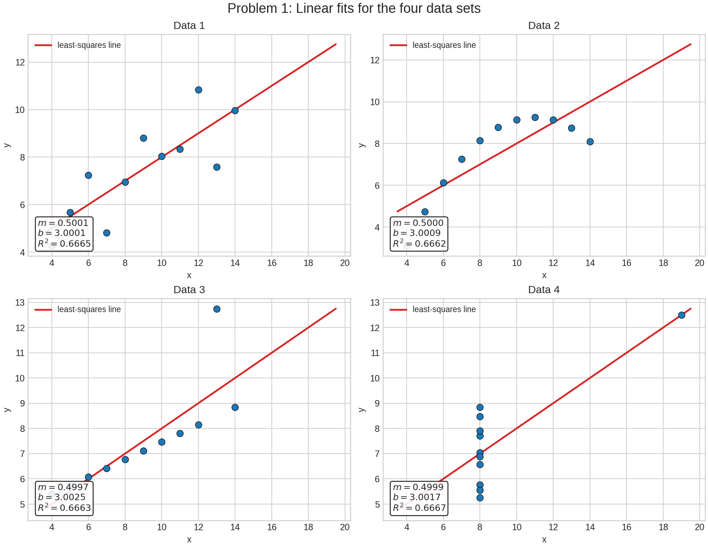
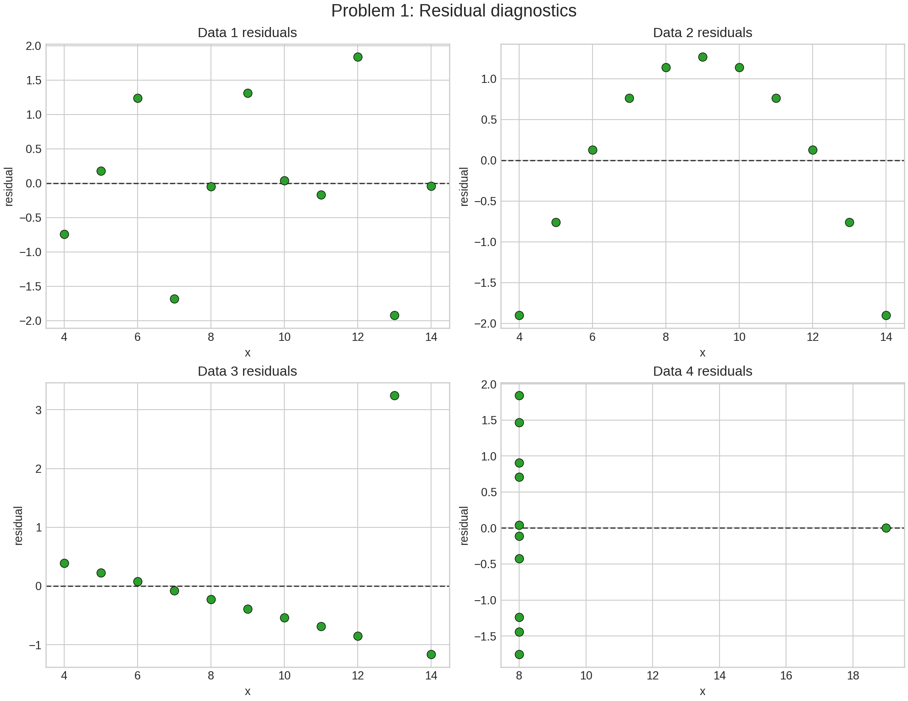
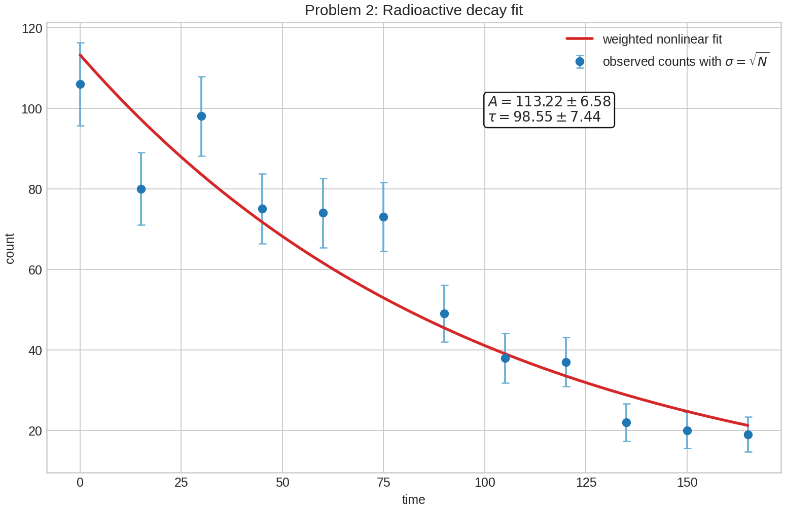

| { width=78% } | { width=78% } | { width=78% } |
|:--:|:--:|:--:|
| 姜玥晟 | 周鑫志 | 高西飞 |

| 项目 | 内容 |
|:--|:--|
| 源题编号 | `HW09` |
| 作业属性 | 小组作业 |
| 小组成员 | 姜玥晟、周鑫志、高西飞 |
| 报告主题 | Anscombe 四重奏的线性拟合比较与放射性衰减参数估计 |
| 实验环境 | `Python 3.13.5`、`numpy`、`matplotlib`、`scipy`、`pypandoc` |

\newpage

# I. 四组数据的直线拟合比较 {-}

**Problem 1：四组数据的直线拟合比较**

Problem 1: Consider the following four sets of data.

给出四组二维数据：

- Data 1: $(10,8.04)$, $(8,6.95)$, $(13,7.58)$, $(9,8.81)$, $(11,8.33)$, $(14,9.96)$, $(6,7.24)$, $(4,4.26)$, $(12,10.84)$, $(7,4.82)$, $(5,5.68)$。
- Data 2: $(10,9.14)$, $(8,8.14)$, $(13,8.74)$, $(9,8.77)$, $(11,9.26)$, $(14,8.10)$, $(6,6.13)$, $(4,3.10)$, $(12,9.13)$, $(7,7.26)$, $(5,4.74)$。
- Data 3: $(10,7.46)$, $(8,6.77)$, $(13,12.74)$, $(9,7.11)$, $(11,7.81)$, $(14,8.84)$, $(6,6.08)$, $(4,5.39)$, $(12,8.15)$, $(7,6.42)$, $(5,5.73)$。
- Data 4: $(8,6.58)$, $(8,5.76)$, $(8,7.71)$, $(8,8.84)$, $(8,8.47)$, $(8,7.04)$, $(8,5.25)$, $(19,12.50)$, $(8,5.56)$, $(8,7.91)$, $(8,6.89)$。

## Problem 1(1)

相关脚本：

- [本地 scripts/problem1.py](../../scripts/problem1.py)
- [GitHub scripts/problem1.py](https://github.com/Void0312Aurora/computational-physics-homework-2026/blob/main/08/scripts/problem1.py)

### 待求问题

Please fit to straight line for each of the four sets of data and discuss it is good or bad fit?

请分别对上述四组数据做直线拟合，并讨论拟合效果是好还是坏。

### 解决方式

对每组数据采用最小二乘法拟合线性模型

$$
y = mx + b.
$$

若记设计矩阵为

$$
X=
\begin{bmatrix}
x_1 & 1\\
x_2 & 1\\
\vdots & \vdots\\
x_n & 1
\end{bmatrix},
\qquad
\boldsymbol{y}=
\begin{bmatrix}
y_1\\y_2\\ \vdots \\ y_n
\end{bmatrix},
$$

则参数向量 $\boldsymbol{\beta}=[m,\ b]^T$ 由正规方程

$$
\boldsymbol{\beta}=(X^TX)^{-1}X^T\boldsymbol{y}
$$

给出。为判断拟合质量，除斜率和截距外，还同时计算决定系数 $R^2$、残差均方根以及异常点特征，并检查残差图是否存在系统结构。

Problem 1 的实现流程如下：

```text
for each data set do
    fit y = m x + b using least squares
    compute R^2 and residual RMSE
    inspect the largest residual and leverage point
    classify the fit by scatter pattern and residual structure
end for
```

### 问题答案

四组数据的最小二乘拟合结果见表 1。

| 数据组 | 斜率 $m$ | 截距 $b$ | $R^2$ | 残差均方根 |
|:--:|--:|--:|--:|--:|
| Data 1 | 0.5001 | 3.0001 | 0.6665 | 1.2366 |
| Data 2 | 0.5000 | 3.0009 | 0.6662 | 1.2372 |
| Data 3 | 0.4997 | 3.0025 | 0.6663 | 1.2363 |
| Data 4 | 0.4999 | 3.0017 | 0.6667 | 1.2357 |

表 1 显示，四组数据的斜率、截距和 $R^2$ 几乎完全一致，均接近

$$
y \approx 0.5x + 3.
$$

但从数据结构看，四组拟合质量并不相同：

- Data 1: 散点大致围绕直线分布，残差无明显趋势，因此线性拟合是合理的。
- Data 2: 点云呈明显弯曲趋势，虽然回归系数与 Data 1 几乎相同，但线性模型遗漏了非线性结构，因此拟合并不好。
- Data 3: 大多数点靠近一条较平的带状区域，仅有点 $(13,\ 12.74)$ 明显离群，它强烈影响了回归斜率，因此该直线不能真实反映主体数据的结构。
- Data 4: 除点 $(19,\ 12.50)$ 外，其余点几乎都位于 $x=8$ 的竖直线上。回归直线几乎完全由这一个高杠杆点决定，因此结果非常脆弱，不可视为稳健的好拟合。

因此，只有 Data 1 的直线拟合可认为是较好的；Data 2、Data 3、Data 4 虽然给出了几乎相同的回归参数，但分别受曲率、离群点和高杠杆点主导，均不应被视为真正可靠的线性拟合。

### 分析

本题对应经典的 Anscombe 四重奏。它说明以下事实：仅凭均值、方差、相关系数和线性回归系数，可能无法区分完全不同的数据结构。尽管四组数据都给出接近

$$
m\approx 0.5,\qquad b\approx 3,\qquad R^2\approx 0.666,
$$

但从可视化和残差分析可知，线性模型只适合 Data 1。对实际问题而言，拟合结果必须与散点图、残差图和异常点分析结合解释，不能只报告回归方程而忽略数据形态。

## Problem 1(2)

相关脚本：

- [本地 scripts/problem1.py](../../scripts/problem1.py)
- [GitHub scripts/problem1.py](https://github.com/Void0312Aurora/computational-physics-homework-2026/blob/main/08/scripts/problem1.py)

### 待求问题

Plot these fits.

请绘制各组数据及其拟合直线。

### 解决方式

将四组数据画成四联图。每个子图同时显示：

- 原始散点；
- 最小二乘拟合直线；
- 对应的 $m$、$b$ 和 $R^2$。

此外再绘制残差诊断图，以观察线性模型是否遗漏了曲率、离群点或高杠杆点效应。

### 问题答案

四组数据与对应拟合直线如图 1 所示。

{ width=92% }

残差诊断图如图 2 所示，其中 Data 2 呈现明显弯曲残差模式，Data 3 和 Data 4 则分别表现出离群点和高杠杆点的主导效应。

{ width=92% }

### 分析

本题对应经典的 Anscombe 四重奏。它说明以下事实：仅凭均值、方差、相关系数和线性回归系数，可能无法区分完全不同的数据结构。尽管四组数据都给出接近

$$
m\approx 0.5,\qquad b\approx 3,\qquad R^2\approx 0.666,
$$

但从可视化和残差分析可知，线性模型只适合 Data 1。对实际问题而言，拟合结果必须与散点图、残差图和异常点分析结合解释，不能只报告回归方程而忽略数据形态。

# II. 放射性衰减数据拟合 {-}

**Problem 2：放射性衰减数据拟合**

Problem 2: The life date of the Decay of a radioactive substance is

给出如下放射性衰减观测数据：

| $i$ | 1 | 2 | 3 | 4 | 5 | 6 | 7 | 8 | 9 | 10 | 11 | 12 |
|:--:|--:|--:|--:|--:|--:|--:|--:|--:|--:|--:|--:|--:|
| $t_i$ | 0 | 15 | 30 | 45 | 60 | 75 | 90 | 105 | 120 | 135 | 150 | 165 |
| $N_i$ | 106 | 80 | 98 | 75 | 74 | 73 | 49 | 38 | 37 | 22 | 20 | 19 |

## Problem 2(1)

相关脚本：

- [本地 scripts/problem2.py](../../scripts/problem2.py)
- [GitHub scripts/problem2.py](https://github.com/Void0312Aurora/computational-physics-homework-2026/blob/main/08/scripts/problem2.py)

### 待求问题

Find the values $A$ and $\tau$ taking into account the uncertainties in the data points.

在考虑数据点不确定度的前提下，求参数 $A$ 和 $\tau$。

### 解决方式

放射性衰减模型取为

$$
N(t)=A e^{-t/\tau},
$$

其中 $A$ 为初始计数尺度，$\tau$ 为特征衰减时间。

由于计数数据来自放射性事件统计，合理的课程近似是将每个观测值视为 Poisson 计数，因此

$$
\sigma_i \approx \sqrt{N_i}.
$$

据此采用加权非线性最小二乘，最小化目标函数

$$
\chi^2(A,\tau)=\sum_{i=1}^{n}\left[\frac{N_i-Ae^{-t_i/\tau}}{\sigma_i}\right]^2.
$$

该方法直接在原始计数空间中处理误差，不会因为对数变换而改变噪声模型。

为交叉核对结果，还对

$$
\ln N = \ln A - \frac{t}{\tau}
$$

做加权线性拟合，其中

$$
\sigma_{\ln N_i}\approx \frac{\sigma_i}{N_i}=\frac{1}{\sqrt{N_i}}.
$$

线性化结果仅作为一致性检查，不作为最终主答案。

### 问题答案

加权非线性最小二乘拟合得到

$$
A = 113.22 \pm 6.58,
\qquad
\tau = 98.55 \pm 7.44.
$$

相应的半衰期为

$$
t_{1/2} = \tau \ln 2 \approx 68.31.
$$

作为交叉核对，加权对数线性拟合给出

$$
A_{\text{lin}} = 116.53 \pm 9.70,
\qquad
\tau_{\text{lin}} = 100.51 \pm 11.57.
$$

两组结果在统计误差范围内一致，说明拟合较为稳定。主拟合的统计量为

$$
\chi^2 = 18.18,
\qquad
\chi^2_\nu = \frac{\chi^2}{12-2} = 1.82.
$$

约化 $\chi^2$ 接近 1 的量级，表明指数衰减模型与观测数据总体相容。

部分观测值与拟合值对比如表 2 所示。

| $t$ | 观测值 $N$ | 不确定度 $\sigma=\sqrt{N}$ | 拟合值 |
|--:|--:|--:|--:|
| 0 | 106 | 10.296 | 113.221 |
| 30 | 98 | 9.899 | 83.507 |
| 75 | 73 | 8.544 | 52.895 |
| 120 | 37 | 6.083 | 33.504 |
| 165 | 19 | 4.359 | 21.222 |

### 分析

本题的关键在于“不确定度”不能被忽略。若所有点被等权对待，则高计数点与低计数点会被视作同样可靠，这与计数统计的性质不符。采用 $\sigma_i=\sqrt{N_i}$ 后，早期高计数数据拥有较小的相对误差，后期低计数数据则拥有较大的相对误差，因此加权拟合更符合放射性计数实验的统计特征。

此外，对数线性化虽然计算方便，但它把原本的加性计数误差转化为对数空间中的近似误差，严格意义上改变了误差模型。因此在本报告中，线性化拟合只用于验证参数量级；最终答案采用原始模型上的加权非线性最小二乘结果。就本题数据而言，二者对 $A$ 和 $\tau$ 的估计相互接近，说明数据与单指数衰减假设具有较好的相容性。

## Problem 2(2)

相关脚本：

- [本地 scripts/problem2.py](../../scripts/problem2.py)
- [GitHub scripts/problem2.py](https://github.com/Void0312Aurora/computational-physics-homework-2026/blob/main/08/scripts/problem2.py)

### 待求问题

Plot these fitting results.

绘制拟合结果。

### 解决方式

在图中对每个观测点画出误差棒 $\sigma_i=\sqrt{N_i}$，并叠加加权非线性最小二乘得到的指数衰减曲线。与此同时记录拟合参数、参数标准差、$\chi^2$ 和约化 $\chi^2$，以检验模型与观测数据的一致程度。

### 问题答案

带误差棒的数据点与指数拟合曲线如图 3 所示。

{ width=82% }

### 分析

本题的关键在于“不确定度”不能被忽略。若所有点被等权对待，则高计数点与低计数点会被视作同样可靠，这与计数统计的性质不符。采用 $\sigma_i=\sqrt{N_i}$ 后，早期高计数数据拥有较小的相对误差，后期低计数数据则拥有较大的相对误差，因此加权拟合更符合放射性计数实验的统计特征。

此外，对数线性化虽然计算方便，但它把原本的加性计数误差转化为对数空间中的近似误差，严格意义上改变了误差模型。因此在本报告中，线性化拟合只用于验证参数量级；最终答案采用原始模型上的加权非线性最小二乘结果。就本题数据而言，二者对 $A$ 和 $\tau$ 的估计相互接近，说明数据与单指数衰减假设具有较好的相容性。

# 附录：原始输出位置 {-}

- `result/temp-01.log`
- `result/problem1_fit_summary.csv`
- `result/problem1_linear_fits.png`
- `result/problem1_residuals.png`
- `result/problem2_decay_fit.csv`
- `result/problem2_observed_vs_fit.csv`
- `result/problem2_decay_fit.png`
