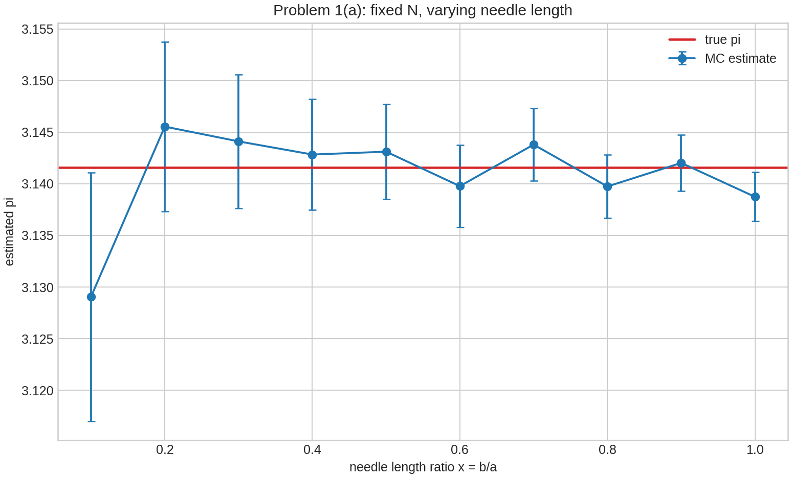
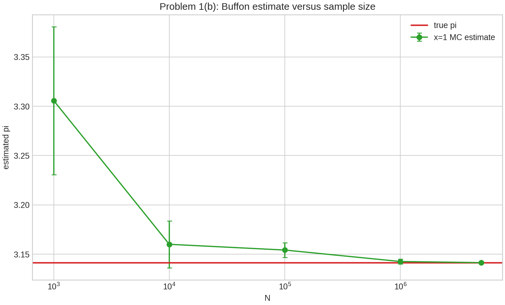
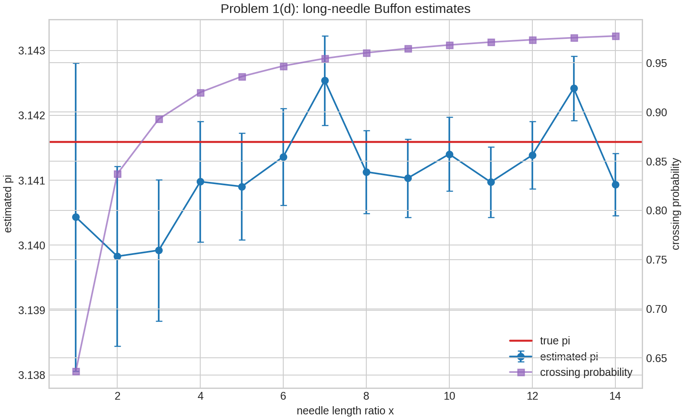
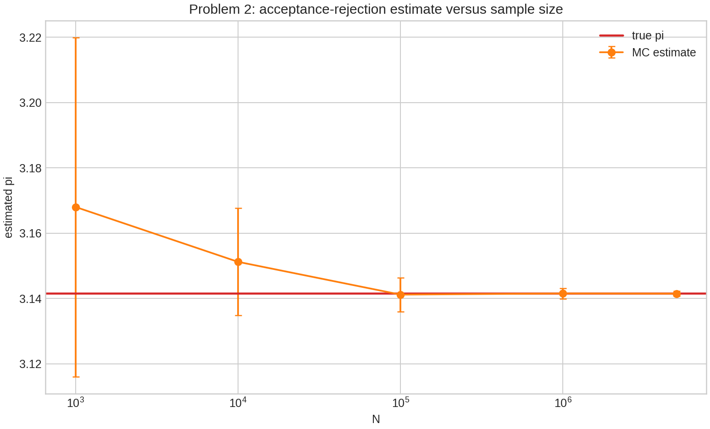
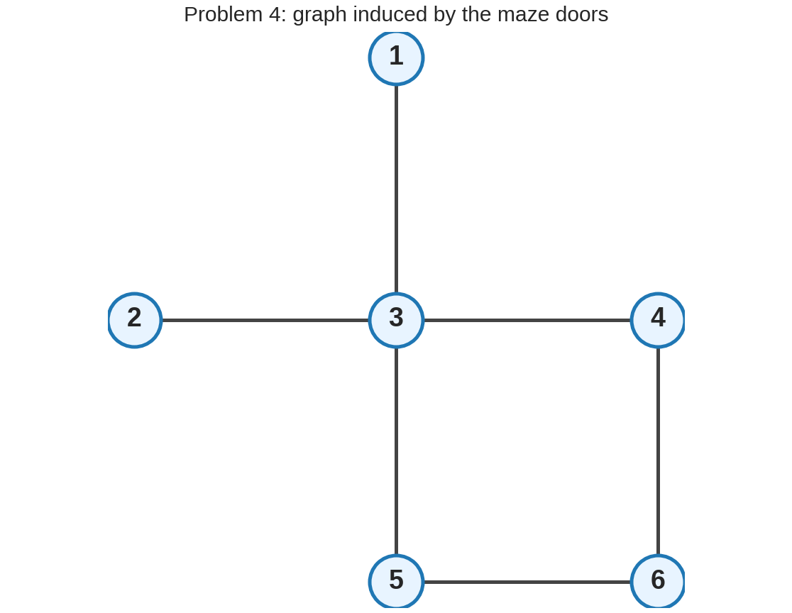
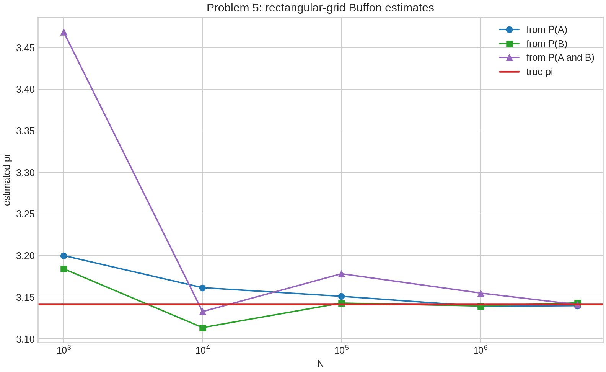
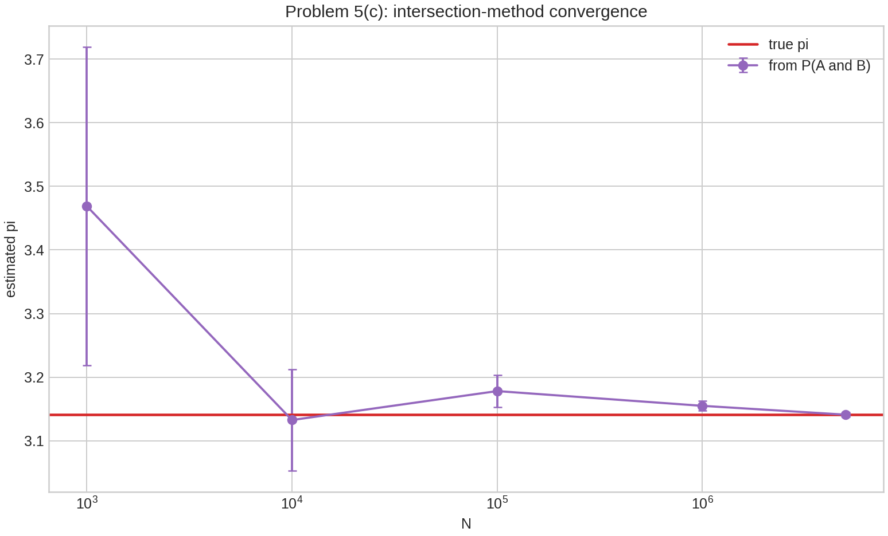

| { width=20% } |
|:--:|

| 项目 | 内容 |
|:--|:--|
| 作业编号 | `HW10` |
| 作业目录 | `HW/09` |
| 学生姓名 | 姜玥晟 |
| 报告主题 | Buffon 投针、接受-拒绝法与 Markov 链 |
| 实验环境 | `Python 3.13.5`、`numpy`、`matplotlib`、`pypandoc` |
| 报告说明 | 正文按题目小问顺序展开；`scripts/hw09_analysis.py` 生成全部结果，`results/` 保存支撑材料。 |

\newpage

# 文件结构与说明 {-}

- `docs/answer.pdf`：最终提交报告。
- `scripts/hw09_analysis.py`：一次性生成全部数值结果、图像与汇总 JSON。
- `results/`：正文中引用的 CSV、PNG、日志与统计汇总文件。

# 题目与任务 {-}

本次作业共 5 题，分别研究 Buffon 投针、接受-拒绝法、三校 Markov 链、迷宫随机游走，以及矩形网格上的 Buffon 投针。每题都给出原题要求、计算方法、直接答案与简短理解。

\newpage

# 第一题：Buffon 投针的 Monte Carlo 模拟

## (a) 固定 $N$ 时改变 $x=b/a$

**待求问题。** 用传统 Monte Carlo 方法模拟 Buffon 投针问题并计算 $\pi$。在固定样本数 $N$ 下改变 $x=b/a$，讨论哪些因素会影响最终结果。为简单起见取 $a=1$。题目提示需要考虑 $N$ 是否足够大，并经验性说明为什么针长增加时估计通常会改善。

**解决方式。** 短针情形取平行线间距 $a=1$、针长 $\ell=x$，且 $0<x\le 1$。令针中心到最近平行线的距离为 $u\sim U(0,a/2)$，针方向角等价取 $\theta\sim U(0,\pi/2)$。穿线条件为

$$
u\le \frac{\ell}{2}\sin\theta.
$$

短针穿线概率为

$$
p=P(\text{穿线})=\frac{2\ell}{\pi a}=\frac{2x}{\pi}.
$$

若 $N$ 次投针中有 $M$ 次穿线，则

$$
\hat{\pi}=\frac{2xN}{M}.
$$

由于 $M$ 服从二项分布，误差传播给出

$$
\operatorname{sd}(\hat{\pi})
\approx \pi\sqrt{\frac{1-p}{pN}}.
$$

**问题答案。** 固定 $N=10^6$，改变 $x$ 得到如下结果。

| $x$ | 命中数 $M$ | $\hat\pi$ | 绝对误差 | 理论标准差 |
|--:|--:|--:|--:|--:|
| 0.1 | 63917 | 3.129058 | 0.012535 | 0.012048 |
| 0.2 | 127164 | 3.145544 | 0.003952 | 0.008225 |
| 0.3 | 190833 | 3.144110 | 0.002518 | 0.006466 |
| 0.4 | 254547 | 3.142838 | 0.001245 | 0.005375 |
| 0.5 | 318156 | 3.143112 | 0.001520 | 0.004597 |
| 0.6 | 382193 | 3.139775 | 0.001818 | 0.003996 |
| 0.7 | 445321 | 3.143800 | 0.002207 | 0.003504 |
| 0.8 | 509596 | 3.139742 | 0.001851 | 0.003084 |
| 0.9 | 572879 | 3.142025 | 0.000432 | 0.002712 |
| 1.0 | 637198 | 3.138742 | 0.002851 | 0.002374 |

{ width=72% }

**理解。** 当 $x$ 增大时，穿线概率 $p=2x/\pi$ 增大，命中数 $M$ 增加，比例 $M/N$ 的相对波动减小。因此从理论标准差看，较长的针更容易得到稳定估计。但单次模拟仍有随机波动，所以绝对误差不必严格随 $x$ 单调下降。

## (b) 改变样本数 $N$

**待求问题。** 改变 $N$ 的取值，观察传统 Buffon 投针方法能够获得多高的计算精度。

**解决方式。** 固定 $x=1$，一次生成最大样本量下的随机投针序列，再对前 $N$ 个样本取累计命中数。这样不同 $N$ 之间共享前缀样本，便于观察样本量增加带来的收敛趋势。

**问题答案。** 结果如下。

| $N$ | 命中数 $M$ | $\hat\pi$ | 绝对误差 | 理论标准差 |
|--:|--:|--:|--:|--:|
| 1000 | 605 | 3.305785 | 0.164192 | 0.075057 |
| 10000 | 6329 | 3.160057 | 0.018464 | 0.023735 |
| 100000 | 63407 | 3.154226 | 0.012633 | 0.007506 |
| 1000000 | 636414 | 3.142608 | 0.001016 | 0.002374 |
| 5000000 | 3183239 | 3.141454 | 0.000138 | 0.001061 |

{ width=72% }

当 $N=5\times 10^6$ 时，本次模拟给出

$$
\hat{\pi}=3.1414543489,
$$

绝对误差约为 $1.38\times10^{-4}$。

**理解。** Monte Carlo 误差的典型量级为 $O(N^{-1/2})$。因此若希望多获得一位十进制有效数字，通常需要约 $100$ 倍样本量。这也是本题中提高精度的主要成本。

## (c) 计算机为什么只能达到这种精度

**待求问题。** 解释为什么本机程序只能得到上述量级的精度，并给出尽可能多的原因。

**解决方式。** 将误差来源分为 Monte Carlo 采样误差、伪随机数误差、计数离散误差、浮点舍入误差和计算资源限制，并比较它们在本实验中的主次关系。

**问题答案。** 本实验的主要限制是采样误差。以 $x=1$ 为例，

$$
\operatorname{sd}(\hat{\pi})\approx
\pi\sqrt{\frac{1-2/\pi}{(2/\pi)N}},
$$

当 $N=5\times10^6$ 时理论标准差约为 $1.06\times10^{-3}$。本次误差 $1.38\times10^{-4}$ 小于一个标准差，属于合理随机波动。

**理解。** 双精度浮点舍入并不是当前样本量下的主导误差。真正限制精度的是随机抽样的慢收敛；此外，伪随机数状态有限、命中数 $M$ 必为整数、运行时间与内存开销随 $N$ 增长，也都会限制实际可取得的精度。

## (d) 长针概率公式的可选实验

**待求问题。** 题目给出长针情形的分段概率函数：

$$
P(x)=
\begin{cases}
\dfrac{2}{\pi}x, & x\le 1,\\[4pt]
\dfrac{2}{\pi}\left(x-\sqrt{x^2-1}+\operatorname{arcsec}x\right), & x>1.
\end{cases}
$$

取 $x=1,2,\ldots,14$，判断能否正确估计 $\pi$，说明原因，并画出最佳计算值随 $x$ 的变化。本文按公式把 $x$ 理解为针长与平行线间距之比。

**解决方式。** 写成

$$
P(x)=\frac{c(x)}{\pi},
$$

其中

$$
c(x)=
\begin{cases}
2x, & x\le 1,\\[4pt]
2\left(x-\sqrt{x^2-1}+\operatorname{arcsec}x\right), & x>1.
\end{cases}
$$

模拟得到穿线频率 $\hat p=M/N$ 后，用

$$
\hat{\pi}=\frac{c(x)}{\hat p}
$$

反推出 $\pi$。

**问题答案。** 固定 $N=10^6$，结果如下。

| $x$ | 理论穿线概率 | $\hat\pi$ | 绝对误差 |
|--:|--:|--:|--:|
| 1 | 0.636620 | 3.140432 | 0.001160 |
| 2 | 0.837248 | 3.139828 | 0.001765 |
| 3 | 0.892880 | 3.139922 | 0.001671 |
| 4 | 0.920000 | 3.140978 | 0.000614 |
| 5 | 0.936123 | 3.140902 | 0.000690 |
| 6 | 0.946825 | 3.141362 | 0.000231 |
| 7 | 0.954449 | 3.142535 | 0.000943 |
| 8 | 0.960159 | 3.141129 | 0.000464 |
| 9 | 0.964596 | 3.141032 | 0.000561 |
| 10 | 0.968142 | 3.141403 | 0.000190 |
| 11 | 0.971043 | 3.140971 | 0.000622 |
| 12 | 0.973459 | 3.141385 | 0.000207 |
| 13 | 0.975503 | 3.142416 | 0.000823 |
| 14 | 0.977254 | 3.140933 | 0.000659 |

{ width=72% }

**理解。** 可以正确估计 $\pi$，但前提是使用长针的正确概率公式。若对 $x>1$ 仍套用短针公式 $P=2x/\pi$，会产生系统偏差。随着 $x$ 增大，穿线概率接近 1，二项波动减小，因此理论标准差下降；但有限样本下仍会有随机起伏。

# 第二题：接受-拒绝法计算圆周率

## (a) 改变样本数 $N$

**待求问题。** 用传统接受-拒绝法计算 $\pi$，并通过改变 $N$ 观察能得到的精度。面积关系为

$$
\frac{A_{\mathrm{circle}}}{A_{\mathrm{square}}}=\frac{\pi}{4}.
$$

**解决方式。** 在单位正方形 $[0,1]^2$ 中均匀采样点 $(x_i,y_i)$。若

$$
x_i^2+y_i^2\le 1,
$$

则该点落在四分之一单位圆内。设圆内点数为 $M$，则

$$
\hat{\pi}=4\frac{M}{N}.
$$

由于 $M\sim \operatorname{Binomial}(N,\pi/4)$，

$$
\operatorname{sd}(\hat{\pi})\approx
4\sqrt{\frac{(\pi/4)(1-\pi/4)}{N}}.
$$

**问题答案。**

| $N$ | 圆内点数 $M$ | $\hat\pi$ | 绝对误差 | 理论标准差 |
|--:|--:|--:|--:|--:|
| 1000 | 792 | 3.168000 | 0.026407 | 0.051920 |
| 10000 | 7878 | 3.151200 | 0.009607 | 0.016419 |
| 100000 | 78529 | 3.141160 | 0.000433 | 0.005192 |
| 1000000 | 785378 | 3.141512 | 0.000081 | 0.001642 |
| 5000000 | 3926830 | 3.141464 | 0.000129 | 0.000734 |

{ width=72% }

当 $N=5\times10^6$ 时，

$$
\hat{\pi}=3.1414640000,
$$

绝对误差约为 $1.29\times10^{-4}$。

**理解。** 接受-拒绝法的事件概率为 $\pi/4\approx0.785$，比短针 Buffon 方法中很多小 $x$ 情形的穿线概率更高，因此相同 $N$ 下二项标准差通常更小。

## (b) 计算机为什么只能达到这种精度

**待求问题。** 解释为什么接受-拒绝法在本机上也只能达到上述精度。

**解决方式。** 继续从二项抽样误差和计算机实现限制两方面分析。

**问题答案。** 接受-拒绝法同样是 Monte Carlo 方法，误差主项为 $O(N^{-1/2})$。本题在 $N=5\times10^6$ 时理论标准差约为 $7.34\times10^{-4}$，本次实际误差 $1.29\times10^{-4}$ 在合理范围内。

**理解。** 即使伪随机数和浮点计算没有明显问题，随机采样本身也不会快速给出很多位正确数字。若希望把误差从 $10^{-4}$ 稳定压到 $10^{-5}$，样本量通常需要增加约 $100$ 倍，这会直接增加运行时间。

# 第三题：三所大学传承问题的 Markov 链

## (a) 原始转移规则

**待求问题。** Harvard、Yale、Dartmouth 三校之间的父子就读概率如下：Harvard 男校友的儿子中 80% 去 Harvard，其余去 Yale；Yale 男校友的儿子中 40% 去 Yale，其余平均分到 Harvard 和 Dartmouth；Dartmouth 男校友的儿子中 70% 去 Dartmouth、20% 去 Harvard、10% 去 Yale。求 Harvard 男校友的孙子进入 Harvard 的概率。

**解决方式。** 按状态顺序 $(H,Y,D)$ 写出行随机矩阵

$$
P=
\begin{pmatrix}
0.8 & 0.2 & 0\\
0.3 & 0.4 & 0.3\\
0.2 & 0.1 & 0.7
\end{pmatrix}.
$$

孙子对应两代转移，因此所求概率为 $(P^2)_{HH}$。

**问题答案。**

$$
P^2=
\begin{pmatrix}
0.70 & 0.24 & 0.06\\
0.42 & 0.25 & 0.33\\
0.33 & 0.19 & 0.48
\end{pmatrix}.
$$

所以 Harvard 男校友的孙子进入 Harvard 的概率为

$$
(P^2)_{HH}=0.70.
$$

**理解。** 这个结果也可由全概率公式得到：

$$
0.8\times0.8+0.2\times0.3+0\times0.2=0.70.
$$

矩阵平方正是把中间一代的所有可能学校自动求和。

## (b) Harvard 男校友的儿子总去 Harvard

**待求问题。** 修改假设：Harvard 男校友的儿子总是进入 Harvard。再次求 Harvard 男校友的孙子进入 Harvard 的概率。

**解决方式。** 修改后的转移矩阵第一行为 $(1,0,0)$：

$$
P'=
\begin{pmatrix}
1 & 0 & 0\\
0.3 & 0.4 & 0.3\\
0.2 & 0.1 & 0.7
\end{pmatrix}.
$$

**问题答案。** 因为从 Harvard 出发第一代必留在 Harvard，而第二代也按同一修改规则必留在 Harvard，所以

$$
(P'^2)_{HH}=1.
$$

**理解。** 修改后，状态 $H$ 对 Harvard 出发的谱系相当于吸收状态，因此两代后的 Harvard 概率变成 1。

# 第四题：迷宫中老鼠运动的 Markov 链

## (a) 转移矩阵

**待求问题。** 老鼠在六个房间的迷宫中运动，每一步从当前房间的所有门中随机选一扇离开。要求给出该 Markov 链的转移矩阵 $P$。

**解决方式。** 根据题图，房间邻接关系取为

$$
1\leftrightarrow3,\quad
2\leftrightarrow3,\quad
3\leftrightarrow4,\quad
3\leftrightarrow5,\quad
4\leftrightarrow6,\quad
5\leftrightarrow6.
$$

每个房间向相邻房间等概率转移。下图给出对应的图结构。

{ width=50% }

**问题答案。** 按状态顺序 $(1,2,3,4,5,6)$，

$$
P=
\begin{pmatrix}
0&0&1&0&0&0\\
0&0&1&0&0&0\\
\frac14&\frac14&0&\frac14&\frac14&0\\
0&0&\frac12&0&0&\frac12\\
0&0&\frac12&0&0&\frac12\\
0&0&0&\frac12&\frac12&0
\end{pmatrix}.
$$

**理解。** 第 $i$ 行非零元素个数等于房间 $i$ 的门数，且同行非零概率相等。

## (b) 不可约但有周期

**待求问题。** 说明该 Markov 链不可约，但不是非周期的。

**解决方式。** 先检查图连通性，再检查返回自身所需步数的奇偶性。

**问题答案。** 由图可知任意房间之间都存在路径，因此链不可约。另一方面，该图是二分图，可取二分划分

$$
\{3,6\}\quad\text{和}\quad\{1,2,4,5\}.
$$

每一步必从一个集合移动到另一个集合，因此返回原状态只能发生在偶数步，周期为 2。

**理解。** 不可约只说明所有状态相互可达；非周期性还要求返回时间的最大公约数为 1。本题虽不可约，但所有状态返回时间均为偶数，所以不是非周期链。

## (c) 平稳分布

**待求问题。** 求该 Markov 链的平稳分布。

**解决方式。** 这是无向图上的简单随机游走，平稳分布与各节点度数成正比。

**问题答案。** 各房间度数为

$$
(1,1,4,2,2,2),
$$

总度数为 $12$，所以

$$
\boldsymbol{\pi}
=\left(\frac1{12},\frac1{12},\frac13,\frac16,\frac16,\frac16\right).
$$

**理解。** 房间 3 有四扇门，长期访问比例最大；房间 1 和房间 2 各只有一扇门，长期访问比例最小。

## (d) 从房间 1 首次到达房间 5 的期望步数

**待求问题。** 房间 5 放置致命陷阱，老鼠从房间 1 出发，求首次到达房间 5 之前的期望步数。

**解决方式。** 令 $h_i=E_i[T_5]$，并取 $h_5=0$。首达时间满足

$$
\begin{aligned}
h_1&=1+h_3,\\
h_2&=1+h_3,\\
h_3&=1+\frac14(h_1+h_2+h_4+h_5),\\
h_4&=1+\frac12(h_3+h_6),\\
h_6&=1+\frac12(h_4+h_5).
\end{aligned}
$$

**问题答案。** 解得

$$
(h_1,h_2,h_3,h_4,h_5,h_6)=(7,7,6,6,0,4).
$$

因此从房间 1 出发首次到达房间 5 的期望步数为

$$
E_1[T_5]=7.
$$

脚本用 $200000$ 次独立模拟验证，模拟均值为 $7.01139$。

**理解。** 解析值和模拟值的差异约为 $0.01139$，属于 Monte Carlo 统计波动。首达时间方程本质上是“一步转移 + 余下期望”的递推。

## (e) 回到房间 1 的期望时间

**待求问题。** 求老鼠回到房间 1 的期望时间。

**解决方式。** 对有限不可约 Markov 链，Kac 公式给出

$$
E_i[T_i^+]=\frac{1}{\pi_i}.
$$

**问题答案。** 因为 $\pi_1=1/12$，

$$
E_1[T_1^+]=12.
$$

脚本模拟均值为 $11.99737$。

**理解。** 平稳分布越小的状态，平均返回时间越长。房间 1 的长期访问比例只有 $1/12$，所以平均每 12 步返回一次。

# 第五题：矩形网格上的 Buffon 投针

## (a) 穿越竖直线的概率

**待求问题。** 矩形网格竖直线间距为 $a$，水平线间距为 $b$。长度 $\ell<\min(a,b)$ 的针随机投到网格上。令 $A$ 表示针穿过竖直线，证明

$$
P(A)=\frac{2\ell}{\pi a}.
$$

**解决方式。** 设针中心到最近竖直线的距离为 $X\sim U(0,a/2)$，方向角取 $\theta\sim U(0,\pi/2)$。给定 $\theta$ 时，

$$
A:\quad X\le \frac{\ell}{2}\cos\theta.
$$

因此

$$
P(A)=\frac{2}{\pi}\int_0^{\pi/2}
\frac{\ell\cos\theta}{a}\,d\theta
=\frac{2\ell}{\pi a}.
$$

**问题答案。** 本式成立。若模拟得到 $\hat p_A$，则可用

$$
\hat\pi_A=\frac{2\ell}{a\hat p_A}
$$

估计 $\pi$。

**理解。** 该式与一维 Buffon 短针公式完全一致，因为只关心是否跨过竖直线时，水平线间距 $b$ 不参与事件判定。

## (b) 穿越水平线的概率

**待求问题。** 令 $B$ 表示针穿过水平线，证明

$$
P(B)=\frac{2\ell}{\pi b}.
$$

**解决方式。** 设针中心到最近水平线的距离为 $Y\sim U(0,b/2)$。给定 $\theta$ 时，

$$
B:\quad Y\le \frac{\ell}{2}\sin\theta.
$$

因此

$$
P(B)=\frac{2}{\pi}\int_0^{\pi/2}
\frac{\ell\sin\theta}{b}\,d\theta
=\frac{2\ell}{\pi b}.
$$

**问题答案。** 本式成立。若模拟得到 $\hat p_B$，则

$$
\hat\pi_B=\frac{2\ell}{b\hat p_B}.
$$

**理解。** 与 (a) 相比，竖直方向和水平方向对称，只是网格间距由 $a$ 换成 $b$。

## (c) 同时穿越竖直线和水平线，并比较三种方法

**待求问题。** 证明

$$
P(A\cap B)=\frac{\ell^2}{\pi ab}.
$$

再分别用 (a)、(b)、(c) 三个公式进行传统 Monte Carlo 模拟，计算 $\pi$，并评论三种方法哪一种效果最好。题目还要求最好绘制 (c) 的结果。

**解决方式。** 给定角度 $\theta$ 时，$X$ 与 $Y$ 独立，所以

$$
\begin{aligned}
P(A\cap B)
&=\frac{2}{\pi}\int_0^{\pi/2}
\frac{\ell\cos\theta}{a}
\frac{\ell\sin\theta}{b}\,d\theta\\
&=\frac{2\ell^2}{\pi ab}
\int_0^{\pi/2}\sin\theta\cos\theta\,d\theta\\
&=\frac{\ell^2}{\pi ab}.
\end{aligned}
$$

模拟中取

$$
a=1,\qquad b=1.5,\qquad \ell=0.8,
$$

并分别统计 $A$、$B$、$A\cap B$ 的频率。对应估计量为

$$
\hat\pi_A=\frac{2\ell}{a\hat p_A},\qquad
\hat\pi_B=\frac{2\ell}{b\hat p_B},\qquad
\hat\pi_{AB}=\frac{\ell^2}{ab\hat p_{AB}}.
$$

**问题答案。**

| $N$ | $\hat\pi_A$ | $\hat\pi_B$ | $\hat\pi_{AB}$ | 最小绝对误差方法 |
|--:|--:|--:|--:|:--|
| 1000 | 3.200000 | 3.184080 | 3.468835 | $B$ |
| 10000 | 3.161431 | 3.113446 | 3.132648 | $AB$ |
| 100000 | 3.151033 | 3.142894 | 3.178150 | $B$ |
| 1000000 | 3.139071 | 3.139360 | 3.154978 | $B$ |
| 5000000 | 3.139767 | 3.143140 | 3.141061 | $AB$ |

{ width=72% }

方法 (c) 的单独收敛图如下。

{ width=72% }

本次参数下理论事件概率为

$$
P(A)=0.509296,\qquad P(B)=0.339531,\qquad P(A\cap B)=0.135812.
$$

从统计效率看，方法 (a) 最好，方法 (b) 次之，方法 (c) 最不稳定。表中某些样本量下 $AB$ 方法偶然更接近真值，是单次随机模拟的波动，不代表其方差更小。

**理解。** 对形如 $\hat\pi=C/\hat p$ 的估计量，事件概率越小，$\hat p$ 的相对误差越大。交叉事件 $A\cap B$ 的概率只有约 $0.136$，命中数明显少于单独穿越竖直线或水平线的事件，所以方差更大。若目标只是估计 $\pi$，应优先使用事件概率较大的方法。
