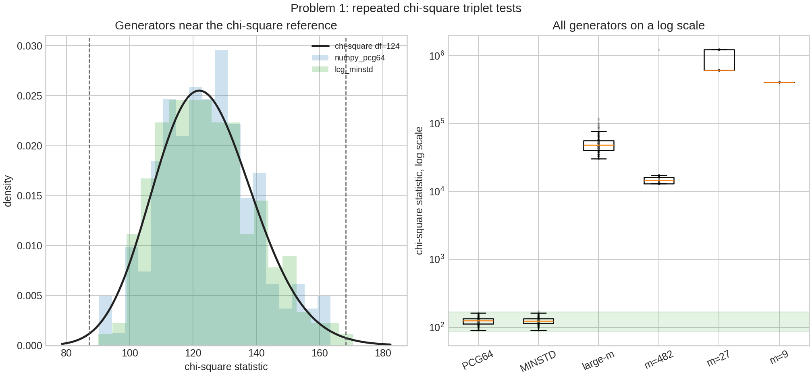
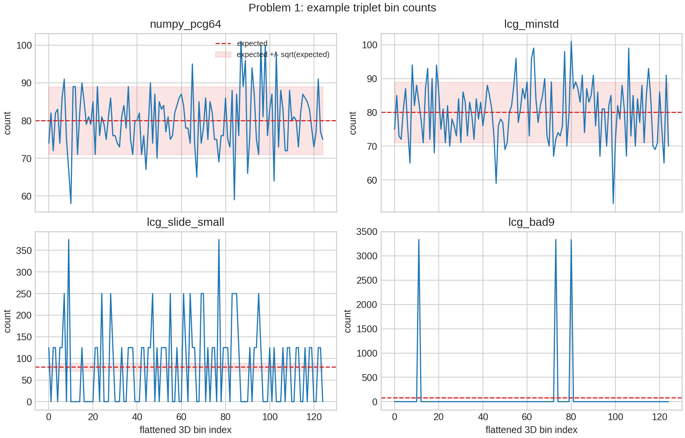
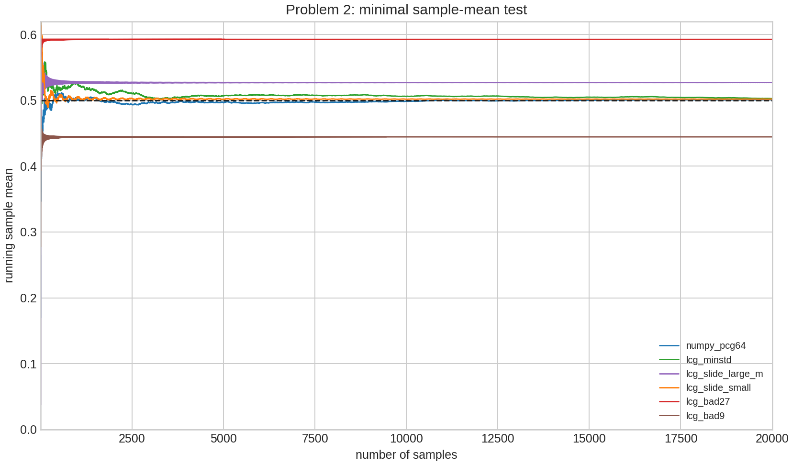
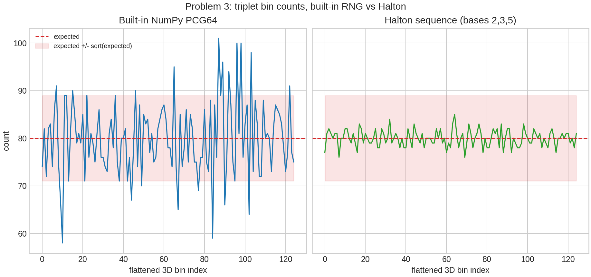
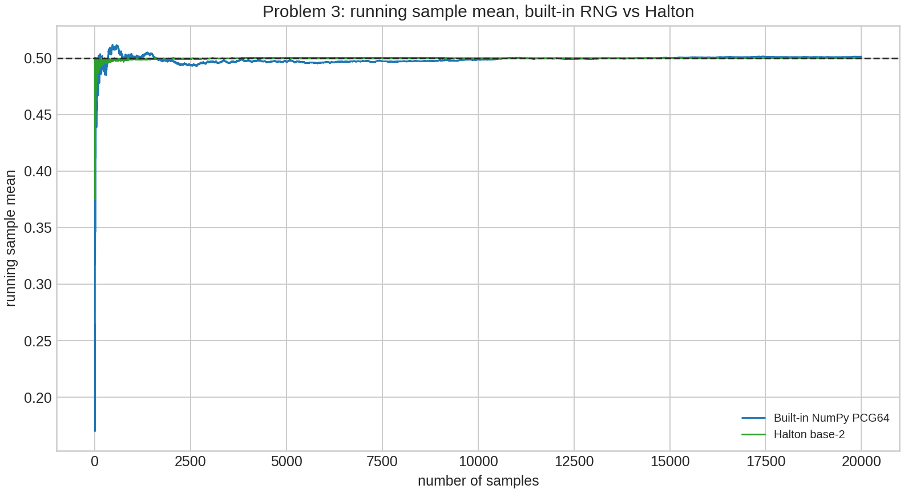
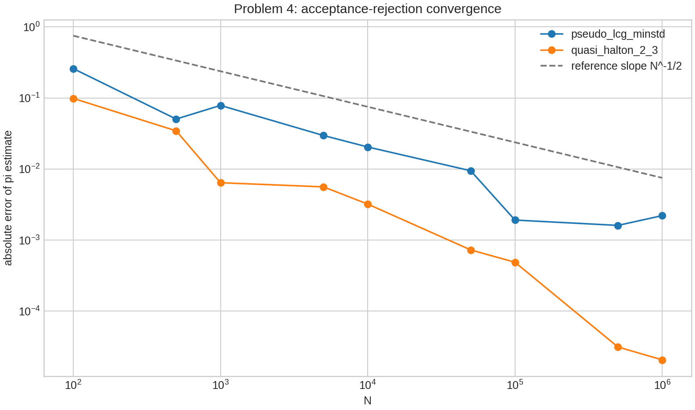
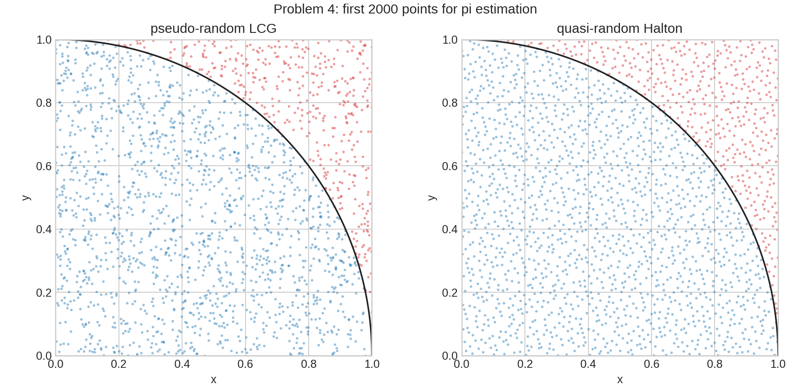

| { width=20% } |
|:--:|

| 项目 | 内容 |
|:--|:--|
| 作业编号 | `HW12` |
| 作业目录 | `HW/10` |
| 学生姓名 | 姜玥晟 |
| 报告主题 | 随机数生成器统计检验、准随机序列与接受-拒绝法估计 $\pi$ |
| 实验环境 | `Python 3.13.5`、`numpy 2.3.3`、`scipy`、`matplotlib`、`pypandoc` |
| 报告说明 | 正文按小问逐节组织；每个小问内部自成完整结构。 |

\newpage

# I. 随机数生成器统计检验 {-}

## Problem 1：卡方随机性检验

### 待求问题

对若干内置或自选随机数生成器做随机性的卡方检验。将单位立方体分成 $N$ 个箱子，抽取许多 $P$ 个三元组。若生成器给出的点在三维单位立方体内足够均匀且近似独立，则每个箱子的点数应接近

$$
n=\frac{P}{N},
$$

典型随机波动约为

$$
\sqrt{\frac{P}{N}}.
$$

题图给出的示例为 $N=100,\ P=1000$。

### 解决方式

本文统一将三维单位立方体 $[0,1)^3$ 沿每个坐标方向分成 5 份，因此总箱数为

$$
N_{\mathrm{bin}}=5^3=125.
$$

每次检验抽取

$$
P=10000
$$

个三元组，理论期望频数为

$$
E=\frac{P}{N_{\mathrm{bin}}}=80.
$$

对观测频数 $O_i$ 计算卡方统计量

$$
\chi^2=\sum_{i=1}^{N_{\mathrm{bin}}}\frac{(O_i-E)^2}{E}.
$$

若样本近似来自独立均匀分布，则 $\chi^2$ 应近似服从自由度

$$
\nu=N_{\mathrm{bin}}-1=124
$$

的卡方分布。右尾 p 值过小表示分箱偏离过大；中心 p 值过小表示统计量落在卡方分布两端，既包括“过于不均匀”，也包括“过于均匀”。

线性同余生成器的递推式为

$$
x_{k+1}=(a x_k+c)\bmod m,\qquad u_k=\frac{x_k}{m}.
$$

检验流程如下：

```text
for each generator:
    repeat the chi-square experiment for many independent seeds
    generate P triples in [0, 1)^3
    assign each triple to one of 5^3 bins
    compute chi-square statistic and p-values
    summarize representative run and repeated-run distribution

compare each generator with the chi-square distribution of df = 124
```

### 问题答案

表 1 给出单次代表性检验和 200 次重复检验的汇总。自由度 124 的 0.5% 与 99.5% 分位数分别为 87.192079 和 168.308113；一个普通随机生成器的卡方值应大致落在该区间附近。

| 生成器 | 示例 $\chi^2$ | 右尾 p 值 | 中心 p 值 | 最小/最大箱频数 | 200 次 $\chi^2$ 均值 | 中心 p 值通过率 |
|:--|--:|--:|--:|:--:|--:|--:|
| `numpy_pcg64` | 97.550 | 0.961914 | 0.076173 | 58 / 101 | 124.787 | 1.000 |
| `lcg_minstd` | 117.125 | 0.656288 | 0.687423 | 53 / 101 | 124.447 | 0.995 |
| `lcg_slide_large_m` | 43307.350 | 0 | 0 | 0 / 966 | 50540.683 | 0 |
| `lcg_slide_small` | 13046.875 | 0 | 0 | 0 / 375 | 20720.703 | 0 |
| `lcg_bad27` | 615000.000 | 0 | 0 | 0 / 5000 | 780625.000 | 0 |
| `lcg_bad9` | 406666.675 | 0 | 0 | 0 / 3334 | 406666.675 | 0 |

{ width=86% }

图 1 中，`numpy_pcg64` 和 `lcg_minstd` 的重复检验分布与理论卡方分布相当接近，而另外四组 LCG 的统计量远离理论范围。图 2 显示了单次检验中部分生成器的 125 个箱子频数。`numpy_pcg64` 和 `lcg_minstd` 的箱频数围绕 80 波动；坏 LCG 会产生大量空箱和少数极高频箱，说明三维点严重集中在某些结构上。

{ width=90% }

### 理解

本题说明，随机数生成器不应只看周期或参数规模。即使 $m=2^{31}-1$ 很大，若 $a$ 和 $c$ 选择不当，三维相邻样本仍可能落在很少的结构上，从而被卡方检验显著拒绝。相反，Park-Miller 型 LCG 在本实验的三维分箱尺度上表现接近内置 `PCG64`。

卡方检验本身也有局限。它只检验所选分箱下的均匀性，不能证明生成器在所有维度、所有变换下都随机。因此，实际评价生成器时还需要结合高维谱检验、自相关检验、运行检验等更丰富的统计测试。

## Problem 2：样本均值的最小统计检验

### 待求问题

使用一个最小统计检验判断随机数生成器的样本均值是否接近 0.5，并测试内置随机数生成器和自己写的生成器。

### 解决方式

若 $u_i$ 独立服从 $U(0,1)$，则

$$
\mathbb{E}(u_i)=\frac12,\qquad \operatorname{Var}(u_i)=\frac1{12}.
$$

对 $M$ 个样本的均值 $\bar u$，中心极限定理给出

$$
\bar u\approx N\left(\frac12,\frac{1}{12M}\right).
$$

因此可构造

$$
z=\frac{\bar u-1/2}{\sqrt{1/(12M)}},
$$

并用标准正态分布的双侧 p 值判断均值是否显著偏离 0.5。本文取 $M=20000$，并同时绘制运行均值随样本数变化的曲线。

计算流程如下：

```text
for each generator:
    generate M one-dimensional samples
    compute final sample mean
    compute z-score under the independent uniform reference model
    compute two-sided p-value
    record the running mean curve

compare whether the final mean is close to 0.5
```

### 问题答案

| 生成器 | 最终样本均值 | $\bar u-0.5$ | z 值 | 双侧 p 值 |
|:--|--:|--:|--:|--:|
| `numpy_pcg64` | 0.5012593264 | 0.0012593264 | 0.616941 | 0.537273 |
| `lcg_minstd` | 0.5026607291 | 0.0026607291 | 1.303486 | 0.192409 |
| `lcg_slide_large_m` | 0.5268434426 | 0.0268434426 | 13.150547 | 1.68947E-39 |
| `lcg_slide_small` | 0.5019008299 | 0.0019008299 | 0.931213 | 0.351744 |
| `lcg_bad27` | 0.5925925926 | 0.0925925926 | 45.360921 | 0 |
| `lcg_bad9` | 0.4444500000 | -0.0555500000 | -27.213831 | 4.4558E-163 |

{ width=86% }

从表 2 可见，`numpy_pcg64` 和 `lcg_minstd` 的样本均值没有显著偏离 0.5。`lcg_slide_large_m`、`lcg_bad27` 和 `lcg_bad9` 明显失败。`lcg_slide_small` 的均值检验没有失败，但它已经在 Problem 1 的三维卡方检验中显著失败。

### 理解

样本均值检验是一个非常弱的必要条件。一个生成器可以具有接近 0.5 的均值，却仍然存在严重周期结构、相邻样本相关性或高维格点缺陷。`lcg_slide_small` 正是这种情形：它的均值看似正常，但三维分箱中大量空箱，说明其分布结构远远不合格。因此，样本均值检验只能作为最初级的筛查，而不能作为随机数质量的充分证明。

## Problem 3：自写准随机数生成器并检验

### 待求问题

编写自己的准随机数生成器，并对其进行卡方随机性检验和样本均值的最小统计检验；同时与系统自带随机数生成器做对比，观察两者在“随机性”和“均匀覆盖性”上的差别。

### 解决方式

本文使用 Halton 低差异序列。对基数 $b$，将正整数 $n$ 写成

$$
n=d_0+d_1b+d_2b^2+\cdots,
$$

则 radical inverse 定义为

$$
\phi_b(n)=\frac{d_0}{b}+\frac{d_1}{b^2}+\frac{d_2}{b^3}+\cdots.
$$

三维准随机点取

$$
\left(\phi_2(n),\phi_3(n),\phi_5(n)\right),\qquad n=1,2,\ldots.
$$

样本均值检验使用一维基数 2 的 Halton 序列。为了看清准随机数与普通伪随机数的差异，本文在同样的样本量下，用系统自带的 `numpy_pcg64` 作为对照组，分别比较：

1. 三维分箱卡方统计量；
2. 运行样本均值是否靠近 0.5。

由于准随机序列的目标不是产生独立随机样本，而是尽可能均匀地覆盖区域，所以其卡方统计量的解释不同于伪随机数。过大的卡方值说明分布不均；过小的卡方值则说明序列比随机样本更均匀。

对应生成流程如下：

```text
for n = 1, 2, ..., sample_count:
    compute radical inverse in base 2
    compute radical inverse in base 3
    compute radical inverse in base 5
    form the 3D Halton point

use the 3D points for chi-square bin counts
use the base-2 sequence for the sample-mean test
```

### 问题答案

三维检验统一取 $10000$ 个点、125 个箱子，单箱期望为 80；样本均值检验统一取 $20000$ 个样本。实验结果如下。

| 检验 | 生成器 | 样本数 | 统计量 | 自由度或 z 值 | p 值 | 辅助结果 |
|:--|:--|--:|--:|--:|--:|:--|
| 三维卡方 | `numpy_pcg64` | 10000 | 97.5500000000 | 124 | 右尾 p=0.9619138559，中心 p=0.07617228826 | 箱频数 58 / 101 |
| 三维卡方 | `halton_2_3_5` | 10000 | 4.6750000000 | 124 | 右尾 p=1，中心 p=4.64494821E-64 | 箱频数 76 / 85 |
| 样本均值 | `numpy_pcg64` | 20000 | 0.5012593264 | 0.6169414369 | 0.5372733541 | 运行均值区间 0.1698609510 / 0.5117193556 |
| 样本均值 | `halton_base2` | 20000 | 0.4999153702 | -0.0414599761 | 0.9669291999 | 运行均值区间 0.375 / 0.5 |

{ width=92% }

{ width=86% }

### 理解

与系统自带的 `numpy_pcg64` 相比，Halton 序列的差异非常明显。`numpy_pcg64` 的三维卡方值为 97.55，落在普通随机波动的合理范围内；而 Halton 的卡方值只有 4.675，箱频数只在 76 到 85 之间变化，说明它把点分布得比独立随机样本还要均匀得多。这会导致右尾 p 值接近 1、中心 p 值极小。

两者在样本均值检验上都接近 0.5，因此如果只看均值，几乎都会被判为“正常”；真正把它们区分开的，是三维分箱后的空间结构。也就是说，准随机序列并不是“更随机”，而是“更均匀”。这种性质适合数值积分和面积估计，但不适合需要不可预测性的模拟或加密场景。

# II. 接受-拒绝法估计圆周率 {-}

## Problem 4(a)：使用伪随机数生成器估计 $\pi$

### 待求问题

用传统接受-拒绝法计算 $\pi$，其中面积关系为

$$
\frac{A_{\mathrm{circle}}}{A_{\mathrm{square}}}=\frac{\pi}{4}.
$$

本小问要求使用自己写的伪随机数生成器。

### 解决方式

在单位正方形 $[0,1]^2$ 中生成点 $(x_i,y_i)$。若

$$
x_i^2+y_i^2\le 1,
$$

则该点落在四分之一单位圆内。设 $N$ 个点中有 $M$ 个落在圆内，则

$$
\hat\pi=4\frac{M}{N}.
$$

伪随机数生成器使用 Park-Miller 型 LCG：

$$
m=2^{31}-1,\qquad a=48271,\qquad c=0.
$$

若 $M\sim\operatorname{Binomial}(N,\pi/4)$，则

$$
\operatorname{sd}(\hat\pi)\approx
4\sqrt{\frac{(\pi/4)(1-\pi/4)}{N}},
$$

误差典型量级为 $O(N^{-1/2})$。

### 问题答案

伪随机 LCG 的估计结果如下。

| $N$ | $\hat\pi_{\mathrm{pseudo}}$ | 绝对误差 |
|--:|--:|--:|
| 100 | 3.4000000000 | 0.2584073464 |
| 500 | 3.1920000000 | 0.0504073464 |
| 1000 | 3.2200000000 | 0.0784073464 |
| 5000 | 3.1712000000 | 0.0296073464 |
| 10000 | 3.1620000000 | 0.0204073464 |
| 50000 | 3.1510400000 | 0.0094473464 |
| 100000 | 3.1396800000 | 0.0019126536 |
| 500000 | 3.1399840000 | 0.0016086536 |
| 1000000 | 3.1393840000 | 0.0022086536 |

当 $N=1000000$ 时，伪随机 LCG 得到

$$
\hat\pi_{\mathrm{pseudo}}=3.1393840000,
$$

绝对误差为

$$
2.2086536\times 10^{-3}.
$$

### 理解

伪随机接受-拒绝法的主要误差来自 Monte Carlo 抽样波动，典型量级为 $O(N^{-1/2})$。因此增加样本量可以降低误差，但收敛速度较慢；即使 $N$ 增大，单次实验的误差也会有随机起伏，不必严格单调下降。

## Problem 4(b)：使用准随机数生成器估计 $\pi$ 并比较

### 待求问题

使用自己的准随机数生成器重复接受-拒绝法计算 $\pi$，并评论伪随机方法与准随机方法哪一种得到更好的结果，尽量给出更多原因。

### 解决方式

准随机数生成器使用二维 Halton 序列，基数为 $(2,3)$。与伪随机方法相同，仍在单位正方形内生成点，并用

$$
\hat\pi=4\frac{M}{N}
$$

估计圆周率。准随机样本不再满足独立二项模型，因此不能直接套用伪随机方法的二项标准差；其优势来自低差异点集对单位正方形的更均匀覆盖。

比较流程如下：

```text
for each sample size N:
    estimate pi using pseudo-random LCG points
    estimate pi using 2D Halton points
    compute absolute errors against true pi

compare error size and point coverage patterns
```

### 问题答案

两种方法的比较结果如下。

| $N$ | 伪随机 LCG $\hat\pi$ | 伪随机绝对误差 | Halton $\hat\pi$ | Halton 绝对误差 |
|--:|--:|--:|--:|--:|
| 100 | 3.4000000000 | 0.2584073464 | 3.2400000000 | 0.0984073464 |
| 500 | 3.1920000000 | 0.0504073464 | 3.1760000000 | 0.0344073464 |
| 1000 | 3.2200000000 | 0.0784073464 | 3.1480000000 | 0.0064073464 |
| 5000 | 3.1712000000 | 0.0296073464 | 3.1472000000 | 0.0056073464 |
| 10000 | 3.1620000000 | 0.0204073464 | 3.1448000000 | 0.0032073464 |
| 50000 | 3.1510400000 | 0.0094473464 | 3.1423200000 | 0.0007273464 |
| 100000 | 3.1396800000 | 0.0019126536 | 3.1420800000 | 0.0004873464 |
| 500000 | 3.1399840000 | 0.0016086536 | 3.1416240000 | 0.0000313464 |
| 1000000 | 3.1393840000 | 0.0022086536 | 3.1415720000 | 0.0000206536 |

{ width=86% }

{ width=90% }

当 $N=1000000$ 时，Halton 准随机序列得到

$$
\hat\pi_{\mathrm{quasi}}=3.1415720000,
$$

绝对误差为

$$
2.06536\times 10^{-5}.
$$

本次实验中，准随机方法明显优于伪随机方法。

### 理解

准随机方法表现更好的主要原因是点集覆盖更均匀。普通伪随机点即使总体服从均匀分布，也会自然产生局部聚集和空洞；面积估计的误差因此受到随机波动支配，典型量级为 $O(N^{-1/2})$。Halton 序列通过低差异构造减少局部空洞，使圆弧边界附近的误差更接近确定性覆盖误差，因此在二维面积估计中常能得到更小误差。

不过，这一结论并不意味着准随机序列在所有问题中都优于伪随机序列。若问题维度很高、被积函数不光滑，或需要真实随机性和独立误差估计，则准随机序列的优势可能减弱，甚至需要随机化低差异序列才能给出可靠的不确定度估计。本题是二维面积估计，正好适合低差异序列发挥优势。
