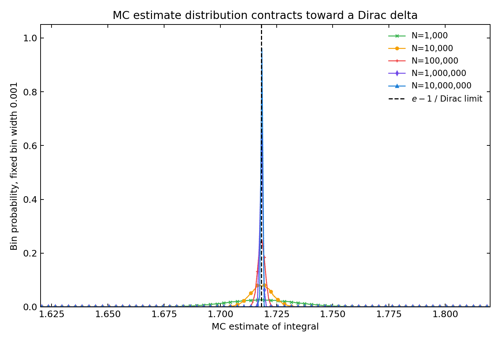
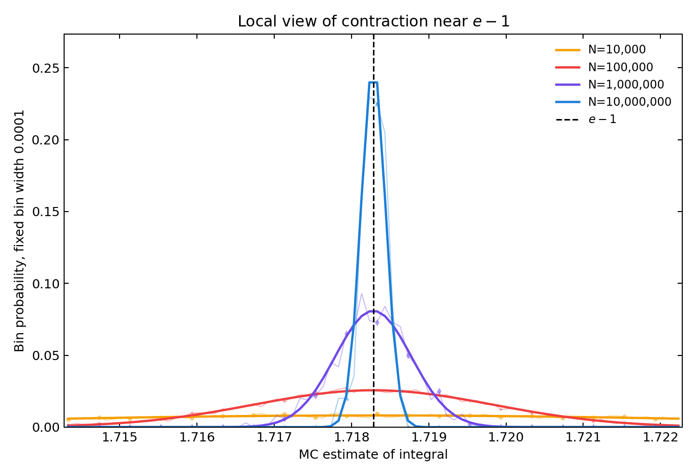
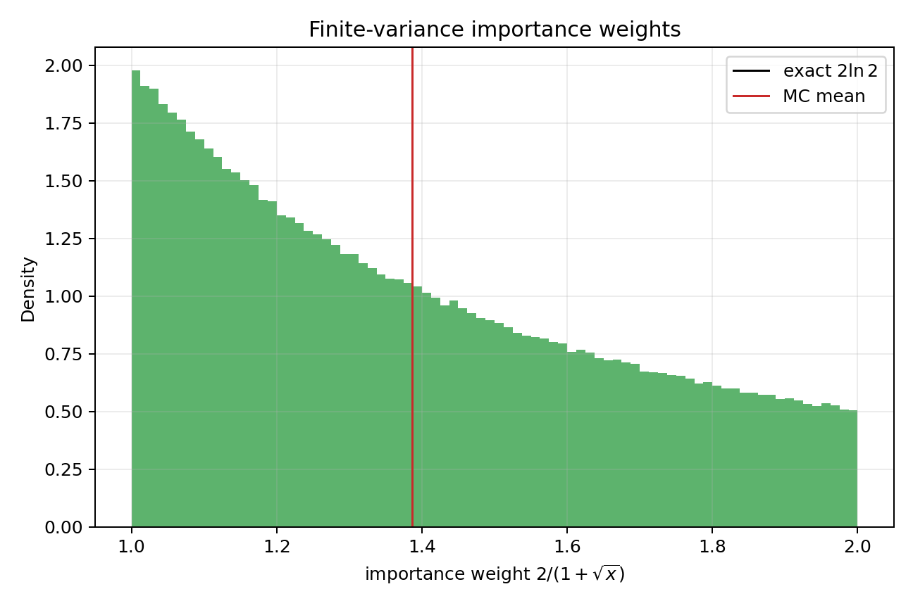
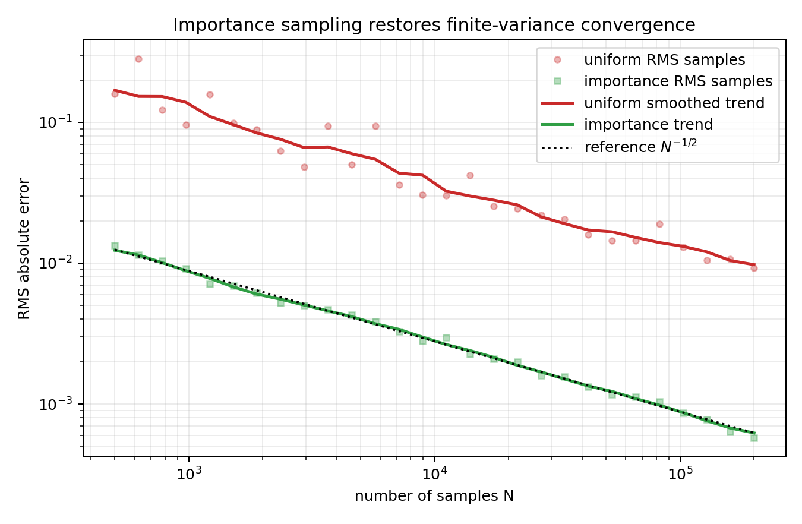
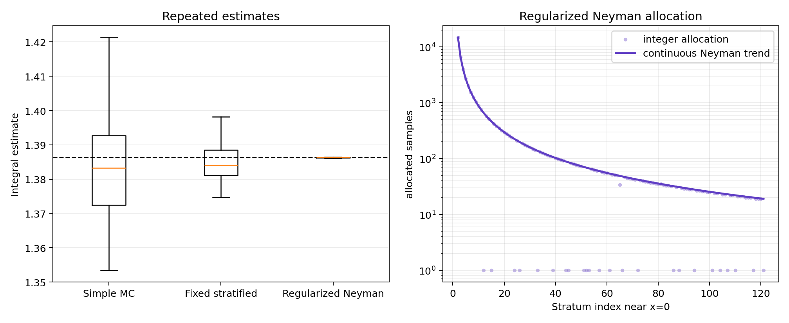
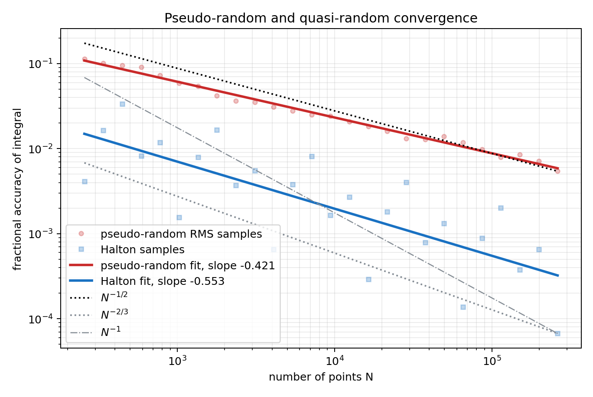
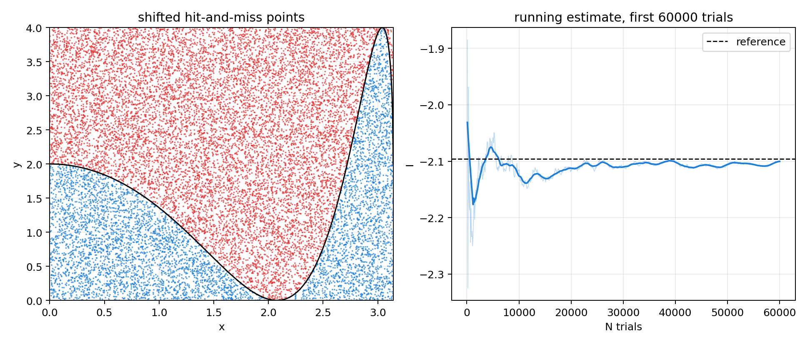
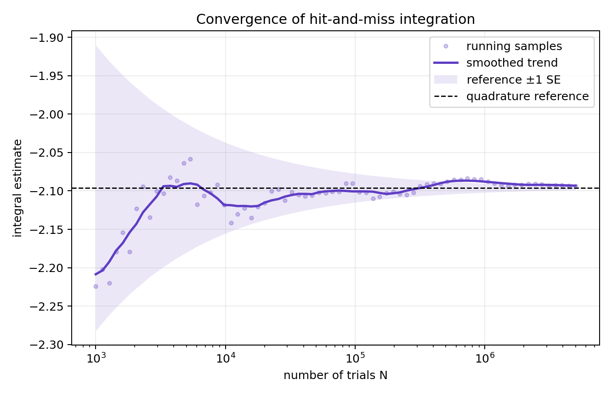
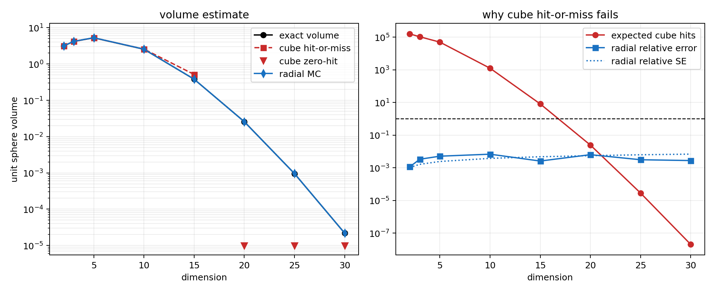

| { width=78% } | { width=78% } | { width=78% } |
|:--:|:--:|:--:|
| 姜玥晟 | 周鑫志 | 高西飞 |

| 项目 | 内容 |
|:--|:--|
| 源题编号 | `HW12` |
| 作业属性 | 小组作业 |
| 小组成员 | 姜玥晟、周鑫志、高西飞 |
| 报告主题 | Monte Carlo 积分、重要性抽样、分层抽样、准随机序列、hit-and-miss 与高维球体积 |
| 实验环境 | `Python 3.13.5`、`numpy 2.3.3`、`scipy 1.16.2`、`matplotlib 3.10.7`、`pypandoc` |

\newpage

# I. 传统 Monte Carlo 积分 {-}

## Problem 1(a)：复现 MC 估计量分布

### 待求问题

使用传统 Monte Carlo 方法计算

$$
I=\int_0^1 e^x\,dx.
$$

复现题图中 MC 积分估计量的分布图，样本数 $N$ 至少取 $1000$，样本越多越好。

### 解决方式

令 $U_i\sim U(0,1)$，则传统 MC 估计量为

$$
\hat I_N=\frac1N\sum_{i=1}^N e^{U_i}.
$$

积分精确值为

$$
I=e-1=1.718281828459045.
$$

单个样本 $Y=e^U$ 的方差为

$$
\operatorname{Var}(Y)
=\int_0^1 e^{2x}\,dx-\left(e-1\right)^2
=\frac{e^2-1}{2}-(e-1)^2.
$$

因此重复实验得到的 $\hat I_N$ 应近似服从中心在 $e-1$、标准差为 $\sqrt{\operatorname{Var}(Y)/N}$ 的正态分布。为了观察采样点数增加时的收缩现象，本文分别取

$$
N=1000,\quad 10000,\quad 100000,\quad 1000000,\quad 10000000.
$$

对每个 $N$ 重复做多次独立积分估计，绘制估计量分布。第一张图使用固定 bin 宽 $0.001$ 展示整体形状；第二张图在 $e-1$ 附近放大，使用固定 bin 宽 $0.0001$ 展示高采样数时的尖峰结构。若 $N\to\infty$，则 $\hat I_N$ 依概率收敛到 $e-1$，分布弱收敛到位于 $e-1$ 的 Dirac delta。

### 问题答案

重复实验结果如下。

| 每次估计样本数 $N$ | 独立积分估计次数 | 估计均值 | 经验标准差 | 理论标准差 | 精确值 | 均值绝对误差 |
|--:|--:|--:|--:|--:|--:|--:|
| 1000 | 100000 | 1.718264 | 0.015531 | 0.015557 | 1.718282 | $1.74\times10^{-5}$ |
| 10000 | 10000 | 1.718315 | 0.004966 | 0.004920 | 1.718282 | $3.34\times10^{-5}$ |
| 100000 | 10000 | 1.718252 | 0.001542 | 0.001556 | 1.718282 | $2.95\times10^{-5}$ |
| 1000000 | 1000 | 1.718267 | 0.000496 | 0.000492 | 1.718282 | $1.44\times10^{-5}$ |
| 10000000 | 200 | 1.718290 | 0.000154 | 0.000156 | 1.718282 | $8.60\times10^{-6}$ |

{ width=86% }

{ width=86% }

图中绿色、橙色、红色、紫色和蓝色曲线分别对应 $N=1000,\ 10000,\ 100000,\ 1000000,\ 10000000$。随着每次积分使用的采样点数增加，估计量分布的宽度按 $N^{-1/2}$ 收缩，峰值不断升高并集中到 $e-1$ 附近。黑色竖虚线表示极限位置，也就是 $N\to\infty$ 时的 Dirac delta 支撑点。局部放大图进一步显示：当 $N$ 从 $10^5$ 增大到 $10^7$ 时，分布已经从可见的钟形曲线压缩为精确值附近很窄的尖峰。

### 分析

这个积分的被积函数光滑且方差有限，所以单次积分估计的标准误差遵循 $O(N^{-1/2})$。表中经验标准差从 $1.553\times10^{-2}$ 逐步降到 $1.537\times10^{-4}$，与理论标准差从 $1.556\times10^{-2}$ 降到 $1.556\times10^{-4}$ 的趋势一致。直观上，$N$ 越大，估计量越不容易偏离精确积分，分布也就越接近集中在 $e-1$ 的狄拉克函数。

## Problem 1(b)：最终结果与误差估计

### 待求问题

给出该积分的最终 Monte Carlo 计算结果，并估计误差。

### 解决方式

最终估计使用独立样本 $N=1000000$。用样本标准差 $s$ 估计标准误差：

$$
\operatorname{SE}(\hat I_N)=\frac{s}{\sqrt N}.
$$

同时与精确值 $e-1$ 比较，得到绝对误差。

### 问题答案

最终结果为

$$
\hat I=1.71831573223,
\qquad
\operatorname{SE}=4.919682842021678\times 10^{-4}.
$$

与精确值 $1.718281828459045$ 相比，绝对误差为

$$
|\hat I-I|=3.39037716857\times 10^{-5}.
$$

该误差约为 $0.069$ 个标准误差，落在 MC 随机波动的正常范围内。

### 分析

标准误差给的是一次随机实验的典型波动尺度，不要求实际误差一定接近它。本次运行的实际误差远小于一个标准误差，说明这次随机样本比较“幸运”，但从方法评价上仍应使用标准误差作为可重复的误差量级。

# II. 重要性抽样处理端点奇异性 {-}

## Problem 2：重要性抽样计算奇异积分

### 待求问题

使用重要性抽样计算

$$
I=\int_0^1\frac{dx}{\sqrt{x}+x}.
$$

如果在 $[0,1]$ 上均匀采样，估计量方差会因为端点 $x=0$ 附近的近似对数发散而无穷大，误差下降慢于 $N^{-1/2}$。改从

$$
g(x)=\alpha\frac1{\sqrt{x}}
$$

型密度中采样，系数 $\alpha$ 自行决定，使 $f(x)/g(x)$ 具有有限方差。

### 解决方式

归一化条件给出

$$
1=\int_0^1 \alpha x^{-1/2}\,dx=2\alpha,
\qquad \alpha=\frac12.
$$

因此

$$
g(x)=\frac1{2\sqrt{x}},\qquad G(x)=\sqrt{x}.
$$

若 $U\sim U(0,1)$，则取

$$
X=U^2
$$

即可服从 $g(x)$。重要性抽样权重为

$$
\frac{f(X)}{g(X)}
=\frac{1}{\sqrt X+X}\cdot 2\sqrt X
=\frac{2}{1+\sqrt X}.
$$

该权重在 $[1,2]$ 内有界，所以估计量方差有限。

### 问题答案

解析值为

$$
I=2\ln2=1.3862943611198906.
$$

取 $N=1000000$ 个重要性样本，得到

| 方法 | $\alpha$ | 样本数 | 估计值 | 标准误差 | 绝对误差 |
|:--|--:|--:|--:|--:|--:|
| $g(x)=1/(2\sqrt{x})$ | 0.5 | 1000000 | 1.386278 | $2.798\times10^{-4}$ | $1.667\times10^{-5}$ |

{ width=78% }

{ width=82% }

### 分析

重要性抽样的核心不是单纯改变采样点，而是让采样密度主动匹配被积函数的困难区域。原函数在 $x=0$ 附近像 $x^{-1/2}$，因此均匀采样会偶尔抽到极大的函数值，导致方差发散。选择 $g(x)\propto x^{-1/2}$ 后，这个奇异因子被采样密度吸收，剩下的权重 $2/(1+\sqrt x)$ 平滑且有界。收敛图中，重要性抽样的 RMS 误差基本沿 $N^{-1/2}$ 参考线下降，而均匀简单 MC 起伏明显且整体误差更大。

# III. 分层抽样与方差比较 {-}

## Problem 3(a)：简单 MC

### 待求问题

对

$$
I=\int_0^1\frac{dx}{\sqrt{x}+x}
$$

先使用简单 Monte Carlo 方法计算，作为分层抽样的比较基线。

### 解决方式

简单 MC 使用 $U_i\sim U(0,1)$，

$$
\hat I=\frac1N\sum_{i=1}^N\frac1{\sqrt{U_i}+U_i}.
$$

为了与分层抽样公平比较，总样本数取

$$
N=5000\times 10=50000.
$$

实验重复 140 次，用重复估计量的标准差作为经验误差尺度。

### 问题答案

简单 MC 的重复实验结果为

| 方法 | 重复次数 | 平均估计值 | 重复标准差 | 平均绝对误差 |
|:--|--:|--:|--:|--:|
| 简单均匀 MC | 140 | 1.384607 | $1.787\times10^{-2}$ | $1.687\times10^{-3}$ |

### 分析

简单均匀 MC 的困难来自 $x=0$ 附近。虽然奇异性可积，但 $f(x)^2$ 在 0 附近近似 $1/x$，二阶矩对数发散。因此样本均值仍能接近正确积分，但普通有限方差 CLT 的标准误差解释并不严格，实际误差下降也容易偏慢。

## Problem 3(b)：固定样本数分层抽样

### 待求问题

令 $k=5000$，每层样本数 $n_i=10$，层概率 $p_i=1/5000$。在第 $i$ 层内生成样本

$$
U_{ij}=\frac{i-1+U}{5000},\qquad i=1,\ldots,5000,\quad j=1,\ldots,10,
$$

并计算估计量方差。

### 解决方式

将 $[0,1]$ 均匀划分为 $k=5000$ 个小区间，第 $i$ 层为

$$
\left[\frac{i-1}{k},\frac{i}{k}\right].
$$

每层独立采样 $n_i=10$ 个点，估计量为

$$
\hat I_{\mathrm{strat}}
=\sum_{i=1}^k p_i\bar f_i,
\qquad p_i=\frac1k.
$$

在重复实验中直接统计 $\hat I_{\mathrm{strat}}$ 的经验方差。

### 问题答案

固定分层抽样结果为

| 方法 | 重复次数 | 平均估计值 | 重复标准差 | 平均绝对误差 |
|:--|--:|--:|--:|--:|
| 固定分层 $n_i=10$ | 140 | 1.386955 | $1.331\times10^{-2}$ | $6.603\times10^{-4}$ |

{ width=88% }

### 分析

固定分层比简单 MC 的重复标准差从约 $0.01787$ 降到约 $0.01331$，方差约降到简单 MC 的一半左右。原因是分层保证每个区间都有样本，不会像均匀简单抽样那样在某些区间过密、某些区间空缺。即使每层只有 10 个样本，空间覆盖也已经有所改善，但端点奇异性仍然限制了固定分层的效果。

## Problem 3(c)：正则化 Neyman 分层分配

### 待求问题

在 $k=5000,\ p_i=1/5000$ 的条件下，求更合理的 $n_i$ 分配及对应方差，并测试该分配是否真正优于固定分层。

### 解决方式

分层估计量的方差近似为

$$
\operatorname{Var}(\hat I)
=\sum_{i=1}^k \frac{p_i^2\sigma_i^2}{n_i},
$$

其中 $\sigma_i$ 是第 $i$ 层内 $f(x)$ 的标准差。在总样本数固定为 $N=\sum_i n_i$ 时，Neyman 分配给出

$$
n_i\propto p_i\sigma_i.
$$

由于 $p_i$ 相等，本题近似为 $n_i\propto\sigma_i$。但是第一层 $[0,1/5000]$ 仍包含 $x=0$，层内二阶矩发散，因此直接把它纳入 Neyman 分配并不严谨。为避免这个问题，本文先把第一层积分解析计算：

$$
\int_a^b\frac{dx}{\sqrt{x}+x}
=2\ln\frac{1+\sqrt b}{1+\sqrt a},
$$

于是第一层贡献为

$$
I_1=2\ln\left(1+\frac1{\sqrt{5000}}\right).
$$

对剩余 4999 层，二阶矩有限。层内二阶矩可由

$$
\int \frac{dx}{(\sqrt{x}+x)^2}
=2\ln t-2\ln(1+t)+\frac{2}{1+t},\qquad t=\sqrt{x}
$$

计算，再按 $n_i\propto\sigma_i$ 分配总样本数 50000。每个剩余层至少保留 1 个样本。

### 问题答案

正则化 Neyman 分配先解析处理第一层，第一层贡献为

$$
I_1=0.02808613708918462.
$$

剩余层的样本数范围为

$$
\min_i n_i=1,\qquad \max_i n_i=14758.
$$

第 2 到第 11 层的样本分配为

$$
[14758,\ 6627,\ 3964,\ 2708,\ 2000,\ 1555,\ 1253,\ 1038,\ 878,\ 755].
$$

对应重复实验结果为

| 方法 | 重复次数 | 平均估计值 | 重复标准差 | 理论预测标准差 | 平均绝对误差 |
|:--|--:|--:|--:|--:|--:|
| 正则化 Neyman 分层 | 140 | 1.386291 | $7.063\times10^{-5}$ | $7.387\times10^{-5}$ | $3.262\times10^{-6}$ |

### 分析

正则化 Neyman 分层明显优于固定分层，重复标准差从 $0.01331$ 降到 $7.06\times10^{-5}$。理论预测标准差为 $7.39\times10^{-5}$，与重复实验非常接近，说明分配策略本身是稳定的，不只是某一次随机结果“看起来不错”。

第一层解析处理很关键。若仍把第一层当普通层用少量 pilot 样本估计方差，分配会对极端样本非常敏感，结果显得粗糙且不可重复。把无限方差层单独拿掉后，剩余层的 Neyman 分配才有清楚的方差公式支撑。

## Problem 3(d)：与重要性抽样的比较

### 待求问题

评论 Problem 3 的分层抽样结果和 Problem 2 的重要性抽样结果，解释它们之间的显著差异。

### 解决方式

比较三种方法的核心方差控制机制：

$$
\text{重要性抽样：改变采样密度，使权重有界；}
$$

$$
\text{分层抽样：固定空间覆盖，减少各区间抽样数波动；}
$$

$$
\text{正则化 Neyman 分层：解析处理无限方差层，再把更多样本分给高波动区间。}
$$

统一参考值为 $2\ln2$。

### 问题答案

在本次实验中，$N=1000000$ 的重要性抽样标准误差约为 $2.80\times 10^{-4}$，绝对误差约为 $1.67\times10^{-5}$。在总样本数 $50000$ 的分层实验中，固定分层的重复标准差约为 $1.33\times10^{-2}$，正则化 Neyman 分层的重复标准差约为 $7.06\times10^{-5}$。

若只按样本量看，重要性抽样最自然地消除了奇异性；正则化 Neyman 分层在少得多的样本数下也能显著降低方差；普通固定分层则介于简单 MC 和正则化 Neyman 分层之间。

### 分析

重要性抽样和分层抽样都在处理同一个问题：$x=0$ 附近对积分贡献和误差贡献都很大。重要性抽样直接把采样密度变成 $x^{-1/2}$，因此权重被压平；固定分层不改变每层内的函数形状，只保证每层都有样本。正则化 Neyman 分层则先把最麻烦的第一层解析掉，再把随机样本集中到高波动层，所以它比固定分层强很多。

# IV. 伪随机与准随机简单 MC {-}

## Problem 4(a)：伪随机数生成器的收敛指数

### 待求问题

使用自写伪随机数生成器，用简单 MC 计算

$$
I=\int_0^1\frac{dx}{\sqrt{x}+x}.
$$

拟合积分精度随随机数个数 $N$ 的幂律关系，观察指数是否约为 $-1/2$。

### 解决方式

自写伪随机数生成器采用 Park-Miller 线性同余法：

$$
x_{n+1}=16807x_n\bmod (2^{31}-1),
\qquad u_n=\frac{x_n}{2^{31}-1}.
$$

对多个 $N$ 计算简单 MC 估计。为了降低单条随机路径偶然误差，伪随机结果使用 96 条不同种子的 RMS 绝对误差。拟合模型为

$$
\log |\hat I_N-I|=a+b\log N,
$$

其中 $b$ 即收敛指数。

### 问题答案

拟合得到伪随机简单 MC 的误差指数为

$$
b_{\mathrm{pseudo}}=-0.420708811385.
$$

最大样本数 $N=262144$ 时，96 条种子的平均估计值和 RMS 误差为

$$
\hat I=1.38582301528,\qquad
\mathrm{RMS\ error}=0.00753322141799.
$$

{ width=84% }

### 分析

指数没有精确达到 $-1/2$，而是略慢一些。图中的纵轴使用 fractional accuracy，即 $|\hat I-I|/I$，这与题面给出的参考图一致；淡色点表示实际采样误差，实线表示对数坐标下拟合出的幂律趋势。这与 Problem 2 中的分析一致：均匀简单 MC 面对 $x=0$ 的 $x^{-1/2}$ 奇异性时，二阶矩存在对数发散，标准有限方差 CLT 的理想 $N^{-1/2}$ 标度会受到影响。因此本题中的伪随机简单 MC 只能表现为接近但慢于 $N^{-1/2}$ 的下降。

## Problem 4(b)：准随机数生成器的收敛指数

### 待求问题

使用自写准随机数生成器，用简单 MC 计算同一积分。拟合精度随样本数 $N$ 的幂律指数，观察是否得到 $-2/3$、$-1$ 或其他值，并解释原因。

### 解决方式

准随机序列使用一维 Halton 序列。对基数 $b=2$，若

$$
n=d_0+d_1b+d_2b^2+\cdots,
$$

则 radical inverse 为

$$
\phi_b(n)=\frac{d_0}{b}+\frac{d_1}{b^2}+\frac{d_2}{b^3}+\cdots.
$$

取 $u_n=\phi_2(n)$，代入同一个简单 MC 平均值，并使用与伪随机相同的对数拟合。

### 问题答案

拟合得到 Halton 准随机简单 MC 的误差指数为

$$
b_{\mathrm{quasi}}=-0.553230244088.
$$

在 $N=262144$ 时，

$$
\hat I=1.38620138477,\qquad
|\hat I-I|=9.29763459563\times10^{-5}.
$$

该误差显著小于同样样本量下伪随机简单 MC 的 RMS 误差。

### 分析

准随机序列在一维区间上的覆盖更均匀，所以整体误差明显小于伪随机样本。但本题函数在端点处不光滑，经典光滑低差异积分中常见的近似 $O(N^{-1})$ 优势被削弱。单条 Halton 序列的误差点会有明显起伏，这是误差抵消随 $N$ 改变造成的；因此图中用拟合实线呈现主趋势。本实验得到约 $-0.553$，比伪随机更好，但没有达到理想光滑情形的 $-1$。

## Problem 4(c)：与分层抽样和重要性抽样的综合比较

### 待求问题

综合评论 Problem 2、Problem 3 与 Problem 4 的结果，解释重要性抽样、分层抽样、伪随机简单 MC 与准随机简单 MC 的显著差异。

### 解决方式

统一从两个角度比较：一是是否改变了奇异端点附近的采样密度，二是是否提高了样本点对区间的覆盖均匀性。所有结果都与解析值

$$
I=2\ln2
$$

比较。

### 问题答案

本次实验中，重要性抽样通过 $x=u^2$ 使权重有界，$10^6$ 样本的绝对误差约为 $1.67\times10^{-5}$。正则化 Neyman 分层用 $50000$ 个随机样本达到约 $7.06\times10^{-5}$ 的重复标准差，并且理论预测标准差与重复实验一致。Halton 准随机简单 MC 在 $262144$ 个点时绝对误差约为 $9.30\times10^{-5}$，明显优于伪随机简单 MC 的 RMS 误差约 $7.53\times10^{-3}$。

### 分析

四种方法的差异可以概括为：普通伪随机简单 MC 最容易受端点奇异性拖累；准随机数改善了覆盖均匀性，但没有改变函数奇异性；正则化分层抽样把无限方差首层从随机估计中移除，并把样本集中到高波动层；重要性抽样直接按奇异形状采样，是对本积分最自然的方差缩减方式之一。

# V. Hit-and-Miss 振荡积分 {-}

## Problem 5：平移后使用 hit-and-miss 方法

### 待求问题

使用 hit-and-miss 方法积分振荡函数

$$
I=\int_0^\pi 2\sin\left(2\sqrt{\pi^2-x^2}\right)\,dx.
$$

若被积函数会变号，可以自行加一个常数使其变为非负，再扣除该常数的积分贡献。

### 解决方式

被积函数

$$
h(x)=2\sin\left(2\sqrt{\pi^2-x^2}\right)
$$

的取值范围在 $[-2,2]$ 内。因此取常数

$$
C=2
$$

使

$$
q(x)=h(x)+2\in[0,4].
$$

在矩形 $[0,\pi]\times[0,4]$ 内均匀取点，若 $y\le q(x)$ 则记为命中。设命中比例为 $\hat p$，则

$$
\int_0^\pi q(x)\,dx\approx 4\pi\hat p,
\qquad
\hat I=4\pi\hat p-2\pi.
$$

同时用高精度数值积分作为参考。

### 问题答案

高精度数值积分参考值为

$$
I_{\mathrm{ref}}=-2.0961315535562566.
$$

使用 $N=5000000$ 次 hit-and-miss 试验得到

$$
\hat I=-2.09348948595,
\qquad
|\hat I-I_{\mathrm{ref}}|=0.00264206760534.
$$

由命中比例的二项方差估计，标准误差为

$$
\operatorname{SE}=0.00264936669325.
$$

最终命中比例为

$$
\hat p=0.3334054.
$$

{ width=94% }

{ width=78% }

### 分析

hit-and-miss 方法把一维积分转化成二维面积估计，直观但方差通常比直接平均函数值更大。这里加 $C=2$ 后函数非负，矩形高度为 4，左图中的蓝点表示命中区域，红点表示拒绝区域；右图显示估计量随样本数逐步靠近参考值。题图中示例值约为 $-2.1095$，本次高精度数值积分给出更稳定的参考值 $-2.09613$；500 万次随机试验的实际误差小于一个标准误差，说明结果与参考值在随机误差范围内一致。

# VI. 高维球体积的 Monte Carlo 估计 {-}

## Problem 6：20 维及更高维单位球体积

### 待求问题

实现 Monte Carlo 方法，估计任意维数 $N$ 和半径 $R$ 的球体积

$$
V(N,R)=\int_{x_1^2+x_2^2+\cdots+x_N^2\le R^2}dx_1dx_2\cdots dx_N.
$$

计算 $R=1,\ N=20$ 的球体积，并尝试 25 维或更高维，同时与传统方法比较。

### 解决方式

传统接受-拒绝法在超立方体 $[-R,R]^d$ 中均匀采样，若

$$
\sum_{i=1}^d x_i^2\le R^2
$$

则命中。估计量为

$$
\hat V_{\mathrm{cube}}=(2R)^d\frac{M}{N_{\mathrm{sample}}}.
$$

解析公式为

$$
V_d(R)=\frac{\pi^{d/2}R^d}{\Gamma(d/2+1)}.
$$

为了说明传统超立方体法在高维下退化，还使用径向积分作对照：

$$
V_d(1)=S_{d-1}\int_0^1 r^{d-1}\,dr,
\qquad
S_{d-1}=\frac{2\pi^{d/2}}{\Gamma(d/2)}.
$$

该对照仍用 Monte Carlo 平均计算一维径向积分，但避免了高维超立方体中的极低命中率。

### 问题答案

关键维数结果如下。

传统超立方体 hit-or-miss 的结果如下。表中的“期望命中数”由精确体积除以超立方体体积后乘以样本数得到，用来判断零命中是否合理。

| 维数 | 精确体积 | 样本数 | 期望命中数 | 实际命中数 | 估计值 | 理论相对标准误差 |
|--:|--:|--:|--:|--:|--:|--:|
| 10 | 2.550164 | 500000 | 1245.197 | 1260 | 2.58048 | 0.028303 |
| 15 | 0.3814433 | 700000 | 8.149 | 11 | 0.5149257 | 0.350315 |
| 20 | 0.02580689 | 1000000 | 0.02461 | 0 | 0 | 6.374294 |
| 25 | 0.0009577224 | 1000000 | 0.00002854 | 0 | 0 | 187.178137 |
| 30 | 0.00002191535 | 1000000 | 0.0000000204 | 0 | 0 | 6999.639855 |

径向 Monte Carlo 对照结果如下。

| 维数 | 精确体积 | 径向 MC 估计 | 相对标准误差 | 相对误差 |
|--:|--:|--:|--:|--:|
| 10 | 2.550164 | 2.567562 | 0.003788 | 0.006822 |
| 15 | 0.3814433 | 0.3824331 | 0.004752 | 0.002595 |
| 20 | 0.02580689 | 0.02564242 | 0.005528 | 0.006373 |
| 25 | 0.0009577224 | 0.0009607087 | 0.006276 | 0.003118 |
| 30 | 0.00002191535 | 0.00002185444 | 0.006881 | 0.002780 |

{ width=94% }

因此，$R=1,\ N=20$ 的解析体积为

$$
V_{20}(1)=0.02580689139.
$$

图中左侧的倒三角标记表示传统超立方体法在该维数下零命中，不能在对数轴上直接画出 0。传统超立方体 hit-or-miss 在 $10^6$ 个点下零命中，给出 0；这并不是程序没有工作，而是因为期望命中数只有 $0.02461$，零命中概率约为 $\exp(-0.02461)\approx0.976$。径向 MC 对照给出

$$
\hat V_{20}=0.0256424202394,
$$

相对误差约为 $0.00637$，相对标准误差约为 $0.00553$。

25 维时解析值为

$$
V_{25}(1)=0.000957722408823,
$$

传统方法同样零命中，而且期望命中数仅为 $2.85\times10^{-5}$；径向 MC 给出 $0.000960708676158$，相对误差约为 $0.00312$，仍在其相对标准误差 $0.00628$ 的同一量级内。

### 分析

高维球体积估计展示了典型的维数灾难。虽然传统超立方体接受-拒绝法概念最直接，但单位球在 $[-1,1]^d$ 中的体积比例随维数快速下降。到 20 维时，100 万个点的期望命中数远小于 1，零命中反而是大概率事件。径向积分把问题化为一维平均，利用了球的对称性，因此仍能稳定复现解析公式。这说明高维 Monte Carlo 不能只靠“多撒点”，更需要使用问题结构设计采样方式。
