| { width=20% } |
|:--:|

| 项目 | 内容 |
|:--|:--|
| 作业编号 | `HW13` |
| 作业目录 | `HW/12` |
| 学生姓名 | 姜玥晟 |
| 报告主题 | 三维随机飞行、自由连接链、格点随机游走、自避随机游走与 Flory 指数 |
| 实验环境 | `Python 3.13.5`、`numpy 2.3.3`、`scipy 1.16.2`、`matplotlib 3.10.7`、`pypandoc` |
| 报告说明 | 正文按小问逐节组织；每个小问内部自成完整结构。 |

\newpage

# I. 三维连续随机游走 {-}

## Problem 1(a)：固定步长三维随机游走

### 待求问题

实现三维随机游走。每一步长度固定为 $\lambda$，统计离开原点后的端到端距离，距离单位取 $\lambda$。

### 解决方式

令第 $i$ 步为

$$
\boldsymbol{s}_i=\lambda \boldsymbol{u}_i,
$$

其中 $\boldsymbol{u}_i$ 是球面上均匀随机方向。三维球面均匀方向不能直接令极角均匀，而应取

$$
\cos\theta \sim U(-1,1),\qquad \phi\sim U(0,2\pi).
$$

端到端向量为

$$
\boldsymbol{R}_N=\sum_{i=1}^N\boldsymbol{s}_i.
$$

因为各步方向独立且均值为 0，

$$
\langle R_N^2\rangle=N\lambda^2,
\qquad
R_{\mathrm{rms}}=\sqrt{\langle R_N^2\rangle}=\lambda\sqrt{N}.
$$

平均模长 $\langle R_N\rangle$ 与 RMS 不完全相同；当 $N$ 足够大时，$\boldsymbol{R}_N$ 的三个分量近似正态，$R_N$ 近似 Maxwell 分布，因此

$$
\langle R_N\rangle \simeq \sqrt{\frac{8}{3\pi}}\,\lambda\sqrt{N}
=0.9213\,\lambda\sqrt{N}.
$$

### 问题答案

模拟到 $N=1000$，并用后半段数据拟合 $c\sqrt{N}$，得到：

| 路径数 | $\langle R\rangle$ 拟合系数 | $R_{\mathrm{rms}}$ 拟合系数 | $N=1000$ 时 $\langle R\rangle/\lambda$ | $N=1000$ 时 $R_{\mathrm{rms}}/\lambda$ |
|--:|--:|--:|--:|--:|
| 50 | 0.9350 | 1.0092 | 30.3325 | 32.7718 |
| 500 | 0.9273 | 1.0085 | 28.8588 | 31.5735 |
| 5000 | 0.9170 | 0.9955 | 29.0677 | 31.5709 |

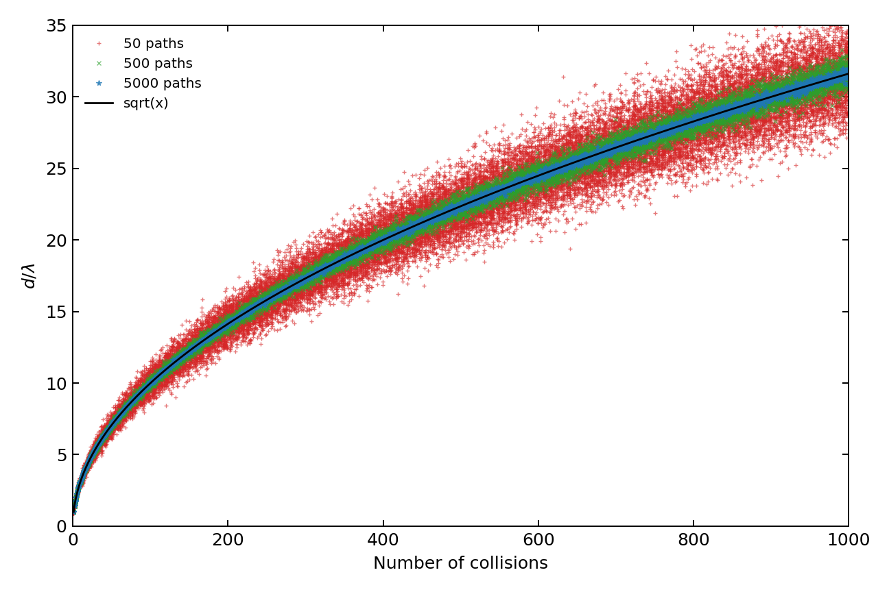{ width=82% }

当路径数增加到 5000 时，$R_{\mathrm{rms}}/\lambda$ 的拟合系数为 $0.9955$，与理论值 $1$ 一致；$\langle R\rangle/\lambda$ 的拟合系数为 $0.9170$，与 Maxwell 近似的 $0.9213$ 一致。

### 理解

题图中常用 $\sqrt{N}$ 作为参考线，本质对应的是均方位移的平方根，而不是严格的平均模长。三维随机游走的向量均值为 0，但平方距离会逐步积累，因此典型距离按 $\sqrt{N}$ 增长，而不是按 $N$ 线性增长。

## Problem 1(b)：变步长三维随机游走

### 待求问题

每一步走不同距离，步长分别在 $0.9\sim1.1,\ 0.8\sim1.2,\ldots,\ 0.1\sim1.9$ 倍 $\lambda$ 的区间内均匀取值，考察端到端距离随碰撞次数的变化。

### 解决方式

设无量纲步长 $L/\lambda$ 在 $[a,b]$ 上均匀分布。由于方向仍独立且各向同性，

$$
\left\langle R_N^2\right\rangle
=N\lambda^2 E[L^2],
$$

其中

$$
E[L^2]=\frac{a^2+ab+b^2}{3}.
$$

因此

$$
\frac{R_{\mathrm{rms}}}{\lambda}
\simeq \sqrt{E[L^2]}\sqrt{N},
\qquad
\frac{\langle R\rangle}{\lambda}
\simeq \sqrt{\frac{8}{3\pi}}\,\sqrt{E[L^2]}\sqrt{N}.
$$

### 问题答案

数值拟合结果如下：

| 步长区间 | $E[L^2]$ | RMS 拟合系数 | RMS 理论系数 | 均值拟合系数 | 均值理论系数 |
|:--|--:|--:|--:|--:|--:|
| 0.9-1.1 | 1.0033 | 0.9678 | 1.0017 | 0.8857 | 0.9229 |
| 0.8-1.2 | 1.0133 | 0.9730 | 1.0066 | 0.8905 | 0.9274 |
| 0.7-1.3 | 1.0300 | 0.9816 | 1.0149 | 0.8985 | 0.9350 |
| 0.6-1.4 | 1.0533 | 0.9935 | 1.0263 | 0.9095 | 0.9456 |
| 0.5-1.5 | 1.0833 | 1.0086 | 1.0408 | 0.9235 | 0.9589 |
| 0.4-1.6 | 1.1200 | 1.0268 | 1.0583 | 0.9404 | 0.9750 |
| 0.3-1.7 | 1.1633 | 1.0479 | 1.0786 | 0.9600 | 0.9937 |
| 0.2-1.8 | 1.2133 | 1.0718 | 1.1015 | 0.9823 | 1.0148 |
| 0.1-1.9 | 1.2700 | 1.0981 | 1.1269 | 1.0070 | 1.0383 |

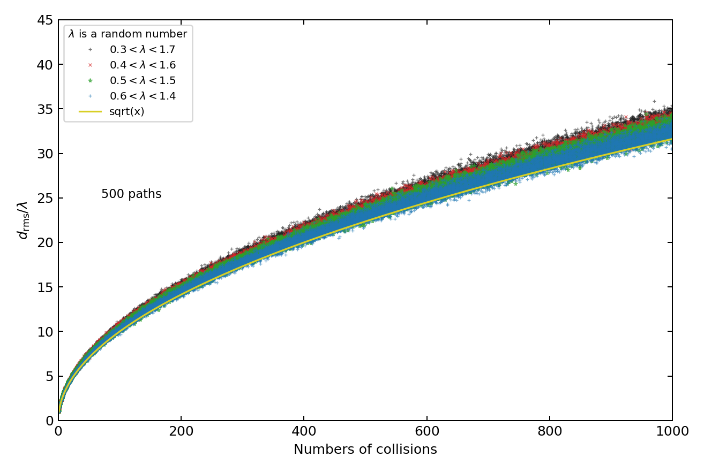{ width=82% }

图中只把题面截图作为作图风格参考，使用 500 条路径并展示 $0.3\sim1.7$ 到 $0.6\sim1.4$ 四组区间。散点带由每个 $N$ 上独立抽取的 RMS 估计点叠加得到，因此显示的是 Monte Carlo 估计的带状波动，而不是单次累积平均曲线。需要注意，若严格按题意取 $L\sim U(a,b)$，则 $0.3\sim1.7$ 组在 $N=1000$ 的 RMS 理论值为 $\sqrt{1.1633\times1000}\simeq34.1$；因此本文保留按题目文字和公式得到的数值结果，而不强行复刻示例图中的间距。

### 理解

这些区间的平均步长都是 $1\lambda$，但步长波动越大，$E[L^2]$ 越大，所以端到端 RMS 距离更大。随机游走的平方位移对步长平方敏感，而不只对平均步长敏感。

## Problem 1(c)：拟合公式

### 待求问题

根据前两问结果，推导或归纳三维随机游走端到端距离的拟合公式。

### 解决方式

把每一步看成独立随机向量。由于交叉项平均为 0，

$$
\left\langle
\left|\sum_{i=1}^N\boldsymbol{s}_i\right|^2
\right\rangle
=\sum_{i=1}^N\langle |\boldsymbol{s}_i|^2\rangle.
$$

若各步长度同分布，则

$$
\langle R_N^2\rangle=N\langle L^2\rangle.
$$

### 问题答案

适合本题的拟合公式为

$$
R_{\mathrm{rms}}(N)
=\sqrt{\langle R_N^2\rangle}
\simeq \sqrt{N\langle L^2\rangle}.
$$

对 $L\sim U(a,b)$，写成题目单位 $\lambda$ 为

$$
\frac{R_{\mathrm{rms}}(N)}{\lambda}
\simeq
\sqrt{\frac{a^2+ab+b^2}{3}}\sqrt{N}.
$$

若拟合的是平均模长而非 RMS，则大 $N$ 下应使用

$$
\frac{\langle R_N\rangle}{\lambda}
\simeq
\sqrt{\frac{8}{3\pi}}
\sqrt{\frac{a^2+ab+b^2}{3}}\sqrt{N}.
$$

题目提示可以使用准随机数。这里额外用 scrambled Sobol 序列一次性采样整条路径的 $2N$ 个方向变量，并与伪随机方向采样比较固定步长 $N=1000$ 时的 RMS 误差：

| 方法 | 路径数 | RMS 拟合系数 | $N=1000$ RMS | RMS 绝对误差 | 均值拟合系数 |
|:--|--:|--:|--:|--:|--:|
| 伪随机 | 128 | 1.0049 | 32.1169 | 0.4941 | 0.9179 |
| scrambled Sobol | 128 | 0.9998 | 30.2352 | 1.3876 | 0.9123 |
| 伪随机 | 512 | 0.9842 | 31.0945 | 0.5282 | 0.9080 |
| scrambled Sobol | 512 | 0.9935 | 31.1137 | 0.5090 | 0.9155 |
| 伪随机 | 2048 | 1.0000 | 31.2692 | 0.3535 | 0.9212 |
| scrambled Sobol | 2048 | 1.0074 | 32.0149 | 0.3922 | 0.9255 |
| 伪随机 | 8192 | 0.9957 | 31.3592 | 0.2636 | 0.9188 |
| scrambled Sobol | 8192 | 1.0011 | 31.6763 | 0.0536 | 0.9220 |

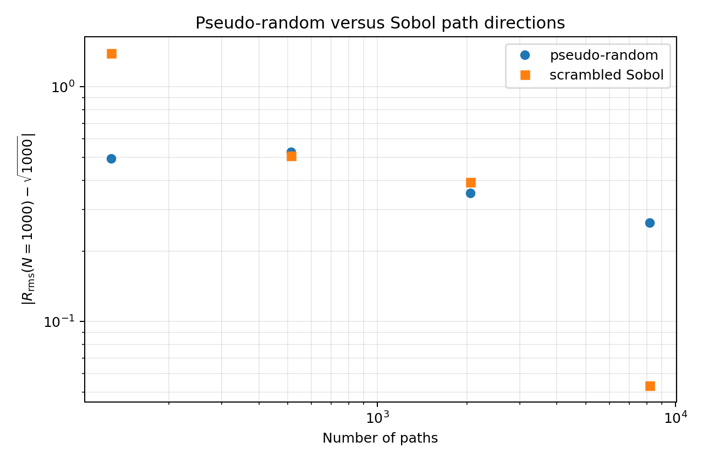{ width=76% }

普通随机模拟使用的是系统库 `numpy.random.default_rng`，即 NumPy 的 PCG64 系列位生成器；它不是本文自写的生成器。为了检查自写生成器是否能达到相近效果，本文另实现了 `xoshiro256**`，并用 HW11 中采用过的 Park-Miller LCG 作为较旧基线。三者的基础均匀性诊断如下：

| 生成器 | 样本数 | 均值绝对误差 | 方差绝对误差 | 滞后一阶相关 | $\chi^2$ 检验 $p$ 值 |
|:--|--:|--:|--:|--:|--:|
| NumPy PCG64 | 200000 | $8.7211\times10^{-4}$ | $3.8533\times10^{-4}$ | $3.0806\times10^{-3}$ | 0.4611 |
| 自写 xoshiro256** | 200000 | $2.4350\times10^{-4}$ | $3.3627\times10^{-4}$ | $-2.7207\times10^{-4}$ | 0.0404 |
| 自写 Park-Miller LCG | 200000 | $4.9038\times10^{-4}$ | $2.7836\times10^{-4}$ | $-1.1000\times10^{-3}$ | 0.7214 |

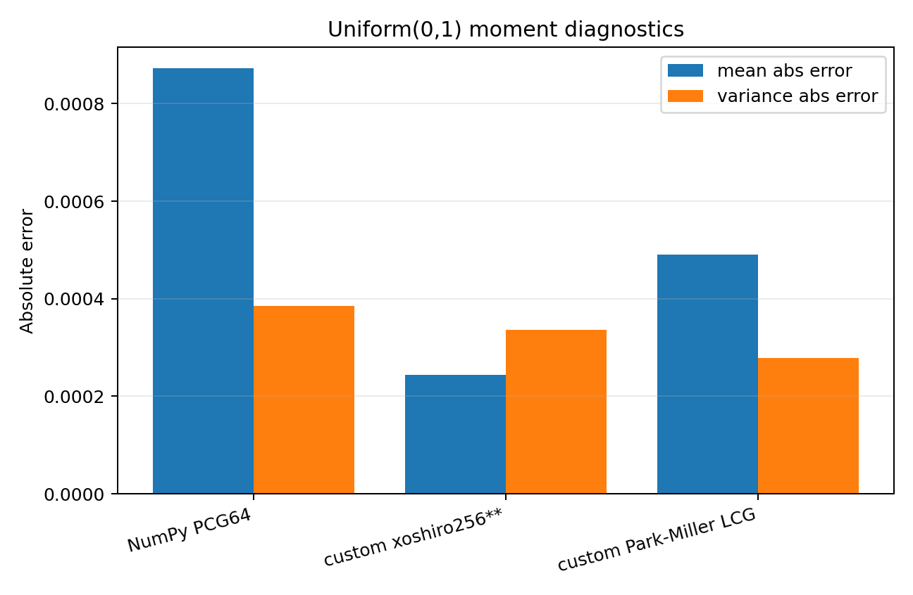{ width=74% }

随机游走中还常需要从有限集合中选方向，因此我把整数抽样也单独拿出来检查。自写 `xoshiro256**` 的 `integers(low, high)` 已改为从原始 `uint64` 做拒绝采样，而不是用浮点数乘区间宽度后取整；这可以避免微小的浮点缩放偏差。它也补充了 `jump` 和 `long_jump` 子流接口，便于以后并行实验时生成相隔很远的独立随机流。

| 生成器 | 样本数 | 整数范围 | $\chi^2$ 检验 $p$ 值 | 最大相对计数误差 |
|:--|--:|:--|--:|--:|
| NumPy PCG64 | 200000 | $0,\ldots,5$ | 0.4091 | 0.805% |
| 自写 xoshiro256** | 200000 | $0,\ldots,5$ | 0.0691 | 0.976% |
| 自写 Park-Miller LCG | 200000 | $0,\ldots,5$ | 0.3951 | 0.830% |

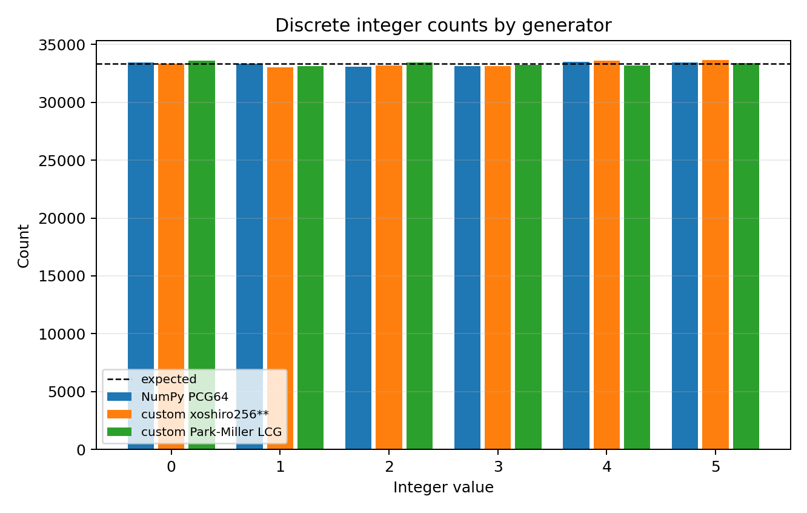{ width=74% }

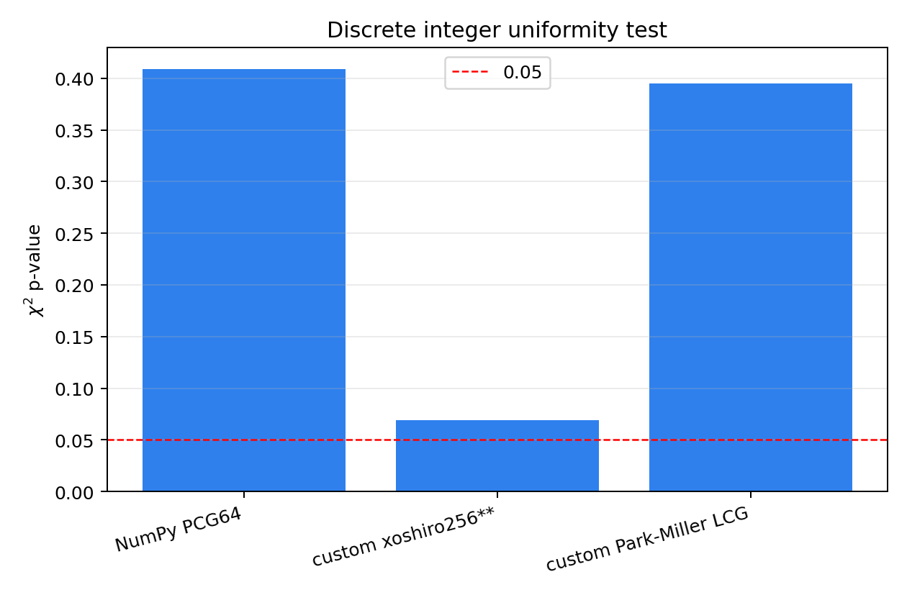{ width=74% }

进一步用 HW11 的两个代表性积分任务比较三者在实际 Monte Carlo 中的表现。取 $N=100000$、重复 50 次时：

| 生成器 | $\int_0^1 e^x dx$ 的 RMS 误差 | 奇异积分重要性抽样 RMS 误差 |
|:--|--:|--:|
| NumPy PCG64 | $1.6756\times10^{-3}$ | $9.8086\times10^{-4}$ |
| 自写 xoshiro256** | $1.4048\times10^{-3}$ | $8.0064\times10^{-4}$ |
| 自写 Park-Miller LCG | $1.7717\times10^{-3}$ | $1.0301\times10^{-3}$ |

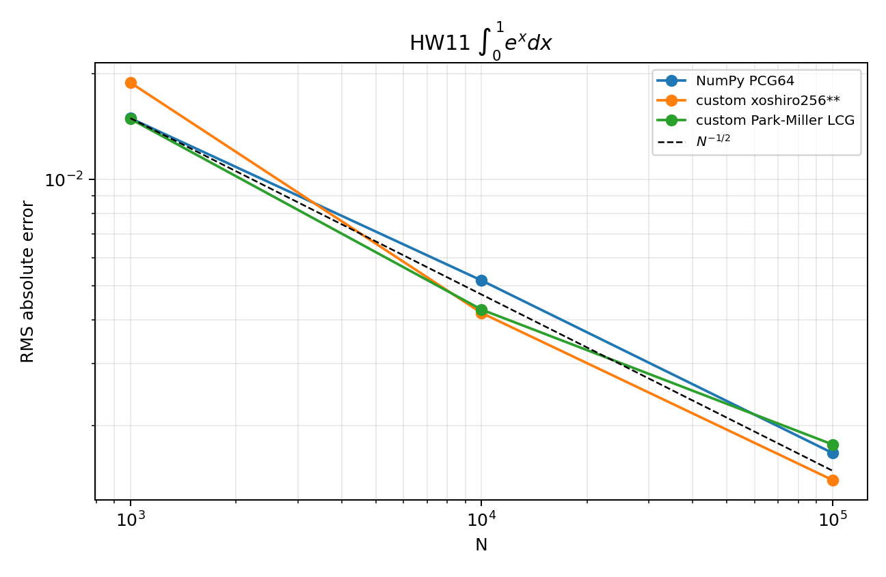{ width=74% }

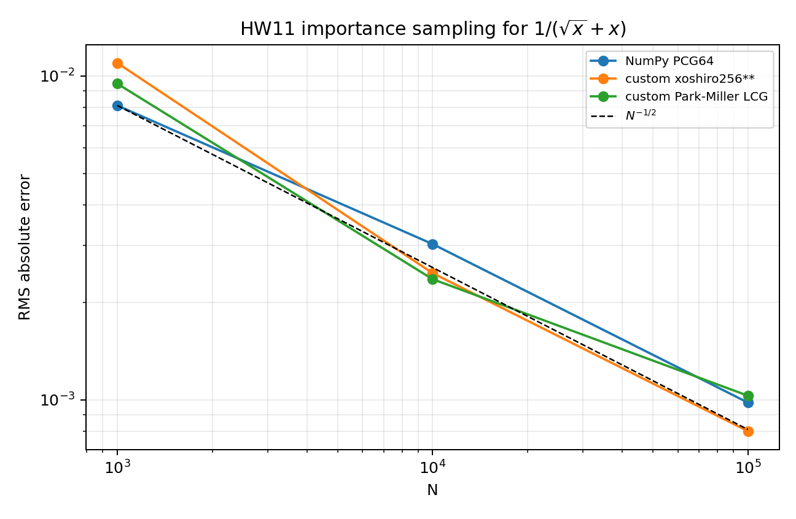{ width=74% }

### 理解

同一个随机游走可以有 $\langle R\rangle$ 和 $\sqrt{\langle R^2\rangle}$ 两种常见“距离”统计量。二者都满足 $\sqrt{N}$ 标度，但系数不同。实验图若直接用 $\sqrt{N}$ 作基准，通常是在检验 RMS 位移或均方位移标度。随机数方面，NumPy PCG64 是本报告主要模拟使用的系统生成器；自写 xoshiro256** 在 HW11 风格积分测试中与 PCG64 同阶，离散整数抽样也未见明显偏离均匀性的信号。Park-Miller 也能给出正确收敛，但周期、维度结构和位宽都更弱，更适合作为 HW11 历史基线而非主生成器。

# II. 聚合物随机飞行链 {-}

## Problem 2(a)：自由连接链的端到端距离与回转半径

### 待求问题

一个溶液中聚合物的简单模型把链看成随机取向的链段序列，各段取向彼此无相关，即自由连接随机游走链模型。计算不同 $N$ 下的端到端距离和回转半径，并检验

$$
\langle R_n^2\rangle
=\frac{6(n+1)}{n+2}\langle R_g^2\rangle.
$$

### 解决方式

链由 $N$ 个单位长度链段构成，节点位置为 $\boldsymbol{r}_0,\ldots,\boldsymbol{r}_N$。端到端平方距离和回转半径为

$$
R_e^2=|\boldsymbol{r}_N-\boldsymbol{r}_0|^2,
$$

$$
R_g^2
=\frac{1}{N+1}\sum_{i=0}^N
\left|\boldsymbol{r}_i-\boldsymbol{r}_{\mathrm{cm}}\right|^2,
\qquad
\boldsymbol{r}_{\mathrm{cm}}=\frac{1}{N+1}\sum_{i=0}^N\boldsymbol{r}_i.
$$

模拟时逐步累积当前位置、位置和与平方位置和，因此无需保存全部轨迹。

### 问题答案

自由连接链结果如下：

| $N$ | 样本数 | $\langle R_e^2\rangle$ | $\langle R_g^2\rangle$ | $\langle R_g^2\rangle/\langle R_e^2\rangle$ | 关系式相对误差 |
|--:|--:|--:|--:|--:|--:|
| 10 | 30000 | 9.984 | 1.816 | 0.18192 | -0.055% |
| 50 | 30000 | 50.331 | 8.518 | 0.16924 | +0.408% |
| 100 | 30000 | 99.900 | 16.840 | 0.16857 | -0.149% |
| 500 | 15000 | 501.959 | 83.461 | 0.16627 | +0.438% |
| 1000 | 8000 | 1005.596 | 167.888 | 0.16695 | -0.072% |
| 5000 | 2500 | 4954.293 | 831.432 | 0.16782 | -0.668% |
| 10000 | 4000 | 9777.686 | 1653.171 | 0.16908 | -1.415% |

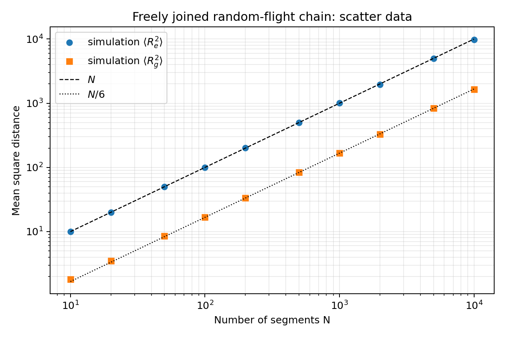{ width=80% }

除最长链仍有约 $1.4\%$ 的统计误差外，其余链长都很好地满足题目给出的关系式。

### 理解

自由连接链是理想链模型，链段之间没有相关性，所以 $\langle R_e^2\rangle\sim N$，$\langle R_g^2\rangle\sim N/6$。有限 $N$ 时的精确修正由 $\frac{6(n+1)}{n+2}$ 给出；当 $N$ 很大时，该因子趋于 6。

## Problem 2(b)：自由旋转链模型

### 待求问题

对自由旋转链模型，例如固定键角 $\theta=68^\circ$，是否能得到与自由连接链相同的结果？并评论结果。

### 解决方式

自由旋转链固定相邻链段夹角，令

$$
\boldsymbol{u}_{i+1}\cdot\boldsymbol{u}_{i}=\cos\theta,
$$

但绕前一链段方向的方位角仍均匀随机。相邻键向量相关系数为

$$
c=\cos68^\circ=0.3746.
$$

端到端平方距离的理论表达式为

$$
\langle R_e^2\rangle
=N+2\sum_{k=1}^{N-1}(N-k)c^k.
$$

当 $N$ 足够大时，

$$
\langle R_e^2\rangle
\simeq
N\frac{1+c}{1-c}.
$$

### 问题答案

自由旋转链结果如下：

| $N$ | 样本数 | $\langle R_e^2\rangle$ | 理论 $\langle R_e^2\rangle$ | $\langle R_g^2\rangle$ | $\langle R_g^2\rangle/\langle R_e^2\rangle$ |
|--:|--:|--:|--:|--:|--:|
| 10 | 15000 | 20.049 | 20.064 | 3.205 | 0.15984 |
| 50 | 15000 | 108.743 | 107.984 | 17.838 | 0.16404 |
| 100 | 15000 | 219.905 | 217.883 | 36.133 | 0.16431 |
| 500 | 6000 | 1099.300 | 1097.078 | 182.101 | 0.16565 |
| 1000 | 3500 | 2184.584 | 2196.071 | 363.770 | 0.16652 |
| 5000 | 1200 | 10824.256 | 10988.020 | 1805.797 | 0.16683 |

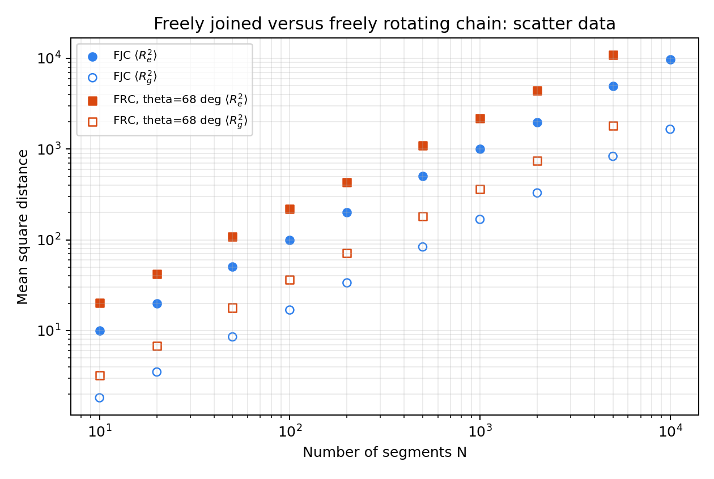{ width=82% }

自由旋转链不能得到与自由连接链完全相同的 $\langle R_e^2\rangle$。在 $\theta=68^\circ$ 时，相邻链段正相关，长链的 $\langle R_e^2\rangle/N$ 约为

$$
\frac{1+\cos68^\circ}{1-\cos68^\circ}=2.198,
$$

明显大于自由连接链的 $1$。

### 理解

自由连接链没有方向记忆，而自由旋转链保留了局部刚性。局部刚性会让链更伸展，所以端到端平方距离更大。不过当 $N$ 足够大时，链仍表现为随机线团，$\langle R_g^2\rangle/\langle R_e^2\rangle$ 仍接近 $1/6$。

## Problem 2(c)：端到端距离分布

### 待求问题

比较端到端距离的模拟分布与理论预测概率密度。

### 解决方式

自由连接链在大 $N$ 下各坐标分量近似正态，方差为 $N/3$。因此 $R=|\boldsymbol{R}|$ 近似服从 Maxwell 分布：

$$
P(R)
=\sqrt{\frac{2}{\pi}}\frac{R^2}{\sigma^3}
\exp\left(-\frac{R^2}{2\sigma^2}\right),
\qquad
\sigma=\sqrt{\frac{N}{3}}.
$$

### 问题答案

以 $N=100$ 为例，30000 条自由连接链给出：

| 指标 | 模拟值 | 理论值 |
|:--|--:|--:|
| $\langle R\rangle$ | 9.2139 | 9.2132 |
| $R_{\mathrm{rms}}$ | 9.9950 | 10.0000 |

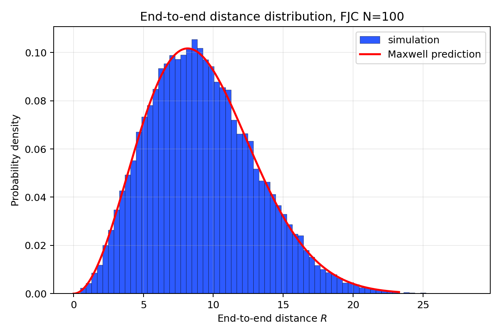{ width=78% }

直方图与 Maxwell 曲线基本重合。

### 理解

端到端向量是许多独立随机向量之和，中心极限定理使其坐标分量接近正态。由于题目比较的是距离 $R$ 而非某个坐标分量，理论分布不是一维 Gaussian，而是三维向量模长对应的 Maxwell 分布。

# III. 一维格点随机游走 {-}

## Problem 3(a)：给定 $N$ 的概率 $P_N(x)$

### 待求问题

实现程序，计算一维格点随机游走在给定步数 $N$ 后位于位置 $x$ 的概率 $P_N(x)$。

### 解决方式

设每一步向右的概率为 $p$，向左的概率为 $1-p$。若向右走了 $k$ 步，则

$$
x=k-(N-k)=2k-N.
$$

因此

$$
P_N(x)=
\binom{N}{k}p^k(1-p)^{N-k},
\qquad
k=\frac{N+x}{2}.
$$

当 $N+x$ 不是偶数时，该位置不可达，概率为 0。

### 问题答案

程序使用二项分布精确计算 $P_N(x)$，并用对数阶乘避免大 $N$ 时组合数溢出。

### 理解

一维格点随机游走的 $x$ 不是连续变量，而是与 $N$ 同奇偶性的离散格点。后续把它与 Gaussian 比较时，必须注意这是离散概率质量，而不是连续概率密度。

## Problem 3(b)：$p=0.5$ 时的精确量比较

### 待求问题

对 $p=0.5$，计算 $N=16,32,64,128,256,512,1024$ 时的 $P_N(x)$、$\langle x_N\rangle$ 与 $\langle\Delta x_N^2\rangle$，并与精确答案比较。

### 解决方式

无偏随机游走满足

$$
\langle x_N\rangle=0,
\qquad
\langle\Delta x_N^2\rangle=N.
$$

峰值位于 $x=0$，峰值概率为 $\binom{N}{N/2}2^{-N}$。

### 问题答案

结果如下：

| $N$ | $\langle x_N\rangle$ | $\langle\Delta x_N^2\rangle$ | 最大概率 | 最大概率位置 | 半高宽 |
|--:|--:|--:|--:|--:|--:|
| 16 | 0.0 | 16.0 | 0.196381 | 0 | 8 |
| 32 | 0.0 | 32.0 | 0.139950 | 0 | 12 |
| 64 | 0.0 | 64.0 | 0.099347 | 0 | 16 |
| 128 | 0.0 | 128.0 | 0.070386 | 0 | 24 |
| 256 | 0.0 | 256.0 | 0.049819 | 0 | 36 |
| 512 | 0.0 | 512.0 | 0.035245 | 0 | 52 |
| 1024 | 0.0 | 1024.0 | 0.024928 | 0 | 72 |

数值结果与精确均值和方差完全一致。

### 理解

无偏情形没有漂移，最可能位置始终是原点。随着 $N$ 增大，峰值概率降低，但分布宽度按 $\sqrt{N}$ 增大，这体现了扩散而不是定向运动。

## Problem 3(c)：分布图、连续性、峰值与宽度

### 待求问题

画出上述 $N$ 的 $P_N(x)$ 关于 $x$ 的图像。判断 $x$ 是否为连续函数；并给出每个 $N$ 下 $P_N(x)$ 的最大值和近似宽度。

### 解决方式

对每个 $N$ 直接枚举 $x=-N,-N+2,\ldots,N$，计算离散概率。宽度用半高宽表示，即 $P_N(x)\ge P_{\max}/2$ 的格点范围。

### 问题答案

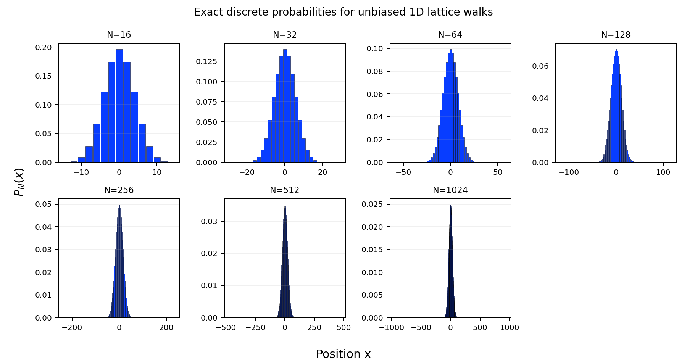{ width=82% }

$x$ 不是连续变量，而是离散格点。最大概率和半高宽已列在 Problem 3(b) 表中。峰值概率从 $N=16$ 的 $0.196381$ 降到 $N=1024$ 的 $0.024928$；半高宽从 8 增大到 72。

### 理解

离散分布在大 $N$ 时会呈现平滑包络，但原始概率仍只定义在可达格点上。图像看起来越来越平滑，是因为可达点越来越密集地铺在越来越宽的尺度上，而不是因为随机游走变成了真正的连续变量。

## Problem 3(d)：Gaussian 近似

### 待求问题

从前面的图说明，当 $N$ 足够大时，计算得到的分布可以用 Gaussian 近似：

$$
P(x)=\frac{1}{\sqrt{2\pi}\sigma}
\exp\left[-\frac{(x-\langle x\rangle)^2}{2\sigma^2}\right],
\qquad
\sigma^2=\langle\Delta x_N^2\rangle.
$$

并判断该拟合是否对所有 $x$ 都同样好。

### 解决方式

由于精确的 $P_N(x)$ 是离散概率质量，而上式是连续密度，比较离散概率时需要乘以格点间距 $\Delta x=2$：

$$
P_N(x)\approx
\frac{2}{\sqrt{2\pi}\sigma}
\exp\left(-\frac{x^2}{2\sigma^2}\right).
$$

### 问题答案

对 $N=1024$，Gaussian 质量近似与精确二项分布的总 $L^1$ 误差为 $2.2793\times10^{-4}$，其中 $|x|\le 2\sigma$ 的中心区域误差为 $1.9809\times10^{-4}$。

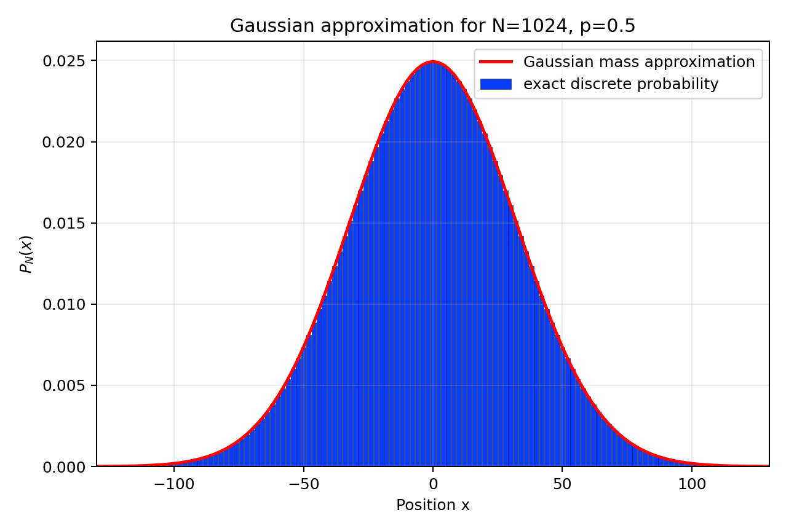{ width=80% }

拟合在分布中心区非常好；在远离中心的极端尾部，二项分布的离散性和有限支撑仍会造成更明显的相对误差。

### 理解

Gaussian 近似来自中心极限定理，因此主要控制典型涨落区。尾部对应罕见事件，有限 $N$ 下仍保留二项分布的结构；如果关心极小概率尾部，直接使用精确二项概率更稳妥。

## Problem 3(e)：$p=0.7$ 的有偏随机游走

### 待求问题

设 $p=0.7$，对同样的 $N$ 计算 $\langle x_N\rangle$ 和 $\langle\Delta x_N^2\rangle$，并解释此时的物理含义。

### 解决方式

有偏情形下，

$$
\langle x_N\rangle=N(2p-1),
\qquad
\langle\Delta x_N^2\rangle=4Np(1-p).
$$

代入 $p=0.7$，

$$
\langle x_N\rangle=0.4N,
\qquad
\langle\Delta x_N^2\rangle=0.84N.
$$

### 问题答案

| $N$ | $\langle x_N\rangle$ | 理论 $\langle x_N\rangle$ | $\langle\Delta x_N^2\rangle$ | 理论方差 | $\langle x_N^2\rangle$ |
|--:|--:|--:|--:|--:|--:|
| 16 | 6.4 | 6.4 | 13.44 | 13.44 | 54.40 |
| 32 | 12.8 | 12.8 | 26.88 | 26.88 | 190.72 |
| 64 | 25.6 | 25.6 | 53.76 | 53.76 | 709.12 |
| 128 | 51.2 | 51.2 | 107.52 | 107.52 | 2728.96 |
| 256 | 102.4 | 102.4 | 215.04 | 215.04 | 10700.80 |
| 512 | 204.8 | 204.8 | 430.08 | 430.08 | 42373.12 |
| 1024 | 409.6 | 409.6 | 860.16 | 860.16 | 168632.32 |

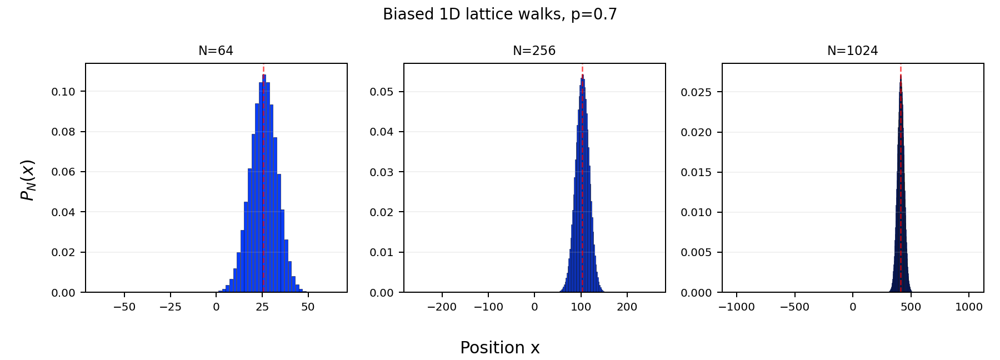{ width=80% }

### 理解

$p=0.7$ 时随机游走具有向正方向的漂移。中心方差仍按 $N$ 增长，是扩散涨落；但关于原点的均方位移 $\langle x_N^2\rangle$ 包含 $\langle x_N\rangle^2$，大 $N$ 时会由漂移项主导，近似按 $N^2$ 增长。

## Problem 3(f)：均方涨落的标度律

### 待求问题

作 $\langle\Delta x_N^2\rangle$ 关于 $N$ 的 log-log 图，并分析大 $N$ 行为。许多随机游走模型满足

$$
\langle\Delta x_N^2\rangle\sim N^{2\eta},
\qquad N\gg1.
$$

### 解决方式

对 $\log \langle\Delta x_N^2\rangle$ 与 $\log N$ 做线性拟合。若斜率为 $s$，则

$$
2\eta=s.
$$

### 问题答案

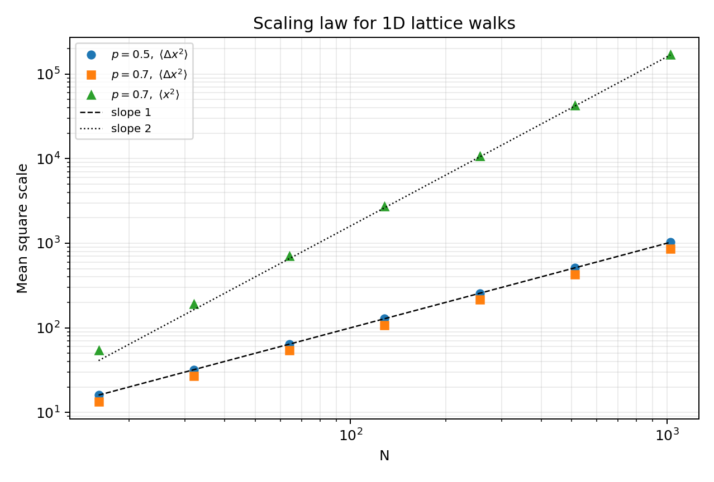{ width=82% }

拟合斜率为：

| 情形 | 拟合斜率 |
|:--|--:|
| $p=0.5$ 的中心方差 $\langle\Delta x^2\rangle$ | 1.0000 |
| $p=0.7$ 的中心方差 $\langle\Delta x^2\rangle$ | 1.0000 |
| $p=0.7$ 的原点均方位移 $\langle x^2\rangle$ | 1.9393 |

所以对无偏扩散或有偏情形的中心涨落，有

$$
\eta=\frac12.
$$

### 理解

扩散涨落的标度指数仍是 $\eta=1/2$。有偏随机游走如果观察 $\langle x^2\rangle$，会混入漂移项 $\langle x\rangle^2\sim N^2$，因此斜率接近 2；这不是扩散指数改变，而是统计量从中心方差换成了关于原点的均方位移。

# IV. 二维聚合物随机游走 {-}

## Problem 4(a)：二维随机方向游走

### 待求问题

实现二维随机游走模型，计算聚合物的回转半径与端到端距离，拟合

$$
\langle r_e^2(L)\rangle\sim L^{2\nu},
\qquad
\langle r_g^2(L)\rangle\sim L^{2\nu},
$$

给出 Flory 指数 $\nu$，画出相关结果，并评论比值是否为 $1/6$。

### 解决方式

二维随机方向游走每一步取单位向量

$$
\boldsymbol{s}_i=(\cos\phi_i,\sin\phi_i),
\qquad
\phi_i\sim U(0,2\pi).
$$

该模型是二维理想链，理论上 $\nu=1/2$，并且长链极限下 $\langle R_g^2\rangle/\langle R_e^2\rangle\to1/6$。

### 问题答案

拟合结果为：

| 模型 | $\langle R_e^2\rangle$ 斜率 | $\nu$（95% bootstrap） | $\langle R_g^2\rangle$ 斜率 | $\nu$（95% bootstrap） |
|:--|--:|:--|--:|:--|
| 二维随机方向游走 | 0.9993 | 0.4997 [0.4981, 0.5010] | 0.9964 | 0.4982 [0.4967, 0.4996] |

部分数值结果：

| $N$ | $\langle R_e^2\rangle$ | $\langle R_g^2\rangle$ | 比值 |
|--:|--:|--:|--:|
| 64 | 63.581 | 10.824 | 0.17024 |
| 256 | 257.516 | 42.957 | 0.16681 |
| 1024 | 1024.457 | 170.545 | 0.16647 |
| 4096 | 4076.295 | 682.496 | 0.16743 |

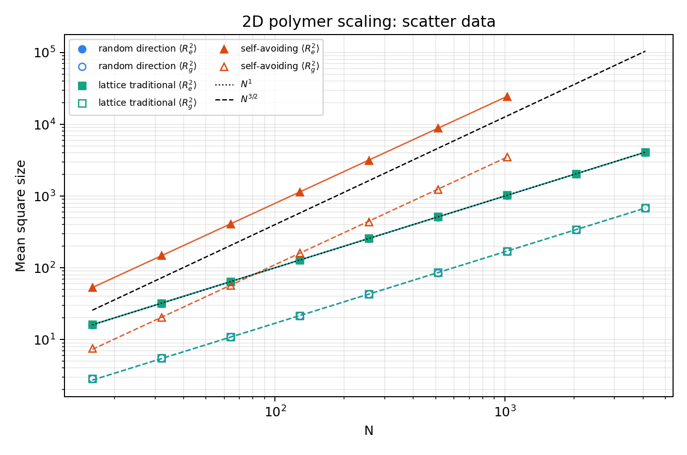{ width=84% }

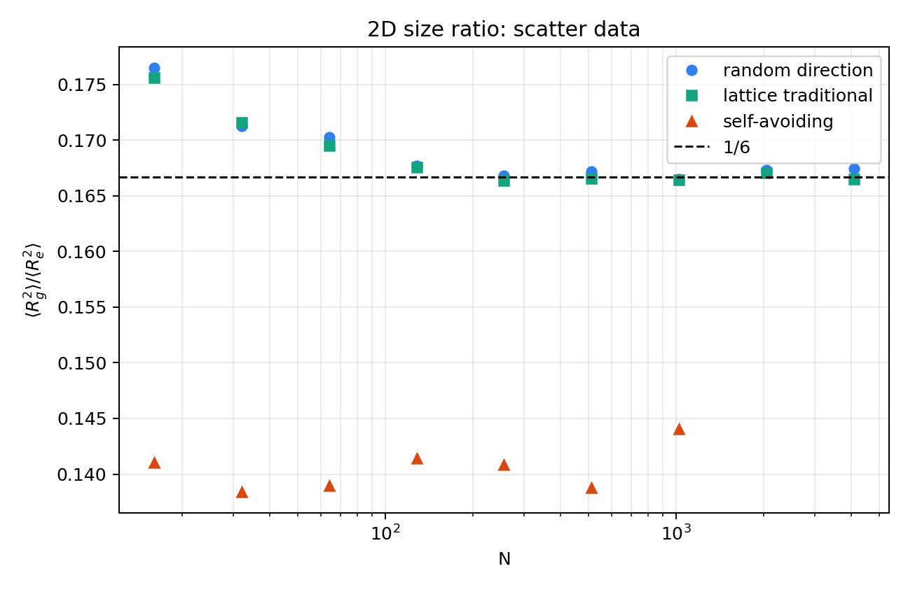{ width=78% }

### 理解

二维随机方向游走没有自避作用，属于理想链普适类。数值上 $\nu$ 接近 $1/2$，比值也收敛到 $1/6$，与理想链理论一致。

## Problem 4(b)：二维传统格点随机游走

### 待求问题

实现二维传统格点随机游走。每一步走向四个最近邻之一，允许自交；计算端到端距离、回转半径、Flory 指数和尺寸比值。

### 解决方式

二维传统格点随机游走每步从

$$
(\pm1,0),\qquad (0,\pm1)
$$

中等概率选择。虽然它限制在格点上，但每一步仍独立、零均值且方差有限，因此仍是理想链。

### 问题答案

拟合结果为：

| 模型 | $\langle R_e^2\rangle$ 斜率 | $\nu$（95% bootstrap） | $\langle R_g^2\rangle$ 斜率 | $\nu$（95% bootstrap） |
|:--|--:|:--|--:|:--|
| 二维传统格点随机游走 | 0.9988 | 0.4994 [0.4990, 0.4997] | 0.9957 | 0.4979 [0.4960, 0.4995] |

部分数值结果：

| $N$ | $\langle R_e^2\rangle$ | $\langle R_g^2\rangle$ | 比值 |
|--:|--:|--:|--:|
| 64 | 64.265 | 10.894 | 0.16951 |
| 256 | 257.203 | 42.786 | 0.16635 |
| 1024 | 1026.308 | 170.783 | 0.16641 |
| 4096 | 4095.075 | 681.754 | 0.16648 |

### 理解

格点约束改变了微观运动方式，但没有改变长链的理想链标度。只要允许自交，排除体积效应不存在，二维传统格点游走和二维随机方向游走给出同一个 $\nu=1/2$ 普适行为。

## Problem 4(c)：二维自避随机游走

### 待求问题

实现二维自避随机游走，计算回转半径和端到端距离，拟合 Flory 指数 $\nu$ 是否接近 $3/4$，并评论尺寸比值是否为 $1/6$。

### 解决方式

自避随机游走要求链的节点不能重复。本文用 pivot 采样法：从直链初态出发，随机选择一个 pivot 点，对其后的链段施加二维格点对称变换；若新构型不自交则接受，否则拒绝。该方法比朴素增长法更适合生成较长的固定长度自避链。

### 问题答案

拟合结果为：

| 模型 | $\langle R_e^2\rangle$ 斜率 | $\nu$（95% bootstrap） | $\langle R_g^2\rangle$ 斜率 | $\nu$（95% bootstrap） |
|:--|--:|:--|--:|:--|
| 二维自避随机游走 | 1.4762 | 0.7381 [0.7297, 0.7459] | 1.4839 | 0.7420 [0.7336, 0.7515] |

部分数值结果：

| $N$ | $\langle R_e^2\rangle$ | $\langle R_g^2\rangle$ | 比值 | pivot 接受率 | 有效样本数 | $\tau_{Rg^2}$ |
|--:|--:|--:|--:|--:|--:|--:|
| 64 | 410.615 | 57.048 | 0.13893 | 0.437 | 350.7 | 4.56 |
| 256 | 3116.380 | 438.938 | 0.14085 | 0.331 | 354.2 | 3.39 |
| 1024 | 24473.300 | 3525.494 | 0.14405 | 0.259 | 342.6 | 2.33 |

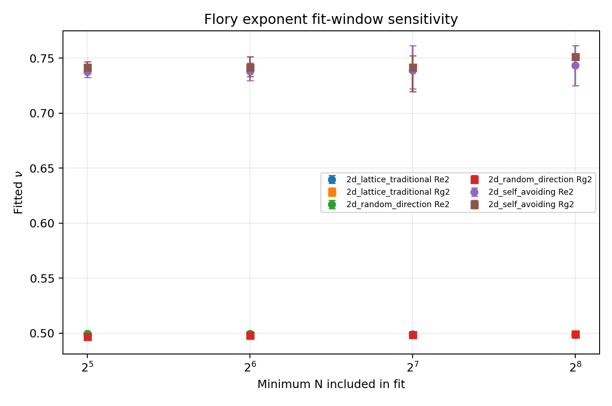{ width=78% }

### 理解

二维自避链的拟合 $\nu\approx0.74$，接近理论值 $3/4$。自避约束使链段不能互相穿过，链团比理想链更膨胀，因此 $\langle R_e^2\rangle$ 的增长比 $N^1$ 更快。尺寸比值约为 $0.14$，低于 $1/6$，说明 $1/6$ 是理想链结果，不适用于二维自避链。

# V. 三维格点随机游走 {-}

## Problem 5(a)：三维传统格点随机游走

### 待求问题

实现三维格点随机游走。每一步以相等概率走向 6 个最近邻之一，即在三个坐标之一加上或减去 1。计算回转半径和端到端距离，拟合 Flory 指数，并评论比值是否为 $1/6$。

### 解决方式

传统三维格点随机游走仍允许自交。每一步从

$$
(\pm1,0,0),\qquad (0,\pm1,0),\qquad (0,0,\pm1)
$$

中等概率选择。它是三维理想链模型，理论上 $\nu=1/2$。

### 问题答案

拟合结果为：

| 模型 | $\langle R_e^2\rangle$ 斜率 | $\nu$（95% bootstrap） | $\langle R_g^2\rangle$ 斜率 | $\nu$（95% bootstrap） |
|:--|--:|:--|--:|:--|
| 三维传统格点随机游走 | 0.9976 | 0.4988 [0.4968, 0.5011] | 0.9967 | 0.4984 [0.4976, 0.4992] |

部分数值结果：

| $N$ | $\langle R_e^2\rangle$ | $\langle R_g^2\rangle$ | 比值 |
|--:|--:|--:|--:|
| 64 | 63.761 | 10.795 | 0.16930 |
| 256 | 256.476 | 42.907 | 0.16729 |
| 1024 | 1026.418 | 171.720 | 0.16730 |
| 4096 | 4052.350 | 681.341 | 0.16813 |

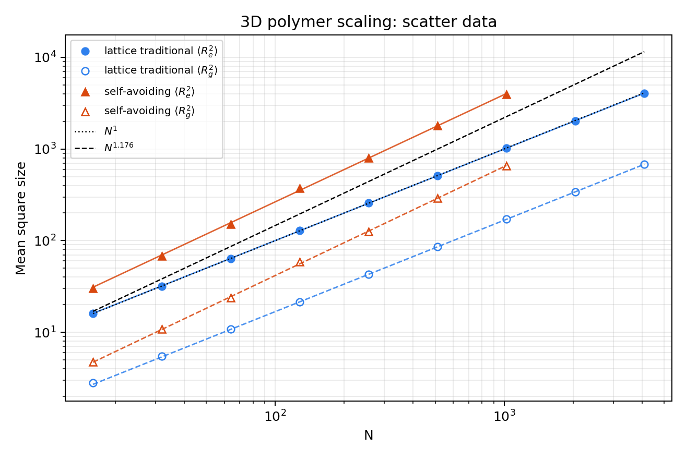{ width=84% }

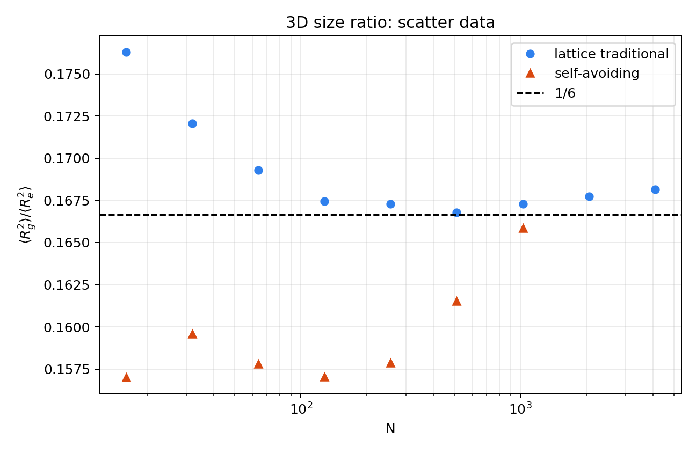{ width=78% }

### 理解

三维传统格点随机游走与二维传统格点随机游走一样属于理想链，维度改变了空间嵌入方式，但未引入自避相互作用。因此 $\nu$ 仍接近 $1/2$，尺寸比值也接近 $1/6$。

## Problem 5(b)：三维自避随机游走

### 待求问题

实现三维自避随机游走，计算回转半径和端到端距离，拟合 Flory 指数 $\nu$ 是否接近 $0.6$，并评论比值是否为 $1/6$。

### 解决方式

三维自避链同样使用 pivot 采样。与二维相比，三维空间更宽，pivot 变换被接受的概率更高；但自避约束仍会使链膨胀。

### 问题答案

拟合结果为：

| 模型 | $\langle R_e^2\rangle$ 斜率 | $\nu$（95% bootstrap） | $\langle R_g^2\rangle$ 斜率 | $\nu$（95% bootstrap） |
|:--|--:|:--|--:|:--|
| 三维自避随机游走 | 1.1697 | 0.5849 [0.5673, 0.5990] | 1.1882 | 0.5941 [0.5743, 0.6065] |

部分数值结果：

| $N$ | $\langle R_e^2\rangle$ | $\langle R_g^2\rangle$ | 比值 | pivot 接受率 | 有效样本数 | $\tau_{Rg^2}$ |
|--:|--:|--:|--:|--:|--:|--:|
| 64 | 150.810 | 23.798 | 0.15780 | 0.624 | 568.9 | 2.81 |
| 256 | 793.792 | 125.329 | 0.15789 | 0.536 | 546.4 | 2.20 |
| 1024 | 3955.500 | 656.096 | 0.16587 | 0.476 | 323.6 | 2.47 |

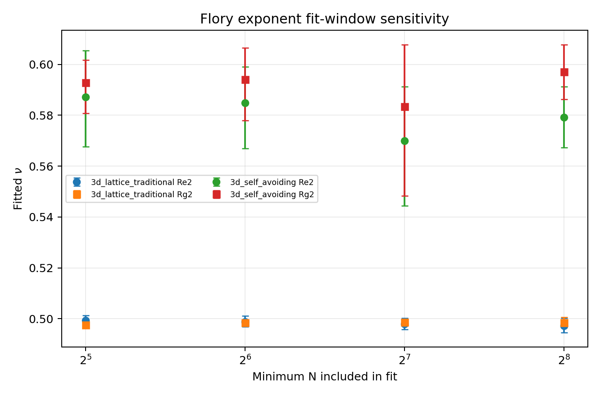{ width=78% }

### 理解

三维自避链得到 $\nu\approx0.59$，接近题目提示的 $0.6$，也接近三维自避游走常见的 $\nu\approx0.588$。尺寸比值约为 $0.16$，不严格等于 $1/6$；自避链的形状统计不同于理想链，但三维中偏离比二维略小。

## Problem 5(c)：三维随机游走的暂态性

### 待求问题

说明三维传统随机游走是暂态的。

### 解决方式

设 $S_n$ 为三维简单随机游走位置。若从原点出发后返回原点的期望次数有限，则随机游走是暂态的。三维中局部中心极限定理给出

$$
P(S_{2n}=0)=O(n^{-3/2}).
$$

由于

$$
\sum_{n=1}^{\infty} n^{-3/2}<\infty,
$$

所以

$$
\sum_{n=1}^{\infty}P(S_{2n}=0)<\infty.
$$

返回次数期望有限，因此最终返回概率小于 1，三维随机游走是暂态的。

### 问题答案

数值上模拟 30000 条三维传统格点随机游走，到 5000 步为止，曾经返回原点的比例为

$$
0.3362.
$$

经典三维简单随机游走的最终返回概率约为 $0.3405$，明显小于 1。

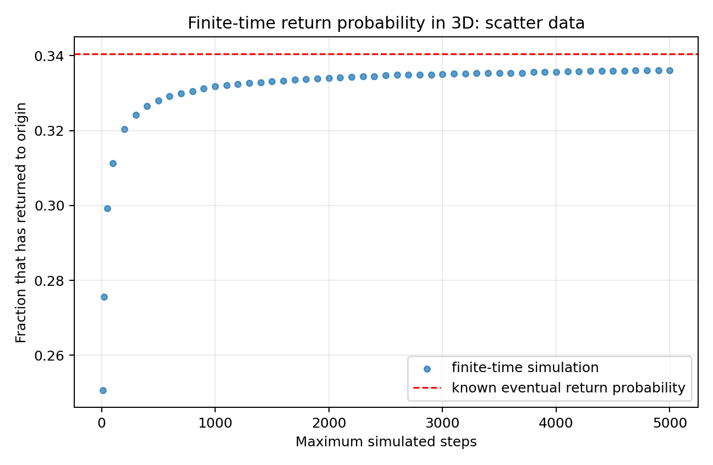{ width=78% }

### 理解

一维和二维简单随机游走几乎必然返回原点，而三维中空间体积增长更快，走出去后“错过原点”的机会显著增大。模拟曲线逐步靠近约 $0.34$ 的返回概率，而不是趋向 1；理论上的返回概率级数收敛给出了暂态性的根本原因。
