| { width=20% } |
|:--:|

| 项目 | 内容 |
|:--|:--|
| 源题编号 | `Homework 14` |
| 学生姓名 | 姜玥晟 |
| 报告主题 | 一维与二维 Ising 模型的 Metropolis、demon 算法和有限尺寸标度 |
| 实验环境 | `Python 3.13.5`、`numpy 2.3.3`、`matplotlib 3.10.7`、`scipy 1.16.2` |
| 统一单位 | 除特别说明外，取 $J=1,\ k_B=1,\ h=0$ |
| 随机种子 | `20260610` |

\newpage

# I. 一维 Ising 模型的 Metropolis 模拟 {-}

## Problem 1(a)：有序初态的平衡时间

### 待求问题

取 $N=20,\ T=1.0$，初态为所有自旋向上。计算每个 Monte Carlo 步后的能量，并估计系统达到平衡所需的步数。

### 解决方式

一维周期边界 Ising 链的能量取为

$$
E=-J\sum_{i=1}^{N}s_i s_{i+1},\qquad s_i=\pm 1.
$$

随机选择一个格点并尝试翻转，能量变化为

$$
\Delta E=2J s_i(s_{i-1}+s_{i+1}).
$$

若 $\Delta E\le 0$ 则接受，否则以 $\exp(-\Delta E/T)$ 的概率接受。本文把 $N$ 次尝试翻转定义为 1 个 MC sweep，并用能量的滑动平均接近理论均值

$$
\langle E\rangle=-N\tanh(1/T)
$$

作为平衡判据。

实际估计平衡时间时，使用 30 个 sweep 的能量滑动平均；当连续 25 个滑动窗口都落在理论均值 $\langle E\rangle=-N\tanh(1/T)$ 的约 $1.2$ 能量单位范围内时，认为轨迹已经进入平衡涨落区。因此这里的“平衡时间”是有限轨迹上的操作性估计，不是严格的弛豫时间常数。

```text
initialize spins, energy E, magnetization M
for sweep = 1 ... n_sweeps:
    accepted = 0
    repeat N times:
        choose a site i uniformly
        compute DeltaE = 2 J s_i (s_{i-1} + s_{i+1})
        accept if DeltaE <= 0 or rand() < exp(-DeltaE / T)
        if accepted:
            flip s_i and update E, M
    record E, M, accepted / N
estimate equilibration from the energy moving average
```

### 问题答案

在 $T=1$ 时，题目给出的理论能量公式给出
$$
\langle E\rangle=-N\tanh(1/T)=-20\tanh(1)=-15.232 .
$$
从全向上初态出发，用上述滑动平均判据估计平衡时间约为 59 个 MC sweep。后 500 个 sweep 的统计均值为
$$
\langle E\rangle=-15.216,\qquad
\langle M\rangle=0.804,\qquad
\langle |M|\rangle=9.572,
$$
平均接受率约为 0.245。这里的 $\langle M\rangle$ 是带符号磁化，长时间极限下应因 $M\leftrightarrow -M$ 对称而趋近 0；$\langle |M|\rangle$ 则反映有限链在低温下保留的有序程度。

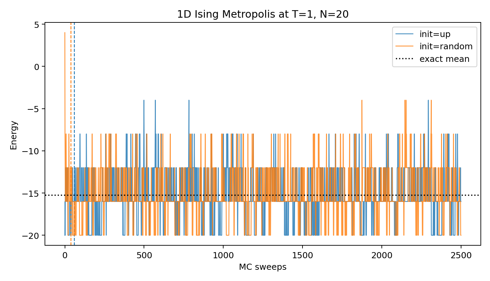{ width=62% fig-pos="H" }

### 理解

全向上初态是最低能量构型，初期只能通过少量热涨落产生畴壁对，因此能量先从 $-20$ 向平衡均值上升。低温下接受率不高，弛豫不是单调过程，但能量滑动平均会围绕理论均值波动。

## Problem 1(b)：随机初态的平衡时间

### 待求问题

把所有自旋初始化为随机的 $\pm 1$，估计系统达到平衡所需的时间。

### 解决方式

算法与 Problem 1(a) 相同，只改变初始自旋构型。随机初态的初始能量通常接近 0，因此在 $T=1$ 时系统需要向低能量区域弛豫。

### 问题答案

随机初态的估计平衡时间约为 37 个 MC sweep；后 500 个 sweep 的均值为
$$
\langle E\rangle=-14.888,\qquad
\langle M\rangle=0.128,\qquad
\langle |M|\rangle=9.280,
$$
平均接受率约为 0.258。

### 理解

随机初态离低温平衡态的能量更远，但它一开始有许多可降低能量的翻转，所以前期降能较快。与全向上初态相比，两者最终能量均接近同一热平衡值；差异主要体现在早期弛豫路径。

## Problem 1(c)：温度扫描、平均能量与磁化

### 待求问题

取 $N=20$，先平衡 100 个 MC sweep，再至少用 200 个 MC sweep 统计 $T=0.5$ 到 $5.0$ 范围内的平均能量 $\langle E\rangle$ 和磁化 $\langle M\rangle$。画出 $\langle E\rangle$ 随 $T$ 的变化，并与精确式 $\langle E\rangle=-N\tanh(1/T)$ 比较；说明 $\langle M\rangle$ 是否依赖初态。

### 解决方式

每个温度点运行 1300 个 MC sweep，舍去前 100 个 sweep 后做平均。零外场下，有限链的 signed magnetization 在充分长时间内应因 $M\leftrightarrow -M$ 对称而趋近 0；但低温下两种磁化方向之间的翻转很慢，所以同时报告 $\langle |M|\rangle$。

```text
for init_mode in {up, random}:
    for T in 0.5, 1.0, ..., 5.0:
        run the 1D Metropolis chain
        discard the first 100 sweeps
        average E, M, |M| and acceptance ratio
        compare mean E with -N tanh(1 / T)
```

### 问题答案

随机初态的主要结果如下。全向上初态给出相同的能量趋势，低温点因隧穿慢而更容易保留初态记忆。

| $T$ | $\langle E\rangle$ | 精确值 | $\langle M\rangle$ | $\langle \lvert M\rvert\rangle$ | 接受率 |
|--:|--:|--:|--:|--:|--:|
| 0.5 | -19.983 | -19.281 | 19.987 | 19.99 | 0.001 |
| 1.0 | -15.287 | -15.232 | 2.280 | 10.12 | 0.232 |
| 1.5 | -11.767 | -11.656 | 0.825 | 6.88 | 0.416 |
| 2.0 | -9.200 | -9.242 | 0.232 | 5.64 | 0.545 |
| 2.5 | -7.690 | -7.599 | 0.340 | 5.41 | 0.618 |
| 3.0 | -6.547 | -6.430 | 0.338 | 5.16 | 0.675 |
| 3.5 | -5.480 | -5.564 | -0.098 | 4.73 | 0.727 |
| 4.0 | -4.903 | -4.898 | -0.523 | 4.25 | 0.754 |
| 4.5 | -4.393 | -4.373 | -0.045 | 4.28 | 0.781 |
| 5.0 | -3.657 | -3.948 | 0.198 | 4.24 | 0.807 |

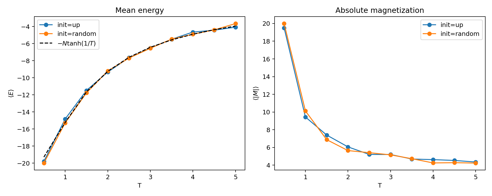{ width=86% fig-pos="H" }

随机初态的全温区平均绝对能量偏差约为 0.152，最大偏差出现在 $T=0.5$，约为 $|-19.983-(-19.281)|=0.703$。这个点的接受率只有 0.001，链几乎停留在完全有序附近，因此它更能反映低温局域 Metropolis 的慢混合，而不是高精度平衡采样。

### 理解

能量随温度升高而上升，即绝对值变小，因为高温允许更多畴壁。$T=0.5$ 时的数值结果不能简单解释为“比解析式更好”，而应解释为有限运行没有充分穿越低温构型空间：局域翻转很难产生和移动畴壁，轨迹偏向 $E=-20$ 的完全有序态。零外场下，平衡分布关于 $M\leftrightarrow -M$ 对称，因此充分长时间平均的 $\langle M\rangle$ 应趋近 0；但低温有限时间模拟可能长时间停留在某一个磁化方向，所以 signed $\langle M\rangle$ 会依赖初态和随机轨迹。$\langle |M|\rangle$ 不会因正负翻转相互抵消，更能反映有限链的有序程度。

## Problem 1(d)：接受率与温度的关系

### 待求问题

判断接受率是温度的增函数还是减函数，并说明 Metropolis 算法在低温下更高效还是更低效。

### 解决方式

在 Problem 1(c) 的温度扫描中，同时统计每个温度点的尝试翻转接受率。

### 问题答案

接受率随温度升高而增大。随机初态下接受率从 $T=0.5$ 的 0.001 增加到 $T=5.0$ 的 0.807。

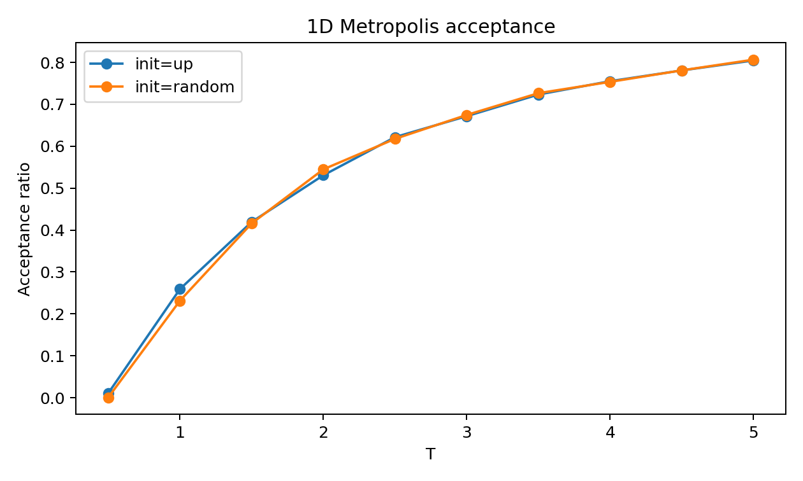{ width=70% fig-pos="H" }

### 理解

Metropolis 因子 $\exp(-\Delta E/T)$ 在低温下强烈压低升能翻转的概率，所以链容易长时间停留在少数低能构型中。低温并不是算法更高效，而是更容易产生慢混合和强相关采样。

# II. 一维 Ising 模型的 demon 算法 {-}

## Problem 2(a)：demon 算法、运行平均与平衡值

### 待求问题

编写程序模拟一维微正则系综中的 Ising 模型 demon 算法。取 $N=100,\ J=1,\ h=0$，期望总能量 $E_{\mathrm{tot}}=-20$。统计 demon 能量、磁化和磁化平方的运行平均，估计这些量接近平衡值所需的时间，并在热化后给出平衡均值。

### 解决方式

初态取全向上，此时系统能量 $E_s=-100$，demon 初始能量为

$$
E_d=E_{\mathrm{tot}}-E_s=80.
$$

每次随机选取一个自旋尝试翻转。若 $\Delta E\le E_d$，则接受翻转，并令

$$
E_s\leftarrow E_s+\Delta E,\qquad
E_d\leftarrow E_d-\Delta E.
$$

这样 $E_s+E_d$ 保持不变。

平衡时间用 demon 能量的运行平均估计：取 60 个 sweep 的滑动窗口，并与后四分之一轨迹的均值比较；当窗口均值持续落入稳定涨落范围内时，认为非平衡初始段已经过去。这个判据主要用于决定从哪里开始统计平均量。

```text
initialize all spins up
set E_s = -N J and E_d = E_total - E_s
for sweep = 1 ... n_sweeps:
    repeat N times:
        choose a site i uniformly
        compute DeltaE for flipping s_i
        if DeltaE <= E_d:
            flip s_i
            E_s = E_s + DeltaE
            E_d = E_d - DeltaE
    record E_s, E_d, M, M^2
discard warmup sweeps and average the recorded quantities
```

### 问题答案

运行平均约在 60 个 MC sweep 后进入稳定区。舍去非平衡段后得到

| 物理量 | 数值 |
|:--|--:|
| $\langle E_d\rangle$ | 2.142 |
| $\langle E_s\rangle$ | -22.142 |
| $\langle M\rangle$ | -0.151 |
| $\langle M^2\rangle$ | 152.574 |
| 接受率 | 0.778 |

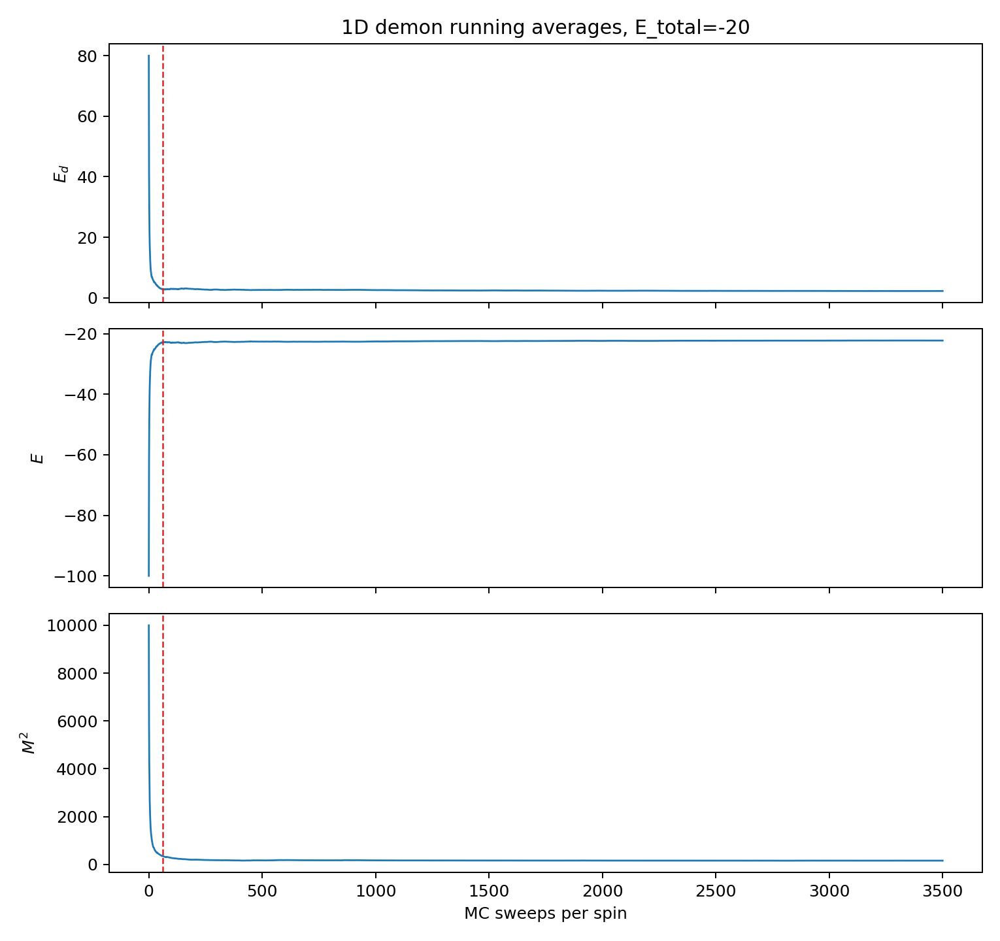{ width=82% fig-pos="H" }

### 理解

总能量较高时，demon 可以频繁提供或吸收能量，因此接受率高于低温 Metropolis 情形。平衡后 $\langle M\rangle$ 接近 0，而 $\langle M^2\rangle$ 保留了有限尺寸涨落信息。

## Problem 2(b)：由 demon 能量确定温度

### 待求问题

使用关系式

$$
\frac{k_BT}{J}=\frac{4}{\ln(1+4J/\langle E_d\rangle)}
$$

求 Problem 2(a) 参数对应的平衡温度，并给出对应的系统能量。

### 解决方式

把热化后的 $\langle E_d\rangle$ 代入上式。系统能量直接由守恒关系

$$
\langle E_s\rangle=E_{\mathrm{tot}}-\langle E_d\rangle
$$

得到。

### 问题答案

由 $\langle E_d\rangle=2.142$ 得

$$
T=3.797.
$$

对应系统能量为

$$
\langle E_s\rangle=-20-2.142=-22.142,\qquad
\langle E_s\rangle/N=-0.221.
$$

在同一温度下，无限一维链公式给出 $E/N=-\tanh(1/T)=-0.257$，与有限系统和有限采样结果定性一致。

### 理解

demon 温度不是简单的 $\langle E_d\rangle$，因为一维 Ising 的 demon 能量取离散值。公式中的对数修正正是离散能级求和带来的结果。

## Problem 2(c)：不同总能量、有限尺寸与运行步数

### 待求问题

对 $N=100,\ J=1$，分别计算 $E_{\mathrm{tot}}=-40,-60,-80$ 时的 $T$ 和 $E$，并与无限一维链精确结果比较。讨论 $E/N$ 如何依赖自旋数 $N$ 和每个自旋的 Monte Carlo 步数。

### 解决方式

每个总能量运行 5000 个 MC sweep，舍去前 1000 个 sweep。比较基准取

$$
\frac{E}{N}=-\tanh(1/T).
$$

为了考察尺寸和运行长度影响，还对近似相同的总能量密度运行了 $N=64,100,200$ 与 1000/5000 sweep 的组合。

### 问题答案

| $E_{\mathrm{tot}}$ | $\langle E_d\rangle$ | $T$ | $\langle E\rangle/N$ | 精确 $E/N$ | $\langle M^2\rangle/N^2$ |
|--:|--:|--:|--:|--:|--:|
| -40 | 0.705 | 2.107 | -0.407 | -0.442 | 0.0219 |
| -60 | 0.238 | 1.389 | -0.602 | -0.617 | 0.0356 |
| -80 | 0.039 | 0.862 | -0.800 | -0.821 | 0.0710 |

用于检查尺寸和步数依赖的辅助结果如下：

| $N$ | sweep | $E_{\mathrm{tot}}/N$ | $T$ | $\langle E\rangle/N$ | 精确 $E/N$ |
|--:|--:|--:|--:|--:|--:|
| 64 | 1000 | -0.625 | 1.392 | -0.629 | -0.616 |
| 64 | 5000 | -0.625 | 1.312 | -0.628 | -0.642 |
| 100 | 1000 | -0.600 | 1.245 | -0.602 | -0.666 |
| 100 | 5000 | -0.600 | 1.402 | -0.602 | -0.613 |
| 200 | 1000 | -0.600 | 1.563 | -0.602 | -0.565 |
| 200 | 5000 | -0.600 | 1.475 | -0.601 | -0.590 |

有限尺寸和步数测试显示：当总能量密度固定在约 $-0.6$ 时，$\langle E\rangle/N$ 本身由总能量守恒强烈约束，变化很小；但 $\langle E_d\rangle$ 是一个小量，因而由它反推出的 $T$ 对采样长度和尺寸更敏感。增大 sweep 数后，温度估计通常更稳定；增大 $N$ 后，单个 demon 相对于系统的能量占比变小，有限尺寸涨落也会改变温度反演的偏差。

### 理解

总能量越负，demon 可用能量越少，温度越低，系统越有序。较大的 $N$ 会减小每个自旋的磁化平方涨落；更长的 MC 时间可以改善 demon 能量分布的统计，但低温处仍然存在慢混合。

## Problem 2(d)：$\langle M^2\rangle$ 随温度的变化

### 待求问题

使用同一组运行，计算 $\langle M^2\rangle$ 随 $T$ 的变化，并判断它随温度升高是增加还是减小。

### 解决方式

把 Problem 2(c) 的三个总能量点按 demon 温度排序，考察归一化量 $\langle M^2\rangle/N^2$。

### 问题答案

当温度从 $0.862$ 升高到 $2.107$ 时，$\langle M^2\rangle/N^2$ 从 0.0710 降到 0.0219。因此在这组三个点中，$\langle M^2\rangle$ 随温度升高而减小。

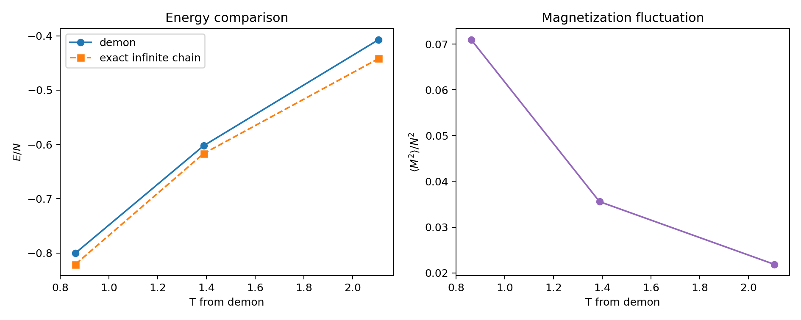{ width=82% fig-pos="H" }

### 理解

低温时体系倾向于形成较长的同向自旋片段，整体磁化涨落更大；高温时畴壁增多，正负自旋更容易抵消，所以 $M^2$ 变小。

# III. 二维正方格 Ising 模型 {-}

## Problem 3(a)：$L=30,\ T=2$ 的弛豫与末态图样

### 待求问题

编写二维正方格 Ising 模型程序，采用热浴、无外磁场、自旋翻转动力学和周期边界。取 $L=30,\ T=2$，初态随机为 $\pm 1$，计算并绘制每个粒子的瞬时能量和磁化随 MC 步的变化，估计热化步数，并画出最终自旋图样，判断系统是否有序。

### 解决方式

二维能量取为

$$
E=-J\sum_{\langle i,j\rangle}s_i s_j.
$$

题面描述的是“随机逐个选择自旋”的单自旋翻转动力学。本文为了让 $L=30$、多温度点和 $L=100$ 图样在本机上稳定运行，主温度扫描采用红黑子格 Metropolis sweep：同一子格内格点互不相邻，可以并行计算 $\Delta E=2Js_i\sum_{\mathrm{nn}}s_j$ 并按 Metropolis 准则翻转。红黑更新仍使用局域翻转和同一 Boltzmann 权重，适合估计平衡热力学量；但它的算法时间相关性不应与随机逐点更新完全等同。因此 Problem 3(g) 和 Problem 3(h) 另用随机单自旋更新来专门比较题面所问的更新顺序与采样频率。

```text
initialize an L x L spin array
for sweep = 1 ... n_sweeps:
    for parity in {red, black}:
        compute nearest-neighbor sums for all sites
        compute DeltaE = 2 J s_i sum_nn s_j on the current sublattice
        accept each proposed flip with the Metropolis rule
        update all accepted sites on that sublattice
    record E / N and |M| / N
```

### 问题答案

在 $T=2<T_c$ 时，估计热化时间约为 38 个 MC sweep。后段平均约为 $E/N=-1.734$，$\langle |m|\rangle=0.908$；最终快照显示大部分自旋同向，体系处于有序相。

这里的热化时间同样是操作性估计：用 35 个 sweep 的能量滑动平均与后四分之一轨迹均值比较，若连续窗口保持在约 $0.03$ 的每自旋能量范围内，则认为轨迹已进入稳定涨落区。

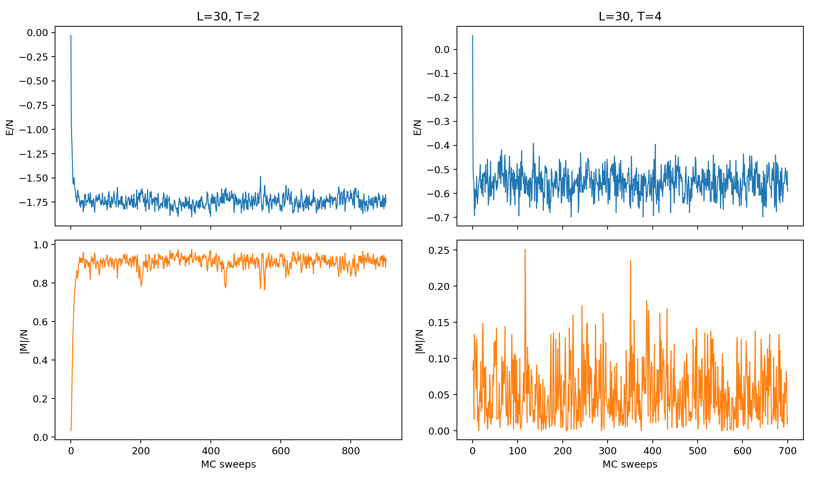{ width=90% fig-pos="H" }

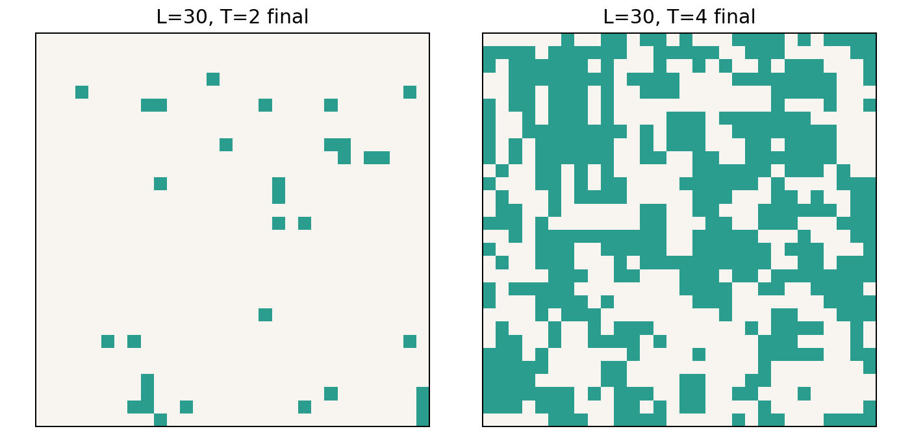{ width=65% fig-pos="H" }

### 理解

$T=2$ 低于二维 Ising 临界温度 $T_c\simeq2.269$，随机初态会通过畴合并形成宏观磁化。有限系统中最终磁化方向由随机涨落决定，因此应看 $|m|$ 而非 signed $m$。

## Problem 3(b)：$L=30,\ T=4$ 的弛豫与末态图样

### 待求问题

取 $T=4$ 重复 Problem 3(a)。

### 解决方式

保持 $L=30$、随机初态、周期边界和同一 Metropolis 更新方式，只改变热浴温度。

### 问题答案

在 $T=4>T_c$ 时，估计热化时间约为 35 个 MC sweep。后段平均约为 $E/N=-0.557$，$\langle |m|\rangle=0.052$；最终快照仍近似杂乱，体系处于无序相。

### 理解

高温热涨落破坏长程有序，正负自旋块不会持续长大。与 $T=2$ 相比，能量绝对值和磁化绝对值都显著降低。

## Problem 3(c)：不同初始磁化构型的影响

### 待求问题

固定温度，例如 $T=1$ 或 $T=2$，改变初始磁化条件，如全向上、全向下、棋盘格、左右半区相反等，判断平衡时间是否改变。

### 解决方式

取 $L=30,\ T=2$，比较随机、全向上、全向下、棋盘格和左右半区相反五种初态。热化时间仍用 35 个 sweep 能量滑动平均接近后段稳定均值的判据估计。

### 问题答案

| 初态 | 估计热化步数 | 后段 $E/N$ | 后段 $\langle |m|\rangle$ |
|:--|--:|--:|--:|
| random | 41 | -1.754 | 0.916 |
| up | 35 | -1.753 | 0.915 |
| down | 35 | -1.749 | 0.915 |
| checkerboard | 35 | -1.743 | 0.912 |
| half | 69 | -1.748 | 0.914 |

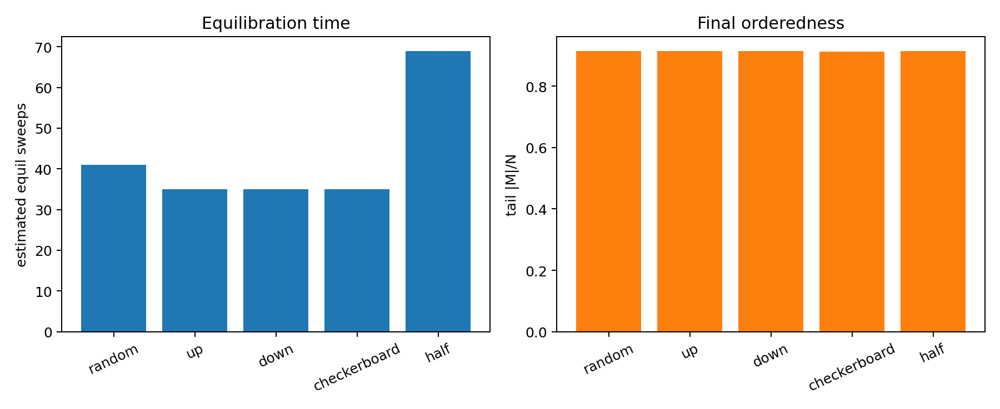{ width=78% fig-pos="H" }

### 理解

最终平衡统计基本一致，但初态会改变弛豫路径。左右半区相反的构型含有较大的畴壁，需要更长时间消除；全向上或全向下已经接近低温有序态，热化较快。

## Problem 3(d)：$L=30$ 的温度扫描与比热

### 待求问题

令温度从 1 到 4，以 $\Delta T=0.5$ 变化。运行足够长时间后计算 $\langle E\rangle/N$ 和 $\langle M\rangle/N$，并作图。由图估计临界温度；分别用能量涨落和数值微分计算比热并比较。

### 解决方式

对每个温度点，$L=30$ 时先热化 1400 sweep，再统计 1800 sweep。比热的涨落估计为

$$
\frac{C}{N}=\frac{\langle E^2\rangle-\langle E\rangle^2}{NT^2},
$$

数值微分估计为

$$
\frac{C}{N}\simeq \frac{d(E/N)}{dT}.
$$

```text
for T in 1.0, 1.5, ..., 4.0:
    equilibrate the L x L lattice
    collect E and |M| during measurement sweeps
    compute mean E/N, mean |M|/N and fluctuation heat capacity
after all temperatures are complete:
    compute numerical d(E/N)/dT on the temperature grid
    locate the finite-size transition region from |M| and C/N
```

### 问题答案

| $T$ | $E/N$ | $\langle \lvert m\rvert\rangle$ | $C/N$ 涨落 | $d(E/N)/dT$ |
|--:|--:|--:|--:|--:|
| 1.0 | -1.997 | 0.999 | 0.022 | 0.093 |
| 1.5 | -1.951 | 0.986 | 0.197 | 0.256 |
| 2.0 | -1.742 | 0.909 | 0.811 | 0.848 |
| 2.5 | -1.103 | 0.218 | 0.861 | 0.924 |
| 3.0 | -0.818 | 0.088 | 0.398 | 0.443 |
| 3.5 | -0.660 | 0.066 | 0.237 | 0.263 |
| 4.0 | -0.556 | 0.056 | 0.163 | 0.208 |

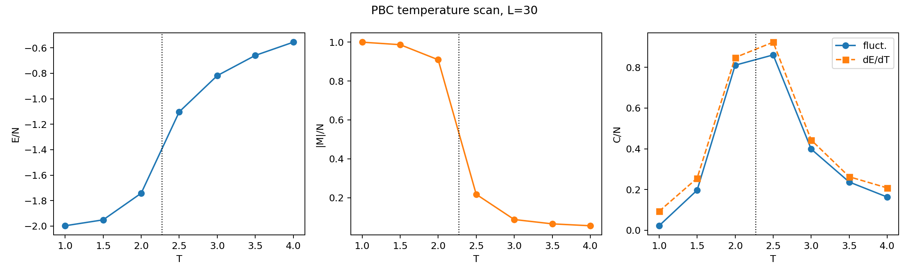{ width=92% fig-pos="H" }

从磁化突降和比热峰可估计有限系统的临界区域在 $T=2.0$ 到 $2.5$ 之间，接近热力学极限值 $T_c=2.269$。在这个粗温度网格上，涨落法的最大值为 $C/N\simeq0.861$，出现在 $T=2.5$；数值微分给出的最大斜率也出现在 $T=2.5$ 附近。由于 $\Delta T=0.5$ 较粗，这里的峰位只能说明临界区域，而不能作为 $T_c$ 的精确估计。

### 理解

有限尺寸系统没有真正奇异点，只有圆滑峰。温度步长为 0.5 时，不能精确定位 $T_c$，但能清楚看到从有序到无序的过渡。

## Problem 3(e)：$L=4$ 的温度扫描

### 待求问题

用 $L=4$ 重复 Problem 3(d)，并评论结果。

### 解决方式

保持周期边界和同一温度网格。由于 $L=4$ 只有 16 个自旋，热化使用 500 sweep，统计 1800 sweep。

### 问题答案

$L=4$ 的曲线中，$\langle |m|\rangle$ 从 $T=1$ 的 0.999 缓慢降到 $T=4$ 的 0.423；比热峰变宽，且没有 $L=30$ 那样清楚的临界区域。

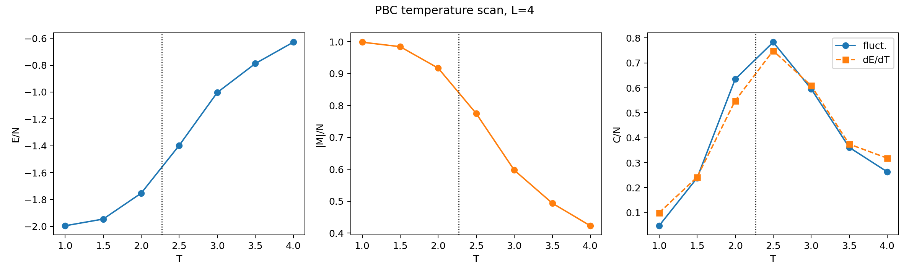{ width=92% fig-pos="H" }

### 理解

小系统中相关长度很容易达到系统尺度，因此相变被强烈圆滑化。$L=4$ 的磁化在高温下仍有较大 $\langle |m|\rangle$，主要来自有限样本的绝对值偏置，而不是热力学极限下的自发磁化。

## Problem 3(f)：开放边界条件

### 待求问题

改用开放边界条件，修改能量计算中的相邻格点关系。对 $L=30$ 和 $L=4$ 重复若干运行并评论结果。

### 解决方式

开放边界下边界自旋邻居数减少，能量只统计实际存在的水平和竖直键。本文在 $T=2.0,2.5,4.0$ 比较 PBC 与 OBC。

### 问题答案

| $L$ | $T$ | 边界 | $E/N$ | $\langle \lvert m\rvert\rangle$ |
|--:|--:|:--|--:|--:|
| 30 | 2.0 | PBC | -1.748 | 0.913 |
| 30 | 2.0 | OBC | -1.591 | 0.807 |
| 30 | 2.5 | PBC | -1.100 | 0.196 |
| 30 | 2.5 | OBC | -1.041 | 0.156 |
| 30 | 4.0 | PBC | -0.558 | 0.057 |
| 30 | 4.0 | OBC | -0.535 | 0.052 |
| 4 | 2.0 | PBC | -1.760 | 0.920 |
| 4 | 2.0 | OBC | -0.926 | 0.622 |
| 4 | 2.5 | PBC | -1.383 | 0.767 |
| 4 | 2.5 | OBC | -0.711 | 0.485 |
| 4 | 4.0 | PBC | -0.633 | 0.425 |
| 4 | 4.0 | OBC | -0.388 | 0.311 |

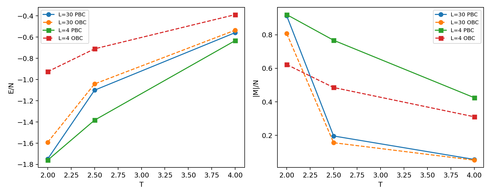{ width=82% fig-pos="H" }

### 理解

开放边界减少了键数，因此 $E/N$ 绝对值更小，并削弱了整体有序。这个影响在 $L=4$ 中尤其强，因为边界自旋占比很高；在 $L=30$ 中仍可见，但相对较弱。

## Problem 3(g)：随机选点与有序扫描

### 待求问题

原程序在每个 MC 步中随机选择自旋尝试翻转。取例如 $L=30$ 和某个温度，若按有序序列选择自旋，结果是否有差别。

### 解决方式

取 $L=30,\ T=2.3$，分别用随机选点和行优先有序扫描做单自旋 Metropolis 更新，并比较热化后的均值。

```text
for update_order in {random, ordered}:
    initialize the same L and T
    for each sweep:
        if random: choose L^2 sites independently at random
        if ordered: visit sites in row-major order
        apply the same single-spin Metropolis acceptance rule
    compare post-warmup E/N, |m| and acceptance ratio
```

### 问题答案

| 更新方式 | $E/N$ | $\langle \lvert m\rvert\rangle$ | 接受率 |
|:--|--:|--:|--:|
| 随机选点 | -1.257 | 0.217 | 0.260 |
| 有序扫描 | -1.334 | 0.461 | 0.228 |

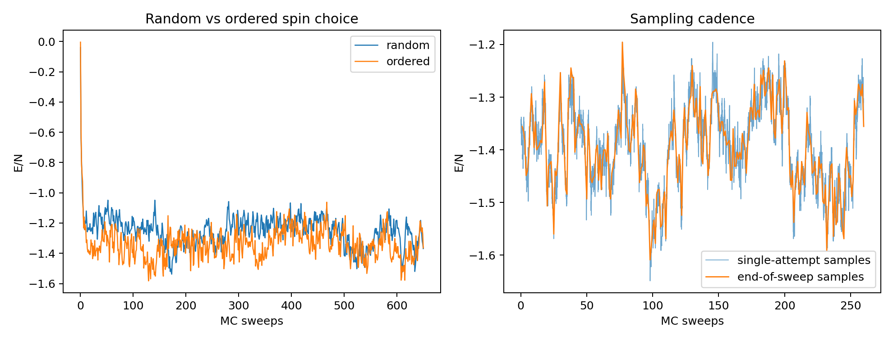{ width=88% fig-pos="H" }

### 理解

有序扫描和随机选点都可用于构造局域更新，但它们的时间相关性不同。本次在 $T=2.3$ 的有限长度运行中，有序扫描得到的 $\langle |m|\rangle$ 明显更大，这不应解释为“有序扫描的热力学平衡态不同”，而应解释为临界附近慢混合、有限采样长度和更新顺序相关性共同造成的动力学差别。若运行充分长并正确满足平衡分布，热力学平均应趋向一致；但用它们讨论“时间演化效率”时不能混用。

## Problem 3(h)：按 sweep 采样与按单次尝试采样

### 待求问题

不在每个完整 MC sweep 后更新能量，而在每个单次自旋尝试后更新并采样。比较两种方法的结果，并讨论是否等价。

### 解决方式

仍取 $L=30,\ T=2.3$，在同一类随机单自旋更新中比较 sweep 末采样和单次尝试过程中的采样。

```text
equilibrate the lattice with random single-spin updates
for each measurement sweep:
    for attempt = 1 ... L^2:
        propose and possibly accept one spin flip
        optionally record E/N after selected single attempts
    record E/N once at the end of the full sweep
compare the two averages without treating dense samples as independent
```

### 问题答案

单次尝试采样得到 $\langle E\rangle/N=-1.3949$，sweep 末采样得到 $\langle E\rangle/N=-1.3937$；对应 $\langle |m|\rangle$ 分别为 0.6469 和 0.6472。

### 理解

若能量和磁化在每次接受翻转后被正确增量更新，两种采样都来自同一 Markov 链，因此平衡均值应一致。但单次尝试采样包含更密集、更强相关的状态；它不能被当作独立样本数增加了 $N$ 倍。

## Problem 3(i)：自旋图样可视化

### 待求问题

可选地展示自旋图样在演化过程中的变化。

### 解决方式

用二维数组直接保存 $s_i=\pm1$，在指定 MC sweep 输出色块图。白色和绿色分别代表两种自旋方向。

### 问题答案

本文在 Problem 4(e) 中给出 $L=100$ 的动态图样抽样图。低温或临界附近会出现大团簇，高温下图样保持细碎无序。

### 理解

图样可视化不是额外的物理量，但它能直观展示畴长大、临界涨落和高温无序之间的差别。需要注意，MC sweep 是算法时间，不等同于真实动力学时间。

# IV. 二维 Ising 模型磁化与有限尺寸标度 {-}

## Problem 4(a)：磁化随温度变化与相变位置

### 待求问题

用 MCMC 模拟二维 Ising 模型的磁化，画出不同温度下磁化 $m$ 随 $T$ 的曲线，并指出相变发生的位置。

### 解决方式

对 $L=4,8,16,32$ 扫描 $T=1$ 到 $4$，统计 $\langle |m|\rangle$。同时画出热力学极限二维 Ising 自发磁化

$$
m(T)=\left[1-\sinh^{-4}\left(\frac{2}{T}\right)\right]^{1/8},\qquad T<T_c.
$$

```text
for L in {4, 8, 16, 32}:
    for each temperature:
        run the 2D Metropolis simulation after warmup
        estimate <|m|> and <m^2>
plot <|m|> against T for each L
overlay the infinite-lattice spontaneous magnetization curve
```

### 问题答案

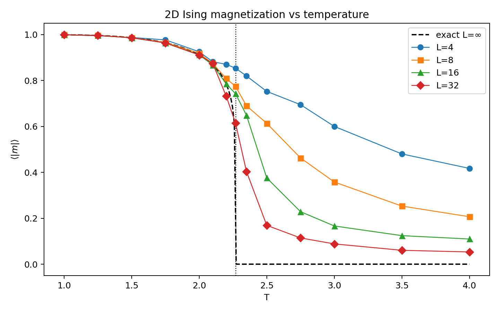{ width=82% fig-pos="H" }

磁化在 $T\simeq2.2$ 到 $2.5$ 附近快速下降。系统尺寸越大，下降越陡，并越接近热力学极限的 $T_c=2.269$。结合 Problem 4(d) 的有限尺寸标度，在 $T=2.269$ 处得到的 $\ln\langle m^2\rangle$--$\ln L$ 斜率为 $-0.277$，接近理论值 $-0.25$，因此 $T=2.269$ 比粗网格峰值位置更能代表本组数据中的临界点。

### 理解

有限尺寸下 $\langle |m|\rangle$ 在 $T>T_c$ 仍不严格为 0，因为有限系统的绝对磁化有正偏置。随着 $L$ 增大，这个高温尾部逐渐降低。

## Problem 4(b)：改变 $L$ 时影响结果的因素

### 待求问题

改变 $L$ 的取值，讨论影响最终结果的因素。

### 解决方式

比较 $L=4,8,16,32$ 的 $\langle |m|\rangle$ 曲线和高温尾部，关注有限尺寸、临界慢化、采样长度和初态影响。

### 问题答案

主要影响因素包括：

1. 有限尺寸效应：小 $L$ 使相变被圆滑化，高温 $\langle |m|\rangle$ 偏大。
2. 临界慢化：靠近 $T_c$ 时相关时间变长，局域翻转需要更长运行才能独立采样。
3. 初态与热化长度：低温从随机初态开始时需要畴合并；有序初态在低温更快。
4. 边界条件：开放边界降低平均配位数，尤其对小 $L$ 影响大。
5. 样本数量：温度点越密、测量 sweep 越多，曲线越平滑，临界区域定位越可靠。

### 理解

$L$ 不只是改变自旋数，也改变相关长度与系统尺度的比值。临界附近若 $\xi$ 接近 $L$，有限系统会表现为一个被截断的相变。

## Problem 4(c)：计算精度受限原因

### 待求问题

讨论为什么本机计算只能达到有限精度。

### 解决方式

从 Monte Carlo 误差、有限尺寸误差和局域更新算法误差三个层面分析。

### 问题答案

本次计算的精度主要受以下因素限制：有限 MC 步数导致统计误差；临界附近样本自相关强，独立样本数远小于记录样本数；局域 Metropolis 更新在低温和临界区慢混合；有限尺寸使临界点不再尖锐；温度网格较粗会影响比热峰和指数拟合。

### 理解

增加计算时间可以降低统计误差，但不能消除有限尺寸误差。若要更精确地估计临界指数，需要更大的 $L$、更密的温度点、更长热化和测量时间，或者使用 Wolff/Swendsen-Wang 等团簇算法降低临界慢化。

## Problem 4(d)：$\ln\langle m^2\rangle$ 与 $\ln L$ 的临界指数

### 待求问题

判断 $\ln\langle M^2\rangle$ 与 $\ln L$ 是否近似线性。选取数据拟合临界指数，并讨论是否符合理论预言以及原因。

### 解决方式

本文用每自旋磁化 $m=M/N$，拟合

$$
\ln \langle m^2\rangle = a + b\ln L.
$$

二维 Ising 模型在临界点满足

$$
\langle m^2\rangle \propto L^{-2\beta/\nu},
$$

理论值为 $\beta=1/8,\ \nu=1$，所以斜率应为 $b=-1/4$。

```text
for target T in {2.0, 2.269, 2.5}:
    collect <m^2> at L = 4, 8, 16, 32
    fit y = ln(<m^2>) against x = ln(L)
    estimate beta / nu from -slope / 2
    compare the T = Tc slope with the theoretical value -1/4
```

### 问题答案

| $T$ | 拟合斜率 $b$ | 由 $-b/2$ 得到的 $\beta/\nu$ |
|--:|--:|--:|
| 2.000 | -0.026 | 0.013 |
| 2.269 | -0.277 | 0.139 |
| 2.500 | -1.297 | 0.648 |

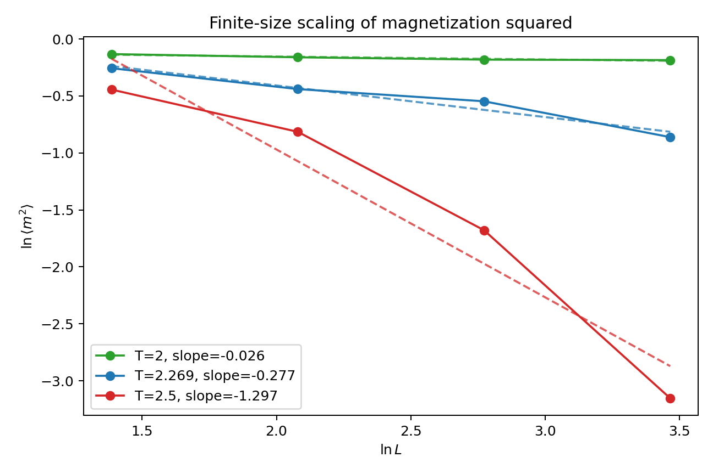{ width=72% fig-pos="H" }

在 $T=2.269$ 处，斜率 $-0.277$ 接近理论值 $-0.25$，对应 $\beta/\nu=0.139$，与理论 $0.125$ 接近。低温 $T=2.0$ 时系统已有自发磁化，$\langle m^2\rangle$ 几乎不随 $L$ 变化；高温 $T=2.5$ 时相关长度有限，$\langle m^2\rangle$ 随尺寸衰减更快。

### 理解

只有在临界点附近，$\ln\langle m^2\rangle$ 与 $\ln L$ 的线性拟合才直接对应临界指数。偏离临界温度后，低温和高温分别受有序相与有限相关长度控制，拟合斜率不再等于临界指数。

## Problem 4(e)：$100\times100$ 自旋图样展示

### 待求问题

以 $100\times100$ 二维正方格点为例，展示 Ising 模型的 MCMC 模拟结果。用两种颜色表示 $s_i=1$ 和 $s_i=-1$，说明这只是 Markov 链迭代过程，不代表真实时间。

### 解决方式

取 $L=100$，分别在 $T=T_c$ 和 $T=2T_c$ 下从随机初态出发，记录 $t=0,100,200,300$ sweep 的自旋图样。

### 问题答案

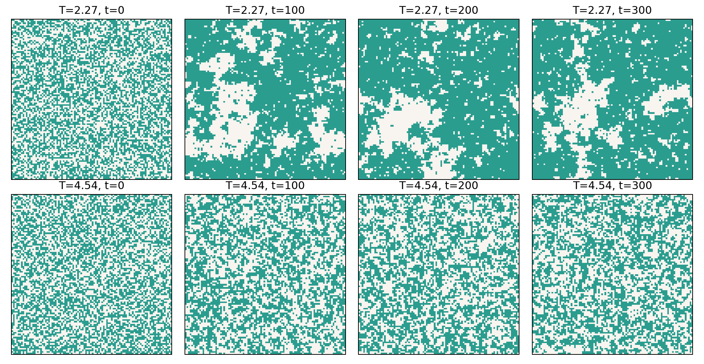{ width=92% fig-pos="H" }

临界附近可见大尺度团簇形成，高温 $2T_c$ 下图样始终保持细碎随机，没有形成稳定宏观磁化。

### 理解

这些图像反映的是 MCMC 构型序列。它可帮助观察相分离和畴增长，但每一帧之间的 MC sweep 不是物理实时时间；若要研究真实动力学，需要额外指定动力学模型和时间标定。
